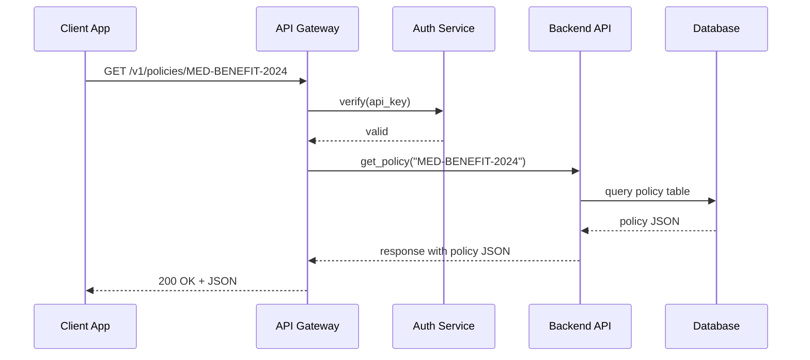

# Chapter 6: Backend API

In [Chapter 5: Microservices Architecture](05_microservices_architecture_.md) we saw how each service (validation, governance, payment) runs independently and talks over APIs. Now we’ll build the **Backend API**—our “interagency MOU” that defines exactly how modules and external systems read or update policies, processes, and data in HMS-SCM.

## Why Do We Need a Backend API?

Imagine two state departments—Child Protective Services and Health Services—need to share policy rules about benefit eligibility. The Backend API is like their signed Memorandum of Understanding (MOU):  
- It says which data each side can access.  
- It specifies request formats, authentication, and error codes.  
- It ensures changes are tracked and secure.

Without a single, well-defined API, each team might create its own endpoints—leading to confusion, broken integrations, and security gaps.

## Central Use Case

**Scenario:** The Health Services portal needs to:  
1. Fetch the current eligibility policy for medical benefits.  
2. Update a process flow when new federal guidelines arrive.  
3. List citizen records for audit.

Here’s how a simple script uses our Backend API client:

```python
# client_example.py
from hms_api_client import HMSApiClient

api = HMSApiClient(api_key="XYZ-123")

# 1. Read policy
policy = api.get_policy("MED-BENEFIT-2024")
print(policy["rules"])

# 2. Update process
update = {"steps": ["verify_id", "check_income", "approve"]}
api.update_process("MED-BENEFIT-2024", update)

# 3. List records
records = api.list_records(limit=10)
print(len(records), "records fetched")
```

Explanation:  
- We create `HMSApiClient` with an API key.  
- `get_policy()` returns JSON rules.  
- `update_process()` sends a JSON patch.  
- `list_records()` retrieves citizen data.

## Key Concepts

1. **Endpoints**  
   - `/policies/{id}`, `/processes/{id}`, `/records`

2. **HTTP Methods**  
   - GET for read, POST/PUT for create/update, DELETE to remove

3. **Authentication & Authorization**  
   - API keys or OAuth tokens in headers

4. **Request/Response Format**  
   - JSON bodies with clear schemas

5. **Versioning**  
   - URL prefix like `/v1/policies/...` for backward compatibility

6. **Error Handling**  
   - Standard HTTP codes (400, 401, 404, 500) and JSON error messages

## How It Works: Step-by-Step



1. **Client App** sends a request to the **API Gateway**.  
2. Gateway calls **Auth Service** to check the API key.  
3. On success, Gateway forwards to **Backend API**.  
4. API reads/writes from the **Database**.  
5. Data returns back to the Client.

## Inside the Code

### File: hms_api.py

```python
# hms_api.py
from flask import Flask, request, jsonify
from policy_service import PolicyService

app = Flask(__name__)
service = PolicyService()

@app.route("/v1/policies/<policy_id>", methods=["GET"])
def get_policy(policy_id):
    # auth check happens in middleware (not shown)
    policy = service.read_policy(policy_id)
    if not policy:
        return jsonify({"error": "Policy not found"}), 404
    return jsonify(policy), 200

@app.route("/v1/processes/<proc_id>", methods=["PUT"])
def update_process(proc_id):
    data = request.get_json()
    service.update_process(proc_id, data)
    return jsonify({"status": "updated"}), 200
```

Explanation:  
- We use Flask to expose two routes: GET and PUT.  
- `PolicyService` handles the logic.  
- Errors return JSON with proper status codes.

### File: policy_service.py

```python
# policy_service.py
import sqlite3

class PolicyService:
    def __init__(self):
        self.conn = sqlite3.connect("hms.db", check_same_thread=False)

    def read_policy(self, policy_id):
        cur = self.conn.execute(
            "SELECT data FROM policies WHERE id=?", (policy_id,))
        row = cur.fetchone()
        return row[0] if row else None

    def update_process(self, proc_id, data):
        self.conn.execute(
            "UPDATE processes SET data=? WHERE id=?",
            (json.dumps(data), proc_id))
        self.conn.commit()
```

Explanation:  
- We connect to a simple SQLite database.  
- `read_policy()` fetches JSON stored under `data`.  
- `update_process()` stores the updated JSON.

## Conclusion

In this chapter, you learned how the **Backend API** provides a secure, versioned, and consistent interface—our platform’s “MOU”—so modules and external systems can read and update policies, processes, and data.  

Next up, we’ll build the user-facing side in [Frontend Interface Components](07_frontend_interface_components_.md).

---

Generated by [AI Codebase Knowledge Builder](https://github.com/The-Pocket/Tutorial-Codebase-Knowledge)