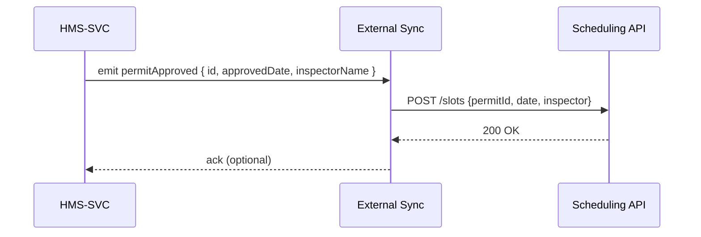

# Chapter 6: External System Sync

Welcome back! In [Chapter 5: Financial Clearinghouse (HMS-ACH)](05_financial_clearinghouse__hms_ach__.md), we learned how fees and payments are recorded. Now it’s time to build the “inter-municipal bridges” that keep outside platforms—scheduling systems, data warehouses, legacy apps—in sync in real time.  

External System Sync ensures once a process update is approved, every connected system sees it immediately. No more stale spreadsheets or manual exports!

---

## 1. Why External System Sync? A Real-World Use Case

Imagine your planning department approves a new **building permit**. Now:
- The city’s **scheduling platform** needs to show the inspection slot.  
- The data warehouse must ingest permit stats for reports.  
- A decades-old **.NET legacy system** still holds permit records.

Without a connector layer, someone must export data or write custom scripts. That leads to delays and data silos. External System Sync acts like a network of highways, routing each approved permit event to every partner system automatically.

---

## 2. Key Concepts

1. **Connector**  
   A small piece of code that knows how to talk to one external system (API URL, auth, data mapping).

2. **Event Bus**  
   An in-memory or message-queue channel where internal events (like `permitApproved`) are published.

3. **Dispatcher**  
   Listens for events, finds matching connectors, transforms the event into the external payload, and sends it.

4. **Mapping Function**  
   A user-supplied function on each connector that picks and reshapes fields for the target system.

5. **Error Handling & Retry**  
   If an external API call fails, the dispatcher can log the failure and retry later to guarantee delivery.

---

## 3. Registering a Connector

Below is a minimal example showing how to register a connector for a scheduling platform.

File: `src/config/connectors.js`
```js
const connectors = require('../services/connectorService')

// Register a “scheduling” connector
connectors.register('scheduling', {
  url: 'https://city-schedule.gov/api/slots',
  method: 'POST',
  // Map an internal event to the external API payload
  map: event => ({
    permitId: event.id,
    date: event.approvedDate,
    inspector: event.inspectorName
  })
})
```
This tells our system: “When any event comes in, if it’s a permit approval, call this URL with the mapped payload.”

---

## 4. How It Works: Sequence Diagram


1. **HMS-SVC** publishes a `permitApproved` event.  
2. **External Sync** (dispatcher) receives it.  
3. Dispatcher calls the scheduling API with the mapped data.  
4. The external system returns success.

---

## 5. Under the Hood: Step-by-Step

1. **Event Emission**  
   When any service (e.g., HMS-SVC or HMS-ACH) completes an action, it calls:
   ```js
   eventBus.emit({ type: 'permitApproved', ...payload })
   ```
2. **Subscription**  
   The dispatcher has subscribed to the event bus.
3. **Lookup Connectors**  
   For each registered connector, it checks if the `type` matches or if the connector wants all events.
4. **Transform & Send**  
   It runs the connector’s `map(event)` function, then does an HTTP call.
5. **Log & Retry**  
   On failure, it logs the error for later inspection and retry.

---

## 6. Internal Implementation

### 6.1 In-Memory Event Bus

File: `src/lib/eventBus.js`
```js
const listeners = []
function subscribe(fn) { listeners.push(fn) }
function emit(event) { listeners.forEach(fn => fn(event)) }
module.exports = { subscribe, emit }
```
A very simple pub/sub: anything calls `emit`, and all subscribers run.

### 6.2 Connector Service

File: `src/services/connectorService.js`
```js
const store = {}
function register(name, cfg) { store[name] = cfg }
function getAll() { return Object.values(store) }
module.exports = { register, getAll }
```
Holds all connector definitions in memory.

### 6.3 Dispatcher

File: `src/services/dispatcher.js`
```js
const fetch = require('node-fetch')
const { getAll } = require('./connectorService')

async function handleEvent(event) {
  for (const c of getAll()) {
    try {
      const body = c.map(event)
      await fetch(c.url, {
        method: c.method,
        headers: {'Content-Type':'application/json'},
        body: JSON.stringify(body)
      })
      console.log('Synced to', c.url)
    } catch (err) {
      console.error('Sync failed for', c.url, err)
      // TODO: enqueue for retry
    }
  }
}

module.exports = { handleEvent }
```
Loops through each connector, runs its mapping, and posts to the external URL.

### 6.4 Wiring It All Up

File: `src/main.js`
```js
const bus       = require('./lib/eventBus')
const dispatcher = require('./services/dispatcher')

// Dispatcher listens to all events
bus.subscribe(dispatcher.handleEvent)

// Example: HMS-SVC emits an event after approval
// eventBus.emit({ type: 'permitApproved', id: 123, approvedDate: '2024-06-01', inspectorName: 'Lee' })
```
With this in place, any call to `eventBus.emit(...)` flows through the dispatcher to all connectors.

---

## 7. Conclusion

Congratulations! You’ve built a beginner-friendly **External System Sync** layer that:
- Registers connectors for any outside platform  
- Captures internal events via an event bus  
- Dispatches mapped payloads to external APIs  
- Logs successes and failures for reliability  

Next, we’ll dive into how **Process & Policy Objects** model your core business definitions in [Chapter 7: Process & Policy Objects](07_process___policy_objects_.md).

---

Generated by [AI Codebase Knowledge Builder](https://github.com/The-Pocket/Tutorial-Codebase-Knowledge)