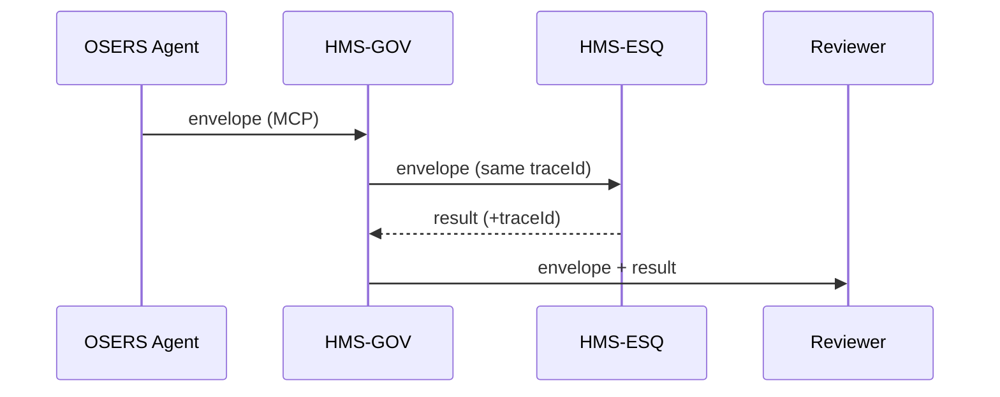

# Chapter 6: Model Context Protocol (HMS-MCP)

[← Back to Chapter&nbsp;5: Human-in-the-Loop (HITL) Override](05_human_in_the_loop__hitl__override_.md)

> “Slack for robots, a contract for auditors.”

---

## 1. Why Do We Need MCP?

In the last chapter an agent paused itself and asked a human, *“Is this denial letter okay?”*  
How did the HITL dashboard know **which draft, rules, and model settings** the agent used?  
Enter **HMS-MCP**—a tiny, JSON-based envelope that travels with every AI thought so that:

* Agents, tools, and humans can read the same “subject line.”  
* Down-stream services (e.g., [HMS-ESQ](03_legal_reasoning_service__hms_esq__.md)) see *exactly* which model, temperature, and datasets were referenced.  
* Auditors can replay the conversation years later.

### Starter Use-Case – Proposing a New OSERS Funding Policy

1. An **AI Policy Agent** drafts a change to an Office of Special Education and Rehabilitative Services (OSERS) grant rule.  
2. The draft calls the statistics tool, the legal checker, and a UI component.  
3. Each hop wraps its message in an MCP envelope so nothing gets lost in translation.

We will build & inspect one of those envelopes in just a few lines of code.

---

## 2. Key MCP Concepts (Beginner Friendly)

| MCP Term           | Everyday Analogy           | One-Line Job                                     |
|--------------------|----------------------------|--------------------------------------------------|
| Context Envelope   | Postal envelope            | Holds sender, receiver, and security stamps      |
| `prompt` block     | Letter body                | The text the model sees                          |
| `tools` section    | Packing slip               | List of outside tools the model may call         |
| `guardrails`       | Speed-limit signs          | Hard rules the model must not break              |
| Signature          | Wax seal                   | Cryptographic proof the envelope is untampered   |
| Trace-ID           | Package tracking number    | Lets auditors replay the entire chain            |

Keep these six ideas in your back pocket—everything else is sugar.

---

## 3. Anatomy of a Minimal Envelope

Below is a **14-line** example. Save it as `osers_policy.mcp.json`.

```jsonc
{
  "traceId"   : "ffc1a2",
  "sender"    : "AGT_OSERS_01",
  "receiver"  : "HITL_DASH",
  "prompt"    : "Draft amendment raising CTE grants by 5%.",
  "model"     : { "name":"gpt-4-0613", "temperature":0.2 },
  "tools"     : ["stats.getGDP","esq.legalCheck"],
  "guardrails": { "maxTokens":800, "noPII":true },
  "signature" : "🔏 base64string"
}
```

Explanation (numbered):

1-3   Postal info: `traceId`, sender, receiver.  
4-5   The *exact* text and model settings.  
6     Allowed external calls.  
7     Hard limits (token cap, PII block).  
8     Tamper-evident signature (trimmed for demo).

---

## 4. Generating an Envelope (Agent-Side, 18 Lines)

```js
// buildEnvelope.js
import { sign } from './crypto.js';           // tiny helper

export function makeMCP({draft, tools}) {     // 1
  const env = {                               // 2
    traceId   : Date.now().toString(36),      // 3
    sender    : 'AGT_OSERS_01',               // 4
    receiver  : 'HITL_DASH',                  // 5
    prompt    : draft,                        // 6
    model     : { name:'gpt-4-0613', temperature:0.2 }, // 7
    tools,                                    // 8
    guardrails: { maxTokens:800, noPII:true } // 9
  };                                          // 10
  env.signature = sign(env);                  // 11
  return env;                                 // 12
}                                             // 13
```

What happens?

1. Caller supplies the draft text + tool list.  
2-10. Envelope fields are filled.  
11. The whole object is cryptographically signed.  
12. Ready to send—simple!

---

## 5. Receiving & Verifying (HITL-Side, 14 Lines)

```js
// verifyEnvelope.js
import { verify } from './crypto.js';

export function accept(env){         // 1
  if(!verify(env))                   // 2
     throw 'Signature fail';         // 3

  if(env.guardrails.noPII && /SSN/.test(env.prompt))
     throw 'PII detected';           // 6

  console.log('Trace-ID', env.traceId);
  return { ok:true, prompt: env.prompt };
}
```

Line-by-line:

1-3  Check the wax seal.  
4-6  Enforce guardrails (e.g., no SSNs allowed).  
7-8  Log & forward the clean prompt.

---

## 6. Life of an MCP Envelope



Notice how **one trace-ID** flows end-to-end, letting auditors stitch the hops together.

---

## 7. Under the Hood

### 7.1 Folder Peek

```
/hms-mcp
 ├─ spec/
 │    └─ v1.json      # JSON-Schema (70 lines)
 ├─ js/
 │    ├─ buildEnvelope.js
 │    ├─ verifyEnvelope.js
 │    └─ crypto.js    # fake RSA helpers
 └─ tests/
      └─ happy.spec.js
```

### 7.2 Schema Snippet (JSON-Schema, 12 Lines)

```jsonc
// spec/v1.json  (excerpt)
{
  "properties": {
    "traceId"  : { "type":"string" },
    "prompt"   : { "type":"string", "maxLength":4000 },
    "tools"    : { "type":"array", "items":{"type":"string"} },
    "guardrails": {
       "type":"object",
       "properties": { "maxTokens":{"type":"integer"}, "noPII":{"type":"boolean"} }
    }
  },
  "required": ["traceId","sender","prompt","model","signature"]
}
```

Validators in any language can use this file to reject malformed envelopes before they cause trouble.

---

## 8. Frequently Asked Questions

**Q: Is MCP yet another messaging format?**  
A: It’s **tiny** (a JSON object) but adds the must-have fields—model config, guardrails, and signature—that normal HTTP headers lack.

**Q: Does MCP replace HTTPS?**  
A: No. HTTPS encrypts the pipe; MCP standardises the *package* inside.

**Q: What if I change model temperature mid-conversation?**  
A: Issue a fresh envelope with a new `traceId`. The history shows every tweak.

**Q: How big can the envelope get?**  
A: Keep it <16 KB; large documents should live in a storage bucket with a URL pointer inside `attachments`.

---

## 9. Key Takeaways

• HMS-MCP is the shared **lingua franca** for agents, tools, and humans.  
• Six fields—trace-ID, sender, prompt, model, tools, guardrails, signature—capture everything auditors need.  
• Envelopes are easy to build (≤18 lines of code) and easy to verify.  
• A single trace-ID lets you replay a policy proposal from first draft to final approval.

---

### Up Next  
Now that messages are signed, typed, and traceable, we can let **multiple agents collaborate** on big tasks.  
Meet the conductor in [Agent Orchestration Service (HMS-ACT)](07_agent_orchestration_service__hms_act__.md).

---

Generated by [AI Codebase Knowledge Builder](https://github.com/The-Pocket/Tutorial-Codebase-Knowledge)