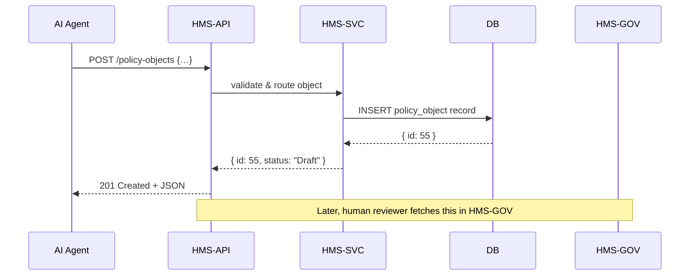

# Chapter 7: Process & Policy Objects

In [Chapter 6: External System Sync](06_external_system_sync_.md), we learned how approved events flow to partner systems. Now we’ll look at how HMS-SCM represents the “bills” and “orders” themselves—our **Process & Policy Objects**. These are the digital templates that describe workflows, rules, and approval criteria, just like real legislative bills or administrative orders.

---

## 1. Why Process & Policy Objects? A Real-World Use Case

Imagine an AI Agent proposes a new “National Pesticide Use Standard” for the National Pesticide Information Center. Before it becomes active, this draft must:
- Define the **title**, **summary**, and **detailed steps** (e.g., public comment, technical review).  
- Specify **rules** (e.g., maximum residue levels) and **approval criteria**.  
- Flow through **review**, **publication**, and **monitoring** phases.

A Process & Policy Object bundles all of that into one structured record. Once the AI Agent builds it, the object travels through every system—from review panels in [HMS-GOV](02_admin_gov_portal__hms_gov__.md) to deployment in HMS-API, and finally public dashboards.

---

## 2. Key Concepts

1. **Policy Object**  
   - Holds metadata: `id`, `title`, `description`.  
   - Contains rules: arrays of conditions and thresholds.  
   - Tracks `status`: Draft → UnderReview → Active → Archived.

2. **Process Object**  
   - Defines the **workflow** steps: e.g., ["Draft", "PublicComment", "Review", "Publish"].  
   - Associates roles and approval criteria for each step.

3. **Lifecycle**  
   - **Draft**: AI Agent or staff is still editing.  
   - **UnderReview**: Awaiting human feedback.  
   - **Active**: Published and enforceable.  
   - **Archived**: Retired or superseded.

4. **Approval Criteria**  
   - Simple checks (e.g., “minimum 100 public comments”) or complex rules.  
   - Stored as part of the object for automated gating.

---

## 3. Creating a New Policy Object

Here’s how an AI Agent or portal can submit a new Policy Object via our API.

File: `src/api/policyObjects.js`
```js
// Create a new policy object
export async function createPolicyObject(data) {
  const res = await fetch('/api/policy-objects', {
    method: 'POST',
    headers: {'Content-Type':'application/json'},
    body: JSON.stringify(data)
  });
  return res.json(); // { id: 55, status: 'Draft', ... }
}
```
This is all you need on the client. Pass in:
```json
{
  "title": "Water Quality Monitoring Policy",
  "description": "Standards for nutrient levels...",
  "rules": [{ "field": "nitrate", "max": 10 }],
  "process": ["Draft","PublicComment","Review","Publish"]
}
```
You’ll get back a new object with its unique `id` and initial `status: 'Draft'`.

---

## 4. What Happens Under the Hood?



1. **HMS-API** receives the POST and checks permissions.  
2. It forwards the data to **HMS-SVC** for business‐rule validation.  
3. **HMS-SVC** saves the object in the database with `status='Draft'`.  
4. The new object appears in [HMS-GOV](02_admin_gov_portal__hms_gov__.md) for human review.

---

## 5. Internal Implementation

### 5.1 Express Route

File: `server/routes/policyObjects.js`
```js
const express = require('express')
const router  = express.Router()
const svc     = require('../services/policyObjectService')

// POST /api/policy-objects
router.post('/', async (req, res) => {
  const created = await svc.create(req.body)
  res.status(201).json(created)
})

module.exports = router
```
*This route delegates to our business‐logic service.*

### 5.2 Service Logic

File: `server/services/policyObjectService.js`
```js
let store = []
let nextId = 1

async function create(data) {
  const record = {
    id: nextId++,
    status: 'Draft',
    title: data.title,
    description: data.description,
    rules: data.rules || [],
    process: data.process || []
  }
  store.push(record)
  return record
}

module.exports = { create }
```
*We mock a database with an in‐memory `store`. In production, this calls your real DB layer.*

---

## 6. Putting It All Together

```mermaid
graph LR
  A[AI Agent] --> B[HMS-API: POST /policy-objects]
  B --> C[HMS-SVC: create()]
  C --> D[(Database)]
  D --> C
  C --> B
  B --> E[HMS-GOV: shows new draft]
```

- **AI Agent** or staff creates a new object.  
- **HMS-API** and **HMS-SVC** enforce rules and persist it.  
- **HMS-GOV** picks it up for human review.

---

## Conclusion

In this chapter you learned how **Process & Policy Objects**:

- Represent workflows and rules as structured templates.  
- Flow from AI creation (Draft) through human review to Active status.  
- Are created via a simple REST endpoint and managed by HMS-SVC.

Next up, we’ll see how AI Agents actually build these drafts in [Chapter 8: AI Agent Framework (HMS-A2A)](08_ai_agent_framework__hms_a2a__.md).

---

Generated by [AI Codebase Knowledge Builder](https://github.com/The-Pocket/Tutorial-Codebase-Knowledge)