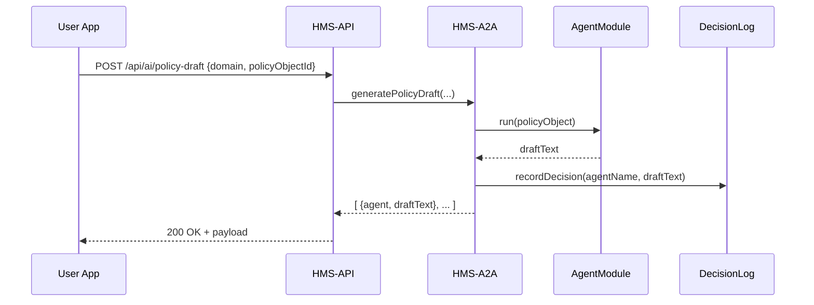

# Chapter 8: AI Agent Framework (HMS-A2A)

Building on [Chapter 7: Process & Policy Objects](07_process___policy_objects_.md), it’s time to see how we turn those objects into smart suggestions. The **AI Agent Framework (HMS-A2A)** is our “council of expert advisors”—each an AI module trained in a specific domain (healthcare, education, conservation)—that analyzes data, drafts policy text, or proposes optimized workflows. All decisions are tracked and auditable.

---

## 1. Why HMS-A2A? A Real-World Use Case

Imagine the Food Safety and Inspection Service (FSIS) wants to update slaughterhouse inspection schedules. They already have a **Process & Policy Object** defining the goal:

- Title: “Optimize Inspection Frequency”  
- Rules: minimum one inspection per month, risk‐based adjustment  
- Workflow steps: Draft → Review → Publish

With HMS-A2A, you call our service, and multiple AI “experts” each propose a revised schedule. Then you pick the best one or merge ideas—all within a governed environment that logs who suggested what.

---

## 2. Key Concepts

1. **Agent Module**  
   A small program trained for a domain (e.g., healthcare). It exposes a `run(input)` function that returns a suggestion.

2. **Agent Registry**  
   Keeps track of all registered agents and their domains, so you can ask “all healthcare agents” for input.

3. **Task Dispatcher**  
   Orchestrates calls to each matching agent, gathers their outputs, and returns them to the caller.

4. **Decision Log**  
   An immutable ledger of every agent’s suggestion, timestamped with agent name and input reference.

---

## 3. Generating a Policy Draft

Here’s how a client requests AI‐generated drafts for a policy object:

```js
// src/api/ai.js
export async function generatePolicyDraft(domain, policyObjectId) {
  const res = await fetch('/api/ai/policy-draft', {
    method: 'POST',
    headers: {'Content-Type':'application/json'},
    body: JSON.stringify({ domain, policyObjectId })
  });
  return res.json(); 
  // Returns: [
  //   { agent: 'HealthExpertAI', draft: 'Article 1: ...' },
  //   { agent: 'RegulationGuru', draft: 'Section A: ...' }
  // ]
}
```

Explanation:
- We POST domain + policyObjectId.  
- The server returns an array of `{agent, draft}` from each expert.

---

## 4. What Happens Under the Hood?



1. **HMS-API** receives the request and calls HMS-A2A.  
2. **HMS-A2A** looks up all agents for that domain.  
3. Each **Agent Module** runs its `run()` function on the policy object.  
4. Results are logged to the **Decision Log**.  
5. The array of drafts is returned to the user.

---

## 5. Internal Implementation

### 5.1 Agent Registry

File: `server/services/agentRegistry.js`
```js
const agents = [];

// Register a new AI agent
function registerAgent({name, domain, run}) {
  agents.push({name, domain, run});
}

// Find agents by domain
function getAgents(domain) {
  return agents.filter(a => a.domain === domain);
}

module.exports = { registerAgent, getAgents };
```
Explanation:
- `registerAgent()` stores each agent’s name, domain, and `run` function.  
- `getAgents()` returns all agents matching a domain.

### 5.2 AI Service & Dispatcher

File: `server/services/aiService.js`
```js
const { getAgents } = require('./agentRegistry');
const logSvc = require('./decisionLogService');

async function generatePolicyDraft({domain, policyObject}) {
  const results = [];
  for (const ag of getAgents(domain)) {
    const draft = await ag.run(policyObject);
    await logSvc.record({agent: ag.name, domain, draft});
    results.push({agent: ag.name, draft});
  }
  return results;
}

module.exports = { generatePolicyDraft };
```
Explanation:
- Fetches agents for the domain.  
- Calls each `run()`, logs the draft, and collects results.

### 5.3 Decision Logging

File: `server/services/decisionLogService.js`
```js
const logStore = [];

async function record(entry) {
  // entry: {agent, domain, draft, timestamp?}
  entry.timestamp = new Date().toISOString();
  logStore.push(entry);
  // In production, persist to a real database or audit log
}

module.exports = { record };
```
Explanation:
- Appends each decision with timestamp, for full accountability.

---

## 6. Bringing It All Together

```mermaid
graph LR
  A[Client App] --> B[HMS-API /ai/policy-draft]
  B --> C[HMS-A2A.generatePolicyDraft()]
  C --> D[agentRegistry.getAgents()]
  C --> E[AgentModule.run()]
  C --> F[decisionLogService.record()]
  F --> G[(Audit Database)]
  E --> C
  C --> B
  B --> A
```

- The client calls **HMS-API**  
- **HMS-A2A** finds agents, runs them, logs decisions, and returns all drafts.

---

## Conclusion

In this chapter you learned how the **AI Agent Framework (HMS-A2A)**:

- Houses a “council” of domain‐specific AI modules  
- Dispatches policy objects to each agent and gathers their drafts  
- Logs every suggestion for governance and traceability  

Next up, we’ll build rules around these AI outputs in the [AI Governance Framework](09_ai_governance_framework_.md).

---

Generated by [AI Codebase Knowledge Builder](https://github.com/The-Pocket/Tutorial-Codebase-Knowledge)