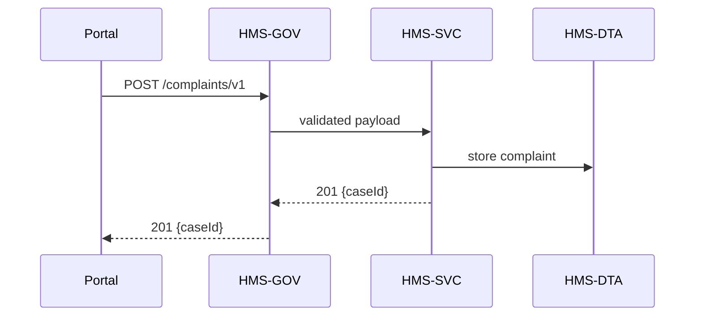

# Chapter 8: Core Backend API Layer (HMS-SVC)

[← Back to Chapter&nbsp;7: Agent Orchestration Service (HMS-ACT)](07_agent_orchestration_service__hms_act__.md)

> “If the platform were a city, HMS-SVC would be the power grid.”

---

## 1. Why Do We Need HMS-SVC?

So far you have seen requests walk through:

1. Governance checks ([HMS-GOV](01_governance_layer__hms_gov__.md))  
2. Policy evaluation ([HMS-CDF](02_policy_codification_engine__hms_cdf__.md))  
3. Legal vetting, agents, orchestration …  

…but eventually **some server must actually do the work**—validate data, compute results, and save them.  
That server tier is **HMS-SVC**.

### Starter Use-Case – “File an Accessibility Complaint”

A citizen reports that a federal website is not screen-reader friendly:

1. The web portal sends `POST /complaints` to HMS-GOV.  
2. After all policy checks, GOV forwards the call to HMS-SVC.  
3. SVC validates the payload, assigns a case number, and stores it.  
4. It returns `201 Created` and publishes an event so agents can follow-up.

We will build this end-to-end with **18 lines of code**.

---

## 2. Key Concepts (Beginner Friendly)

| Term           | Analogy                           | One-Line Job                                          |
|----------------|-----------------------------------|-------------------------------------------------------|
| Service Facade | Restaurant menu                   | Gives clients a single, predictable set of endpoints. |
| Domain Service | Chef in the kitchen               | Knows the recipe (business rules) for its data.       |
| Versioning     | Menu edition # vs. #              | Lets GOV route `v1` and `v2` calls side-by-side.      |
| Throttling     | “Please wait to be seated” sign   | Stops any user from overloading the service.          |
| Service Mesh   | Underground cable grid            | Connects dozens of services securely, with retries.   |

---

## 3. Talking to HMS-SVC (Client-Side)

Below is a super-small portal call (`complaintClient.js`, 12 lines).

```js
// complaintClient.js
import axios from 'axios';

export async function fileComplaint(data){
  const res = await axios.post('https://api.gov/complaints/v1', data, {
    headers:{ 'x-api-key':'PORTAL123' }
  });
  console.log('Case #', res.data.caseId);
}
```

What will happen?

1. The request first hits HMS-GOV.  
2. After policy & legal guards, it is forwarded to SVC.  
3. SVC creates `caseId = CMP-2024-00042` and returns JSON.

---

## 4. Implementing the Endpoint (Service-Side) — 18 Lines

```js
// services/complaintSvc.js
import express from 'express';                 // 1
const app = express(); app.use(express.json());// 2

// --- Middleware: basic throttling (5 req/min/IP) ---
const hits = new Map();
app.use((req,res,next)=>{
  const ip = req.ip;                           // 6
  const now = Date.now();                      // 7
  hits.set(ip, (hits.get(ip)||[]).filter(t=>now-t<60_000).concat(now));
  if(hits.get(ip).length>5)                    // 9
     return res.status(429).send('Slow down'); // 10
  next();                                      // 11
});

// --- Main route ---
app.post('/complaints/v1', (req,res)=>{
  const {email, description} = req.body;       // 14
  if(!email || !description)                   // 15
     return res.status(400).send('Bad input');
  const caseId = 'CMP-' + Date.now();          // 17
  // TODO: save to DB + publish event (skipped)
  res.status(201).json({caseId});              // 19
});

app.listen(4000, ()=>console.log('SVC on 4000'));
```

Explanation (short):

• Lines 6-11 ‒ naive per-IP throttling.  
• Lines 14-17 ‒ minimal validation & ID creation.  
• Line 19 ‒ returns `201 Created`.

---

## 5. What Happens Under the Hood?



1. GOV forwards only after policy, legal, and rate checks pass.  
2. SVC runs its own business validation + throttling.  
3. Data persists via [Data Hub & Analytics Engine (HMS-DTA)](09_data_hub___analytics_engine__hms_dta__.md).  
4. Response travels back the same route.

---

## 6. Inside HMS-SVC (Folder Peek)

```
/hms-svc
 ├─ services/
 │    └─ complaintSvc.js      # you just saw it
 ├─ mesh/
 │    └─ envoy.yaml           # traffic, retries, mTLS
 ├─ libs/
 │    └─ validators.js        # shared Joi schemas
 └─ README.md
```

### 6.1 Shared Validator (10 Lines)

```js
// libs/validators.js
import Joi from 'joi';
export const complaintSchema = Joi.object({
  email       : Joi.string().email().required(),
  description : Joi.string().min(20).max(2000).required()
});
```

Each micro-service imports this schema to stay consistent.

### 6.2 Service Mesh Snippet (envoy.yaml, 8 Lines)

```yaml
# envoy.yaml (excerpt)
apiVersion: v1
kind: Service
metadata: { name: complaint-svc }
spec:
  connectTimeout: 2s
  retries: { attempts: 3, perTryTimeout: 1s }
  tls: { mode: STRICT }
```

Outcome: if the DB hiccups, the mesh retries automatically; all traffic is mTLS-encrypted.

---

## 7. Versioning & Deprecation in 3 Steps

1. Keep old handler alive: `/complaints/v1`.  
2. Add new one: `/complaints/v2` (maybe requires a file upload).  
3. In **HMS-GOV** you write a single policy rule:

```yaml
# gov_version_redirect.rule.yml
if api = "/complaints/*" and header("API-Version") = "2" then
     route_to "/complaints/v2"
```

No portal changes until clients opt-in.

---

## 8. Common Questions

**Q: How is this different from HMS-GOV’s API gateway?**  
Gateway = door; SVC = entire building behind the door.

**Q: Can I call SVC from outside without GOV?**  
No. Private network only. All public calls **must** enter through [HMS-GOV](01_governance_layer__hms_gov__.md).

**Q: REST vs. gRPC?**  
Both are supported. REST for browsers, gRPC for high-throughput internal calls.  
Just expose two façades that talk to the same domain logic.

---

## 9. Key Takeaways

• HMS-SVC hosts **all core business logic**: validations, calculations, transforms.  
• Think of it as a **mesh of tiny micro-services**, each owning one domain (complaints, loans, health claims…).  
• Built-in throttling, versioning, and mTLS keep traffic safe and stable.  
• Other layers (GOV, CDF, ESQ, ACT) focus on policy, legality, and orchestration—SVC does the **work**.

---

### Up Next

Data just landed in the database—how do analysts, auditors, and dashboards crunch it?  
Time to explore the [Data Hub & Analytics Engine (HMS-DTA)](09_data_hub___analytics_engine__hms_dta__.md).

---

Generated by [AI Codebase Knowledge Builder](https://github.com/The-Pocket/Tutorial-Codebase-Knowledge)