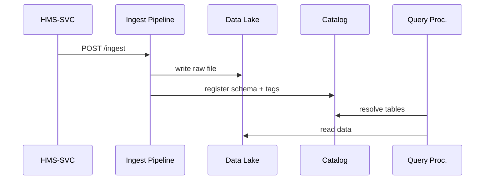

# Chapter 9: Data Hub & Analytics Engine (HMS-DTA)

[← Back to Chapter 8: Core Backend API Layer (HMS-SVC)](08_core_backend_api_layer__hms_svc__.md)

> “The evidence locker, library, and coffee machine for every byte that enters HMS-SCM.”

---

## 1. Why Do We Need HMS-DTA?

Imagine a single veteran, **Sergeant Lee**, who:

1. Submits **Form 22-1990** for education benefits.  
2. Uploads a DD-214 PDF.  
3. Calls the hotline twice (calls are transcribed).  
4. Lives near an EPA air-quality sensor whose data affects housing eligibility.

All four artifacts eventually land in **HMS-DTA**—the engine room where:

* The PDF is OCR-indexed.  
* Phone transcripts are tagged as audio → text lineage.  
* Sensor readings stream in as time-series.  
* Every row is stamped with policy lineage and PII flags.

To a newcomer it feels like “the database.”  
To specialists it’s a **polyglot data lake** that keeps versions, tracks provenance, and answers real-time queries for AI agents and auditors alike.

---

## 2. Key Concepts (Beginner Friendly)

| Term | City-Hall Analogy | One-Line Job |
|------|------------------|--------------|
| Data Lake | City archive basement | Stores every file in raw form |
| Ingest Pipeline | Mailroom clerk | Converts incoming envelopes into shelved boxes |
| Catalog | Card catalog drawers | Lets you find “all claims filed on 2024-05-01” |
| Lineage Graph | Chain-of-custody ledger | Shows how data moved & changed |
| PII Tag | Red “top secret” sticker | Flags Social Security Numbers, addresses, etc. |
| Stream View | Live CCTV feed | Query the most recent events in seconds |

---

## 3. Starter Use-Case – “Find Delayed Claims”

Goal: Identify any education-benefit claim that has sat **>30 days** without decision.

We’ll:

1. Ingest a new claim record.  
2. Run a simple SQL-ish query to list overdue items.

### 3.1 Ingesting a Claim (18 lines)

```js
// ingestClaim.js
import axios from 'axios';

async function ingest(claim){
  const payload = {
     _schema : 'edu_claim_v1',
     data    : claim,
     meta    : { source:'HMS-SVC', lineage:['/claims/api'] }
  };
  await axios.post('http://dta/ingest', payload);
  console.log('📥 Stored claim', claim.claimId);
}

ingest({ claimId:'C-1001', veteranId:'VET42', filedOn:'2024-04-01' });
```

What happens?

1. We wrap the record with a schema label and a tiny lineage array.  
2. POST `/ingest` tells DTA’s mailroom to validate, tag PII, and drop the JSON into the lake.  
3. A “stored” event is pushed to the internal event bus so dashboards update instantly.

---

### 3.2 Querying Overdue Claims (14 lines)

```js
// overdueQuery.js
import axios from 'axios';

const sql = `
  SELECT claimId, filedOn
  FROM edu_claim_v1
  WHERE status = 'pending'
    AND datediff('day', filedOn, now()) > 30
`;

const { data: rows } = await axios.post('http://dta/query', { sql });
rows.forEach(r => console.log('⚠️  Overdue', r.claimId));
```

Explanation:

* The `/query` endpoint speaks a familiar SQL-flavoured dialect—even if the underlying store is a mix of S3, Postgres, and Kafka.  
* `datediff` is a built-in function; no fancy window functions required for beginners.  
* Query results arrive as plain JSON.

---

## 4. What Happens Under the Hood?



1. Service writes to **Ingest Pipeline**.  
2. Pipeline stores bytes in the lake and updates the **Catalog**.  
3. When someone runs a query, **Query Processing** checks the catalog for locations and pushes computation to the right engine (Spark, DuckDB, etc.).  
4. Every step emits lineage events to the **Lineage Graph** for audits.

---

## 5. A Peek Inside the Code Base

```
/hms-dta
 ├─ ingest/
 │    └─ handler.js
 ├─ catalog/
 │    └─ schemas.json
 ├─ lineage/
 │    └─ graph.js
 ├─ query/
 │    ├─ router.js
 │    └─ engines/
 │         ├─ duck.js
 │         └─ spark.js
 └─ README.md
```

### 5.1 Ingest Tagging (16 lines)

```js
// ingest/handler.js  (simplified)
import { detectPII } from './pii.js';
import { addNode }   from '../lineage/graph.js';

export async function ingest(req, res){
  let { _schema, data, meta } = req.body;

  if(detectPII(data))          // flag but still store
     meta.tags = (meta.tags||[]).concat('PII');

  const path = `/raw/${_schema}/${Date.now()}.json`;
  await lake.put(path, JSON.stringify(data));  // S3 write

  addNode({ path, ...meta });  // lineage graph
  res.status(202).send('stored');
}
```

Walk-through:

1. `detectPII` scans for SSNs & emails.  
2. File is written to an object store.  
3. `addNode` saves provenance (source, time, PII flag) in the lineage graph.

### 5.2 Tiny Lineage Lookup (12 lines)

```js
// lineage/graph.js  (toy graph)
const edges = [];   // [{from,to,ts}]

export function addNode(node){
  edges.push({from:node.source, to:node.path, ts:Date.now()});
}

export function trail(path){
  return edges.filter(e => e.to === path);
}
```

Analysts can later call `trail('/raw/edu_claim_v1/171245.json')` and see every hop—perfect for FOIA or Inspector General audits.

---

## 6. Frequently Asked Questions

**Q: PostgreSQL? S3? Parquet? Do I need to care?**  
Not at first. `/ingest` and `/query` hide storage details. Choose the right engine later without touching client code.

**Q: Can agents stream live data?**  
Yes. Publish to the `edu_claim_v1_stream`; DTA automatically exposes it as a “Stream View” that supports `SELECT * FROM .. ORDER BY ts DESC LIMIT 10`.

**Q: How is PII protected?**  
PII fields are salted & tokenised on ingest. Only authorised roles (validated by [HMS-GOV](01_governance_layer__hms_gov__.md)) may de-tokenise.

**Q: What if a schema changes?**  
Register `edu_claim_v2`. DTA stores both, and catalog views can UNION them if desired. No downtime.

---

## 7. Key Takeaways

• HMS-DTA is the **single source of truth**—raw files in, rich queries out.  
• Ingest, Catalog, Lineage, and Query are four simple services that beginners can reason about.  
• Versioned schemas prevent data pile-ups; PII tags keep auditors happy.  
• Agents, dashboards, and regulators all ask the same `/query` endpoint, guaranteeing consistency.

---

### Up Next

Now that every agency can store and analyse data in one place, we must **share** some of that data with other departments—securely and verifiably.  
Enter [Secure Inter-Agency Communication (HMS-A2A)](10_secure_inter_agency_communication__hms_a2a__.md).

---

Generated by [AI Codebase Knowledge Builder](https://github.com/The-Pocket/Tutorial-Codebase-Knowledge)