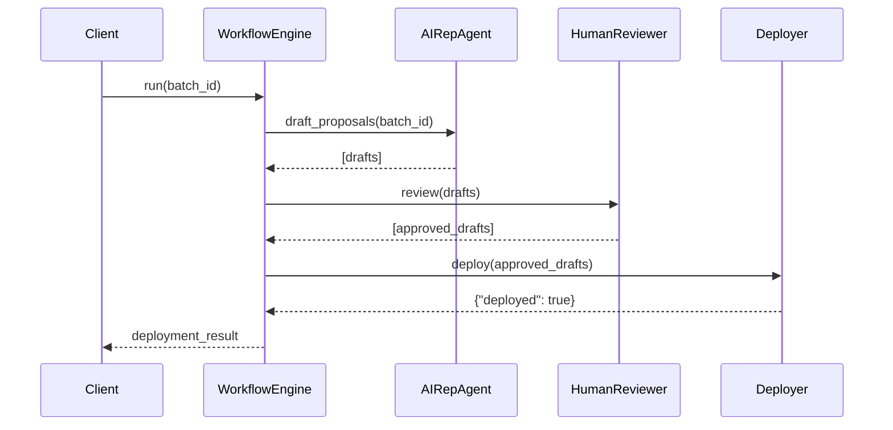

# Chapter 9: Process Optimization Workflow

In the previous chapter, we met our autonomous policy analyst in the [AI Representative Agent](08_ai_representative_agent_.md). Now we’ll see how a **structured workflow** takes a citizen complaint all the way through drafting, review, deployment, and oversight—just like how a bill becomes law in Congress.

## Why a Process Optimization Workflow?

Imagine a federal benefits office gets a flood of complaints:  
> “I waited three weeks and never heard back!”  

That’s like a bill introduced in the House. It needs debate, amendments, and a signature to become policy. Our **Process Optimization Workflow** automates that journey:

1. **Complaint Intake** (“bill introduced”)  
2. **AI Proposal Drafting** (“committee debate”)  
3. **Human Review & Amendment** (“floor amendments”)  
4. **Approval & Deployment** (“signed into law”)  
5. **Metrics Tracking** (“oversight and audits”)

This ensures every complaint leads to measurable system improvements—and we can track its impact.

## Central Use Case

A state agency portal logs complaints about slow grant reviews. We want to:

1. Collect new complaints daily.  
2. Let our [AI Representative Agent](08_ai_representative_agent_.md) draft proposals.  
3. Send drafts to a human reviewer for tweaks.  
4. Deploy approved changes to the process engine.  
5. Monitor metrics (e.g., average review time) to confirm improvements.

By the end of this chapter, you’ll see how to wire these pieces into one easy-to-use workflow.

## Key Concepts

1. **Complaint Intake**  
   Where user feedback is collected and queued.

2. **AI Drafting**  
   Our agent turns trends into draft proposals.

3. **Human Review**  
   A staff member inspects and adjusts drafts.

4. **Deployment**  
   Approved proposals update live policies.

5. **Metrics Tracking**  
   Ongoing measurement of performance before and after changes.

## Using the Workflow

Here’s how a client script kicks off the optimization:

```python
# run_workflow.py
from process_optimization_workflow import ProcessOptimizationWorkflow

workflow = ProcessOptimizationWorkflow()

result = workflow.run({
    "batch_id": "CMP-2024-15",
    "description": "Slow review complaints"
})
print(result)
# -> {"status": "deployed", "proposal_id": "PR-102", "metrics": {...}}
```

Explanation:

- We pass a batch of complaints (`batch_id`).
- `run()` executes all steps.
- The result shows deployment status, a proposal ID, and updated metrics.

## What Happens Under the Hood?



1. **Client** calls the workflow with a complaint batch.  
2. **WorkflowEngine** asks the **AIRepAgent** for draft proposals.  
3. Drafts go to **HumanReviewer** for edits.  
4. **Deployer** applies approved changes.  
5. Workflow returns the final deployment result.

## Inside the Code

### File: process_optimization_workflow.py

```python
# process_optimization_workflow.py

from workflow_engine import WorkflowEngine

class ProcessOptimizationWorkflow:
    def __init__(self):
        self.engine = WorkflowEngine()

    def run(self, params):
        # 1. Draft, 2. Review, 3. Deploy, 4. Track
        return self.engine.execute(params["batch_id"])
```

Explanation:  
- We wrap our `WorkflowEngine` in a friendly class.  
- `run()` just passes the complaint batch ID and returns the full result.

### File: workflow_engine.py

```python
# workflow_engine.py

from ai_rep_agent import AIRepresentativeAgent
from human_review import HumanReviewer
from deployer import Deployer
from metrics import MetricsTracker

class WorkflowEngine:
    def __init__(self):
        self.ai      = AIRepresentativeAgent()
        self.review  = HumanReviewer()
        self.deploy  = Deployer()
        self.metrics = MetricsTracker()

    def execute(self, batch_id):
        drafts  = self.ai.generate_recommendations(self.ai.load_feedback(batch_id))
        approved = self.review.inspect(drafts)
        deploy_res = self.deploy.apply(approved)
        stats = self.metrics.compare(batch_id)
        return {"status": deploy_res["ok"],
                "proposal_id": approved[0]["id"],
                "metrics": stats}
```

Explanation:  
- We fetch feedback, draft proposals, review them, deploy, then track metrics.  
- The final dict combines all results.

### File: human_review.py

```python
# human_review.py

class HumanReviewer:
    def inspect(self, drafts):
        # In a real app, show a UI for edits
        for d in drafts:
            d["title"] += " (Reviewed)"
        return drafts
```

Explanation:  
- A stub that “reviews” by appending text. In practice, a user would approve or edit.

### File: deployer.py

```python
# deployer.py

class Deployer:
    def apply(self, approved_drafts):
        # Apply each proposal to your process engine
        for d in approved_drafts:
            print(f"Deploying {d['id']}")
        return {"ok": True}
```

Explanation:  
- Simulates deploying proposals. Real code would call your policy API.

### File: metrics.py

```python
# metrics.py

class MetricsTracker:
    def compare(self, batch_id):
        # Compare average review time before vs after
        return {"before_days": 7, "after_days": 3}
```

Explanation:  
- Returns dummy metrics. In reality, you’d query your monitoring system.

## Conclusion

You’ve learned how the **Process Optimization Workflow** shepherds user complaints from intake through AI drafting, human review, deployment, and metrics tracking—much like a bill becoming law with ongoing oversight. In the next chapter, we’ll bring humans directly into AI loops in our [Human-in-the-Loop (HITL) Mechanism](10_human_in_the_loop__hitl__mechanism_.md). Happy optimizing!

---

Generated by [AI Codebase Knowledge Builder](https://github.com/The-Pocket/Tutorial-Codebase-Knowledge)