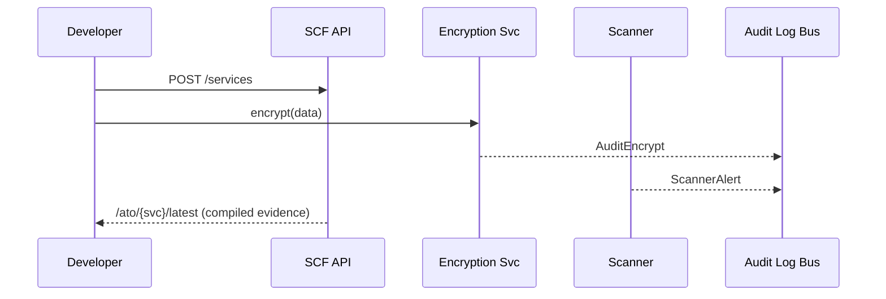

# Chapter 9: Security & Compliance Framework
*Coming from [Monitoring, Telemetry, and KPIs](08_monitoring__telemetry__and_kpis_.md).*

---

## 1. Why Do We Need “Digital Guard-Rails”? – A 90-Second Story  
The **Department of Education** wants to launch a new microservice called **“Student-Aid Calculator.”**  
Before a single student can click *“Submit”*, federal rules demand that:

1. All data at-rest is encrypted (HIPAA §164.306).  
2. Only authorized staff can view logs (CJIS 5.4).  
3. Vulnerability scans run **continuously** (FedRAMP RA-5).  
4. Evidence for an *Authority-to-Operate (ATO)* package is ready for auditors.

If each development team hand-codes these requirements, mistakes are guaranteed.  
The **Security & Compliance Framework (SCF)** acts like the platform’s **immune system**—guard-rails that *every* service automatically inherits.

---

## 2. Mental Model (Beginner-Friendly Table)

| Everyday Analogy | SCF Component | One-Sentence Role |
|------------------|--------------|-------------------|
| Lockable filing cabinet | **Encryption Service** | Seamlessly encrypts / decrypts data fields. |
| Nightly building patrol | **Continuous Scanner** | Looks for outdated libraries & open ports 24/7. |
| Police incident log | **Audit Log Bus** | Immutable stream of “who did what, when.” |
| Legal cross-reference book | **Control Library** | Maps each guard-rail to FedRAMP, HIPAA, CJIS IDs. |
| Pre-filled tax form | **ATO Artifact Generator** | Auto-builds PDF/JSON evidence for auditors. |

Keep these five pieces in mind—everything else plugs into them.

---

## 3. Guided Walk-Through: Securing “Student-Aid Calculator”

We will:

1. Register the new service with SCF.  
2. Store sensitive data using the Encryption Service.  
3. Watch the Continuous Scanner catch an outdated package.  
4. Generate an ATO evidence bundle—all in **< 60 lines** total.

### 3.1 Step 1 – Register the Service

```python
# register_service.py
import requests
svc = {
  "name": "student-aid-calculator",
  "owner": "doe@ed.gov",
  "dataSensitivity": "pii",
  "controls": ["encrypt-at-rest", "audit-log", "daily-scan"]
}
r = requests.post("https://scf.hms.gov/services", json=svc)
print(r.json())        # ➜ {"serviceId": "SVC-2101"}
```
**What happened?**  
SCF creates an entry and attaches the **Control Library** rules that match “pii”.

---

### 3.2 Step 2 – Store Data Securely

```python
# calc_service.py  (snippet in the microservice)
from scf_sdk import encrypt, audit

def save_income(ssn: str, income: int):
    row = {
       "ssn_enc": encrypt(ssn),   # transparently uses KMS key
       "income": income
    }
    DB.insert(row)
    audit("SAVE_INCOME", row_id=row["ssn_enc"])
```
**Why only two helper calls?**  
• `encrypt()` hides KMS keys & rotation logic.  
• `audit()` pushes an event to the **Audit Log Bus**.

---

### 3.3 Step 3 – Continuous Scanner Flags a Risk

```python
# console output (no code to write)
[SCAN] student-aid-calculator
 └─ CVE-2023-12345 detected in requests==2.19.0  → severity HIGH
```
**Behind the curtain** the scanner container pulled your image, ran `trivy`, and pushed a `ScannerAlert` event.

---

### 3.4 Step 4 – Generate ATO Evidence

```python
# fetch_evidence.py
bundle = requests.get(
  "https://scf.hms.gov/ato/SVC-2101/latest").json()
print(bundle.keys())   # dict_keys(['controls', 'scanReport', 'encryption', 'logs'])
```
You now have a **zip/JSON** that an ISSO can drop straight into the FedRAMP package—no screenshots, no Excel sheets.

---

## 4. What Happens Under the Hood?


Five actors, one simple flow.

---

## 5. Deep-Dive: Minimal Internal Code

### 5.1 Control Library (file: `controls.py`, 15 lines)

```python
CONTROLS = {
  "encrypt-at-rest": {
     "refs": ["FedRAMP SC-13", "HIPAA 164.312"],
     "enforce": lambda data: data.startswith("enc:")
  },
  "audit-log":      {"refs": ["CJIS 5.4"], "enforce": None},
  "daily-scan":     {"refs": ["FedRAMP RA-5"], "enforce": None}
}

def list_for(sensitivity):
    base = ["audit-log", "daily-scan"]
    if sensitivity == "pii": base.append("encrypt-at-rest")
    return base
```
• Maps friendly IDs to official citations.  
• `list_for()` decides which controls attach to a service.

---

### 5.2 Encryption Service Stub (file: `enc.py`, 12 lines)

```python
KEY = "KMS:abc123"          # pretend KMS key ARN

def encrypt(raw: str) -> str:
    from base64 import b64encode
    cipher = b64encode(raw.encode()).decode()
    _audit("ENCRYPT", size=len(raw))
    return "enc:" + cipher

def decrypt(enc: str) -> str:
    from base64 import b64decode
    return b64decode(enc[4:]).decode()

def _audit(action, **meta):
    print({"type":action, **meta})   # ships to Audit Log Bus
```
Under 15 lines: Base64 stands in for real AES; focus is on the *pattern*.

---

### 5.3 Continuous Scanner Scheduler (file: `scanner.py`, 18 lines)

```python
import subprocess, time, json, requests
SERVICES = requests.get("https://scf.hms.gov/services").json()

while True:
    for s in SERVICES:
        img = f"registry/{s['name']}:latest"
        result = subprocess.run(["trivy","-q",img], capture_output=True)
        alerts = _parse(result.stdout.decode())
        if alerts:
            requests.post("https://scf.hms.gov/alerts",
                          json={"svc":s['name'], "alerts":alerts})
    time.sleep(86400)     # daily
```
Real scanners are bigger; this demo just calls `trivy` and forwards JSON.

---

### 5.4 ATO Artifact Generator (file: `ato.py`, 14 lines)

```python
def build_bundle(svc_id):
    svc = DB.services[svc_id]
    bundle = {
      "controls": {c: CONTROLS[c]["refs"] for c in svc["controls"]},
      "scanReport": DB.scans.get(svc_id, []),
      "encryption": {"kmsKey": KEY},
      "logs": DB.audit.get(svc_id, [])
    }
    return bundle
```
Called when `/ato/{svc}/latest` is requested.

---

## 6. Extending the Guard-Rails (For Experts)

1. **Add a New Control**  
   ```python
   CONTROLS["s3-bucket-public-block"] = {
     "refs": ["FedRAMP AC-3"], "enforce": check_bucket_policy
   }
   ```
2. SCF will automatically attach it to every service flagged `storage="s3"` and include its evidence in the next ATO bundle.

---

## 7. Debugging & Best Practices

* **Fail Closed** – If encryption key lookup fails, raise an exception; never write plaintext.  
* **Tag Audit Events** with `serviceId` and `controlId` for easy searching.  
* **Avoid Alert-Fatigue** – Group scanner findings; one email per day > 100 per hour.  
* **Version Controls** – Store `controls.py` under [Change Management & Versioning](04_change_management___versioning_.md).  
* **Use RBAC** – Only security staff can fetch `/ato/*`—more in the next chapter!

---

## 8. Recap  
• The SCF provides **built-in guard-rails**: encryption, scanning, audit logging, and ready-made ATO evidence.  
• Developers add *one import* and *one registration call*; compliance artifacts flow automatically.  
• Internally, a tiny Control Library maps every rule to FedRAMP, HIPAA, and CJIS citations—auditors love it.

Ready to decide **who** can view or modify these protected resources?  
Head over to [Role-Based Access Control (RBAC)](10_role_based_access_control__rbac__.md).

---

Generated by [AI Codebase Knowledge Builder](https://github.com/The-Pocket/Tutorial-Codebase-Knowledge)