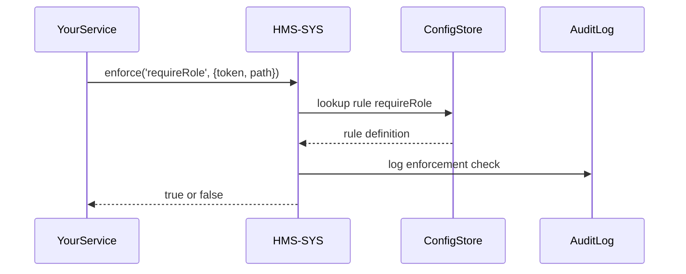

# Chapter 10: Governance Layer (HMS-SYS)

In [Chapter 9: AI Governance Framework](09_ai_governance_framework_.md) we saw how AI outputs are checked for ethics and privacy. Now let’s zoom out to the entire HMS-SCM platform’s “city hall”—the **Governance Layer (HMS-SYS)**. This layer sets global policies, security rules, and system-wide settings that every downstream service must obey.

---

## 1. Why the Governance Layer?

Imagine the U.S. Department of Health and Human Services (HHS) is rolling out a telemedicine data portal. They need to ensure:

- **All** services use the same encryption standard.  
- Health records stay private in every subsystem.  
- Auditors can see who changed system settings and when.  

Without a central “city hall,” each microservice might pick its own rules—leading to confusion, security holes, and compliance failures. HMS-SYS is that city hall: it defines and enforces global policies so every part of HMS-SCM behaves consistently.

---

## 2. Key Concepts

1. Global Policy Enforcement  
   A central store of rules (e.g., “PII must be masked in logs”).  

2. Security Rules  
   System-wide checks (e.g., “All APIs require TLS and role-based tokens”).  

3. System-Wide Configuration  
   Shared settings (e.g., default timeouts, feature flags).  

4. Transparency & Audit  
   Immutable logs of policy changes, who made them, and when.  

5. Compliance Standards  
   Standards like FISMA, HIPAA, or GDPR encoded as policies.

---

## 3. How to Use the Governance Layer

Below are minimal examples showing how a service can register policies, enforce security rules, and read configs from HMS-SYS.

### 3.1 Register a Global Policy

File: `src/services/policyRegistry.js`
```js
const registry = require('./governanceClient')

// Define a new policy
registry.registerPolicy('maskPII', {
  description: 'Mask any personal data in logs',
  rule: record => {
    // simple mask for SSN-like patterns
    return record.replace(/\d{3}-\d{2}-\d{4}/g, '***-**-****')
  }
})
```
This tells HMS-SYS: “Whenever a log record passes through, apply `maskPII`.”

### 3.2 Enforce a Security Rule in Your Service

File: `src/services/authService.js`
```js
const gov = require('./governanceClient')

async function checkRequest(req) {
  // ask HMS-SYS if this token is allowed for this path
  const allowed = await gov.enforce('requireRole', {
    token: req.headers.authorization,
    path: req.path
  })
  if (!allowed) throw new Error('Access denied by global policy')
}
```
Here we call `enforce('requireRole', params)` to apply a system-wide role check.

### 3.3 Read a System-Wide Configuration

File: `src/index.js`
```js
const gov = require('./governanceClient')

async function startApp() {
  // load feature flags and defaults
  const config = await gov.getConfig('serviceTimeouts')
  console.log('Timeouts:', config)  // e.g. { api:5000, db:10000 }
}
startApp()
```
This fetches the shared `serviceTimeouts` object for consistent timeouts across services.

---

## 4. What Happens Under the Hood?



1. Your service calls `GOV.enforce`.  
2. HMS-SYS loads the rule from its store.  
3. It logs the check for auditors.  
4. Returns the result to your service.

---

## 5. Under the Hood: Implementation Sketch

### 5.1 In-Memory Policy Store

File: `server/services/sysPolicyService.js`
```js
const policies = {}

// Register a policy
function registerPolicy(name, def) {
  policies[name] = def
}

// Retrieve a policy
function getPolicy(name) {
  return policies[name]
}

module.exports = { registerPolicy, getPolicy }
```

### 5.2 Enforcement Service

File: `server/services/enforcementService.js`
```js
const { getPolicy } = require('./sysPolicyService')
const audit = require('./auditService')

async function enforce(name, params) {
  const policy = getPolicy(name)
  const result = await policy.rule(params)
  await audit.log({ policy: name, params, result })
  return result
}

module.exports = { enforce }
```

### 5.3 Exposing a REST API

File: `server/routes/sys.js`
```js
const express = require('express')
const { enforce } = require('../services/enforcementService')
const { getConfig } = require('../services/configService')
const router = express.Router()

router.post('/enforce/:policy', async (req, res) => {
  const result = await enforce(req.params.policy, req.body)
  res.json({ allowed: result })
})

router.get('/config/:key', async (req, res) => {
  const value = await getConfig(req.params.key)
  res.json(value)
})

module.exports = router
```

---

## Conclusion

In this chapter you learned how the **Governance Layer (HMS-SYS)**:

- Registers and enforces global policies and security rules  
- Provides shared configurations to every service  
- Logs every enforcement action for full transparency  

Next up, we’ll see how humans fit into these workflows in [Human-In-The-Loop Workflow](11_human_in_the_loop_workflow_.md).

---

Generated by [AI Codebase Knowledge Builder](https://github.com/The-Pocket/Tutorial-Codebase-Knowledge)