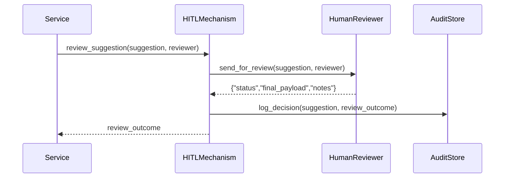

# Chapter 10: Human-in-the-Loop (HITL) Mechanism

In [Chapter 9: Process Optimization Workflow](09_process_optimization_workflow_.md) we built an end-to-end flow that drafts, reviews, deploys, and measures policy changes. Now we add a formal **Human-in-the-Loop (HITL) Mechanism** so every AI suggestion or automated change is vetted, tweaked, and finally ratified by a real decision-maker—just like how Congress reviews and can veto executive actions.

## Why Do We Need a HITL Mechanism?

Imagine an AI service auto-approves urgent housing grants for veterans. We still need a housing official to verify each case before funds disburse:

- Preserve accountability: an official signs off.
- Maintain control: humans can override or adjust AI text.
- Create audit trails: who approved what and when.

Without HITL, we risk unreviewed automation and lose trust.

## Central Use Case

A disaster-relief AI engine flags 100 applications as “urgent.” Instead of mass-approving, the system uses HITL:

1. AI emits a list of urgent suggestions.  
2. HITL Mechanism routes each suggestion to a case officer.  
3. Officer reviews, adds comments, then approves or rejects.  
4. Final decisions are applied and logged.

## Key Concepts

1. **Override Path**  
   The route suggestions take to reach a human reviewer instead of auto-applying.

2. **Approval Path**  
   Once reviewed, approved items flow back into execution (e.g., payment, notification).

3. **Accountability**  
   Every decision attaches a reviewer ID and timestamp.

4. **Audit Trail**  
   Logs each original suggestion, reviewer edits, final status, and notes.

## Using the HITL Mechanism

Here’s how a service might hand off an AI suggestion to HITL:

```python
# app.py
from hitl import HumanInTheLoopMechanism

hitl = HumanInTheLoopMechanism()

suggestion = {
    "id": "S-001",
    "type": "expedite_grant",
    "payload": {"app_id": "GR-2024-15", "reason": "Hurricane damage"}
}

result = hitl.review_suggestion(suggestion, reviewer="Officer-007")
print(result)
# -> {
#      "id": "S-001",
#      "status": "approved",
#      "reviewer": "Officer-007",
#      "final_payload": {...},
#      "notes": "Looks good"
#    }
```

Explanation:
- We create `HumanInTheLoopMechanism`.
- Call `review_suggestion` with the AI’s suggestion and a reviewer ID.
- We get back the final decision, the reviewer, and any notes or edits.

## What Happens Under the Hood?



1. **Service** calls the HITL Mechanism.  
2. HITL forwards the suggestion to a **HumanReviewer** (UI or email).  
3. Reviewer returns a decision object.  
4. HITL logs everything in an **AuditStore**.  
5. Final outcome returns to the service.

## Inside the Code

Below are the key files and minimal implementations.

### File: hitl.py

```python
# hitl.py
from human_reviewer import HumanReviewer
from audit_store import AuditStore

class HumanInTheLoopMechanism:
    def __init__(self):
        self.reviewer = HumanReviewer()
        self.audit    = AuditStore()

    def review_suggestion(self, suggestion, reviewer):
        # 1. Send to human
        outcome = self.reviewer.review(suggestion, reviewer)
        # 2. Log for audit
        self.audit.log(suggestion, outcome)
        # 3. Return final decision
        return outcome
```

Explanation:
- We compose a `HumanReviewer` and an `AuditStore`.
- `review_suggestion` ties them together: send, log, and return.

### File: human_reviewer.py

```python
# human_reviewer.py
class HumanReviewer:
    def review(self, suggestion, reviewer):
        # In real use, present UI and wait for input.
        # Here we simulate approval with no edits.
        return {
          "id": suggestion["id"],
          "status": "approved",
          "reviewer": reviewer,
          "final_payload": suggestion["payload"],
          "notes": "Auto-approved by simulation"
        }
```

Explanation:
- Stub that “reviews” by auto-approving. In production, this invokes a form or email workflow.

### File: audit_store.py

```python
# audit_store.py
import datetime

class AuditStore:
    def log(self, suggestion, outcome):
        record = {
          "suggestion_id": suggestion["id"],
          "timestamp": datetime.datetime.utcnow().isoformat(),
          "suggestion": suggestion,
          "outcome": outcome
        }
        # In real life, write to database or append to a log file.
        print("AUDIT LOG:", record)
```

Explanation:
- Creates a simple audit record with timestamp and prints it. Replace with real storage.

## Conclusion

You’ve learned how the **Human-in-the-Loop Mechanism** ensures AI suggestions are vetted and approved by real decision-makers, preserving accountability and authority. Next up, we’ll see how to keep HMS-SCM in sync with outside systems in [External System Synchronization](11_external_system_synchronization_.md).

---

Generated by [AI Codebase Knowledge Builder](https://github.com/The-Pocket/Tutorial-Codebase-Knowledge)