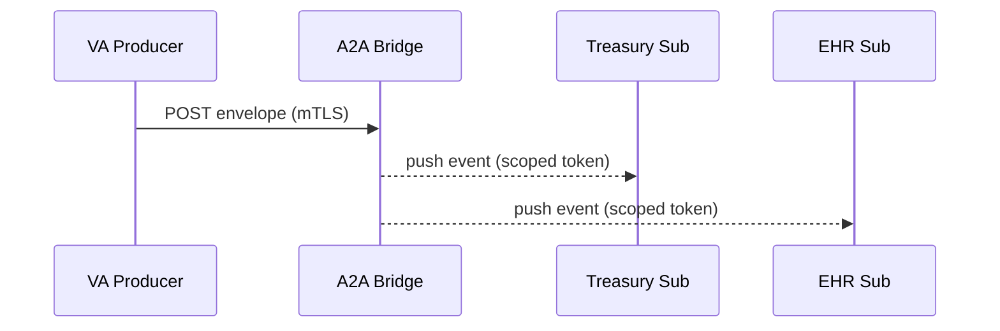

# Chapter 10: Secure Inter-Agency Communication (HMS-A2A)

[← Back to Chapter&nbsp;9: Data Hub & Analytics Engine](09_data_hub___analytics_engine__hms_dta__.md)

> “From siloed departments to a single, secure whisper-net.”

---

## 1. Why Do We Need HMS-A2A?

Picture a routine—but legally sensitive—event:

1. A **VA hospital** reschedules Sergeant Lee’s knee-surgery from May 3 to May 10.  
2. That change must *instantly* reach an **outside EHR vendor**, the **Treasury payment queue** (to delay travel reimbursement), and the **Education Department** (so GI-Bill tutors know Lee is unavailable).

E-mail? Too slow. Open internet? Too risky.  
**HMS-A2A** is the encrypted courier that:

* Opens a **zero-trust tunnel** between agencies.  
* Performs **mutual attestation** (both ends prove who they are).  
* Carries **fine-grained access tokens** right inside every event.

To a newcomer it feels like “VPN + API.”  
To experts it’s “mTLS + hardware keys + event bus security policies.”

---

## 2. Key Concepts (Beginner Friendly)

| Term | City-Hall Analogy | One-Line Job |
|------|------------------|--------------|
| Secure Tunnel | Armored mail truck | Encrypts bytes in motion |
| Mutual Attestation | Two clerks exchanging badges | Each side proves identity *before* data flows |
| Access Token | Color-coded mailbag | Limits which topics or records you can touch |
| A2A Envelope | Address label on each parcel | States sender, receiver, scope, and signature |
| Event Bridge | Central sorting hub | Routes envelopes to subscribed agencies |

Keep these five concepts in mind—the rest is wiring.

---

## 3. Starter Use-Case: “Surgery Reschedule” Event

Goal: Push a **`surgery.rescheduled`** event from the VA hospital system to:

* Department of Treasury (delay payment)  
* External EHR vendor (update calendar)

We will:

1. Create an A2A envelope.  
2. Send it over the tunnel.  
3. Watch subscribers receive it.

---

### 3.1 Producer Code (VA Hospital) – 18 Lines

```js
// vaProducer.js
import https from 'https';
import { sign } from './hsm.js';          // hardware-key helper

const envelope = {
  event   : 'surgery.rescheduled',
  payload : { veteranId:'VET42', old:'2024-05-03', new:'2024-05-10' },
  scope   : ['treasury.delayPay','ehr.updateCal'],
  ts      : Date.now()
};
envelope.sig = sign(envelope);           // mutual attestation piece

const req = https.request({
  host  : 'bridge.gov',
  port  : 443,
  path  : '/a2a/events',
  method: 'POST',
  cert  : process.env.VA_CERT,           // mTLS certificate
  key   : process.env.VA_KEY
}, res => console.log('Status', res.statusCode));

req.write(JSON.stringify(envelope));
req.end();
```

Explanation  
1-5  Build the envelope with scope & timestamp.  
6   Cryptographically sign it using a hardware-secured module (`hsm.js`).  
7-15 Set up an **mTLS** HTTPS request (both ends present certs).  
12-13 Certificates live in environment vars—no hard-coding secrets.  
16-17 Send JSON; done.

---

### 3.2 Subscriber Code (Treasury) – 12 Lines

```js
// treasurySubscriber.js
import { verify } from './hsm.js';
import { subscribe } from 'a2a-sdk';

subscribe('surgery.rescheduled', (env)=>{
  if(!verify(env)) return;              // reject tampered data
  const {veteranId, new:date} = env.payload;
  console.log('⏸ Pausing travel pay for', veteranId, 'until', date);
  // TODO: call ACH service later
});
```

Explanation  
• `subscribe` registers a callback on the **event bridge**.  
• `verify` checks the VA signature *and* the bridge token.  
• The payload is now safe to use.

---

## 4. What Happens Under the Hood?



1. VA connects with **mutual TLS** (both ends prove identity).  
2. Bridge verifies signature & scope.  
3. Bridge forwards to each subscriber, attaching a *new* token limited to that agency’s rights.

---

## 5. Zoom-In: Internal Architecture

```
/hms-a2a
 ├─ bridge/
 │    ├─ server.js         # main relay (90 lines)
 │    └─ policies.yml      # scope → queue map
 ├─ sdk/
 │    └─ subscribe.js      # tiny helper used above
 ├─ hsm/
 │    └─ index.js          # mock hardware key functions
 └─ README.md
```

### 5.1 Bridge Routing Logic – 15 Lines

```js
// bridge/server.js (snippet)
import { verify } from '../hsm/index.js';
import queues from './policies.yml';          // YAML mapping

app.post('/a2a/events', async (req,res)=>{
  const env = req.body;
  if(!verify(env)) return res.status(400).send('bad sig');

  for(const [queue, scopes] of Object.entries(queues)){
    if(scopes.some(s => env.scope.includes(s)))
       bus.publish(queue, env);               // internal event bus
  }
  res.status(202).send('queued');
});
```

Line-by-line:

1-3 Import helpers and a policy map (YAML).  
4-6 Reject any envelope with an invalid signature.  
7-10 For each queue, forward only if the envelope’s scope matches—**fine-grained access** in 4 lines!

### 5.2 Policy File (policies.yml) – 8 Lines

```yaml
treasury-queue :
  - treasury.delayPay

ehr-queue :
  - ehr.updateCal
```

A clerk can update routing policies without touching code.

---

## 6. Security Layers Stacked

1. **Transport:** mTLS tunnel (encrypts bytes).  
2. **Envelope Signature:** hardware-key sign/verify (detects tampering).  
3. **Scope Filter:** YAML policies (limits who sees what).  
4. **Trace-ID:** Re-uses the [MCP envelope](06_model_context_protocol__hms_mcp__.md) `traceId` when the event originated from an AI agent, making investigation trivial.  
5. **Audit:** Every publish/consume emits `a2a.log` events to [Activity Logging & Audit Trail](21_activity_logging___audit_trail_.md).

---

## 7. Frequently Asked Questions

**Q: Is A2A just another VPN?**  
No. VPNs protect *pipes*; A2A also signs *messages*, enforces *per-event scopes*, and records *lineage*.

**Q: Can one agency replay old events?**  
Only if its token still allows the scope. Revoking a scope instantly blocks replays.

**Q: Hardware keys sound scary—can I test without them?**  
Yes. The sample `hsm/index.js` ships a software fallback. Swap with YubiHSM or AWS KMS in prod.

**Q: Does A2A store data?**  
Very briefly. Messages live in in-memory queues until every subscriber acks. Then they’re wiped (retained in the audit log only).

---

## 8. Key Takeaways

• **HMS-A2A is the platform’s encrypted courier**—combining mTLS tunnels, signed envelopes, and scope-based routing.  
• A beginner sends events with ~18 lines of code; the bridge handles the hard parts: attestation, filtering, and audit.  
• Policies live in human-readable YAML, so security teams—not just developers—can manage access.  
• Trace-IDs and audit hooks tie A2A traffic back to data lineage and AI decisions.

---

### Up Next

Some A2A events trigger real money movement—grants, refunds, payroll.  
The next stop is the [Financial Transaction Engine (HMS-ACH)](11_financial_transaction_engine__hms_ach__.md), where we handle dollars with the same rigor we just applied to data.

---

Generated by [AI Codebase Knowledge Builder](https://github.com/The-Pocket/Tutorial-Codebase-Knowledge)