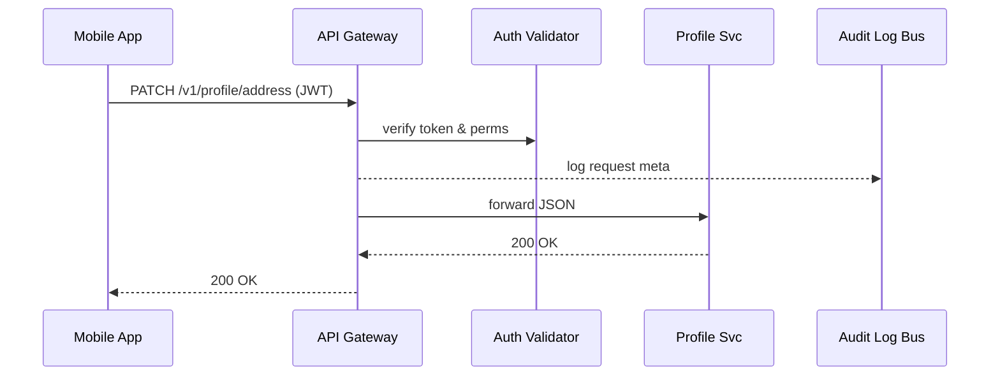

# Chapter 11: Backend API Gateway (HMS-API / HMS-MKT)

*Coming from [Role-Based Access Control (RBAC)](10_role_based_access_control__rbac__.md).*

---

## 1. Why Another Layer? – A Two-Minute Story  

The *Department of Veterans Affairs (VA)* is rolling out a **“OneVA Health Portal.”**  
A veteran opens the mobile app to:

1. Update their mailing address.  
2. Refill a prescription.  
3. Check appointment analytics.

Behind the scenes these actions hit **five different microservices** owned by different VA teams.  
Without a *single front door* the client would need to know:

* 5 base URLs,  
* 5 auth quirks,  
* 5 rate-limit rules.

That is like asking a citizen to memorize every office address in Washington, D.C.  
**Backend API Gateway (HMS-API / HMS-MKT)** is the **city’s main post office**: one door in, many well-labeled conveyor belts out.

---

## 2. What Exactly Is the API Gateway?

“Every parcel (HTTP request) passes through it, gets x-rayed (auth), stamped (rate-limit), and sent to the correct building (microservice).”  
Because *all* traffic flows here, we also:

* Log who did what and when for FOIA or IG audits.  
* Apply governance policies (mask SSNs, block deprecated versions).  
* Expose **one** clean URL for mobile & web teams.

---

## 3. Two Flavors, Same DNA  

| Gateway | Audience | Typical URL | Example |
|---------|----------|-------------|---------|
| **HMS-API** | Internal & trusted agency apps | `https://api.hms.gov` | Refill prescription |
| **HMS-MKT** | External partners/marketplace | `https://market.hms.gov` | Third-party scheduler |

They share the same codebase; only policy sets differ (throttling, CORS, etc.).

---

## 4. Core Concepts (Kid-Friendly Cheat-Sheet)

| Analogy | Gateway Part | One-Line Beginner Explanation |
|---------|--------------|--------------------------------|
| Street sign | **Route** | Maps `/v1/profile/*` ➜ Profile Service. |
| TSA Agent | **Auth Validator** | Checks JWT from RBAC chapter. |
| Speed bump | **Rate Limiter** | Stops any client sending >X req/min. |
| CCTV camera | **Audit Tap** | Streams every request meta to the Audit Log Bus. |
| Postal scale | **Payload Filter** | Blocks files >10 MB unless policy allows. |

---

## 5. Guided Walk-Through: “Update Veteran Address”  

We will:

1. Declare a route in YAML.  
2. Send the request as a citizen.  
3. Watch the Gateway validate, log, and forward—all under **20-line** snippets.

### 5.1 Declare the Route

File: `routes.yml`

```yaml
- path: /v1/profile/address
  method: PATCH
  target: http://profile-svc:8000/address
  perms: [UPDATE_OWN_PROFILE]   # enforced by RBAC token
```

*Explanation*: One line says *where* to forward and *who* is allowed.

---

### 5.2 Citizen Sends the Request

```python
# client_update.py
import requests, json
token = "eyJhbGciOi..."          # issued by Auth Service
payload = {"street": "123 Freedom Ln", "zip": "22202"}

r = requests.patch(
    "https://api.hms.gov/v1/profile/address",
    headers={"Authorization": f"Bearer {token}"},
    json=payload)

print(r.status_code)   # 200 on success
```

The citizen talks **only** to `api.hms.gov`, unaware of downstream services.

---

### 5.3 What the Gateway Does (High Level)

1. Reads `routes.yml` to find the target.  
2. Decodes JWT, confirms `UPDATE_OWN_PROFILE` permission.  
3. Checks rate-limit (60 req/min).  
4. Sends audit event:  
   ```json
   {"actor":"USR-17","action":"PATCH_ADDRESS","ts":"..."}
   ```  
5. Forwards JSON to `profile-svc`.  
6. Relays the 200/400/etc. back to the client.

---

## 6. Under the Hood (Step-By-Step)



Five actors, one short path.

---

## 7. Minimal Gateway Implementation (≤20 lines/section)

### 7.1 Boot File – `gateway.py`

```python
from fastapi import FastAPI, Request, HTTPException
import yaml, httpx, jwt, time, asyncio, uuid, json
app = FastAPI(); routes = yaml.safe_load(open("routes.yml"))

def find_route(p, m):
    for r in routes:
        if r["path"]==p and r["method"]==m: return r

@app.api_route("/{full_path:path}", methods=["GET","POST","PATCH","PUT","DELETE"])
async def proxy(req: Request, full_path: str):
    r = find_route("/"+full_path, req.method)
    if not r: raise HTTPException(404)

    tok = req.headers.get("Authorization","").replace("Bearer ","")
    try: claims = jwt.decode(tok, "secret", algorithms=["HS256"])
    except: raise HTTPException(401)

    if not set(r.get("perms",[])).issubset(claims.get("perms",[])):
        raise HTTPException(403)

    body = await req.body()
    _audit(claims["sub"], req.method, full_path)
    async with httpx.AsyncClient() as c:
        resp = await c.request(req.method, r["target"], content=body,
                               headers=req.headers)
    return resp.text, resp.status_code

def _audit(actor, action, path):
    print(json.dumps({"id": uuid.uuid4().hex, "actor":actor,
                      "action":action, "path":path, "ts":time.time()}))
```

*Highlights*  
• Loads routes from YAML.  
• Verifies JWT and permissions in three lines.  
• Prints audit JSON (in real life this would `publish()` to the Audit Log Bus).  
• Uses `httpx` to forward the request—no fancy reverse-proxy needed for a demo.

---

### 7.2 Tiny Rate-Limiter Plug-In (Optional)

```python
BUCKET = {}
def rate_ok(ip, limit=60):
    t = int(time.time())
    key = (ip, t//60)
    BUCKET[key] = BUCKET.get(key, 0) + 1
    return BUCKET[key] <= limit
```

Call `rate_ok(req.client.host)` at the start of `proxy()` to reject traffic bursts.

---

## 8. Observability & Governance Hooks  

* **Monitoring** – The gateway exposes its own `/metrics` using the middleware from [Monitoring, Telemetry, and KPIs](08_monitoring__telemetry__and_kpis_.md).  
* **Security** – All incoming/outgoing payloads run through PII maskers configured in [Security & Compliance Framework](09_security___compliance_framework_.md).  
* **Versioning** – Changes to `routes.yml` go through [Change Management & Versioning](04_change_management___versioning_.md) so a bad route can be rolled back instantly.

---

## 9. Debugging Tips for Beginners  

1. Hit `GET /_routes` (debug-only) to list active mappings.  
2. Grep gateway logs for `PATCH_ADDRESS` to trace a request.  
3. If every call returns 401, check the system clock—JWT `exp` may be in the past.  
4. Use `curl -v` to confirm that headers pass through unchanged.

---

## 10. Key Takeaways  

• The API Gateway is the **single, auditable front door** for *all* microservices.  
• Routes live in a tiny YAML; no code redeploy needed to add a new path.  
• Built-in auth, rate-limit, and audit hooks ensure every request is safe and traceable.  
• HMS-API serves trusted apps; HMS-MKT safely opens selected endpoints to partners.

---

## 11. What’s Next?  

Now that we have a solid front door, let’s design the **front porch**—the web and mobile interfaces citizens actually see.  
Head over to [Interface Layer (HMS-MFE / Portals)](12_interface_layer__hms_mfe___portals_.md).

---

Generated by [AI Codebase Knowledge Builder](https://github.com/The-Pocket/Tutorial-Codebase-Knowledge)