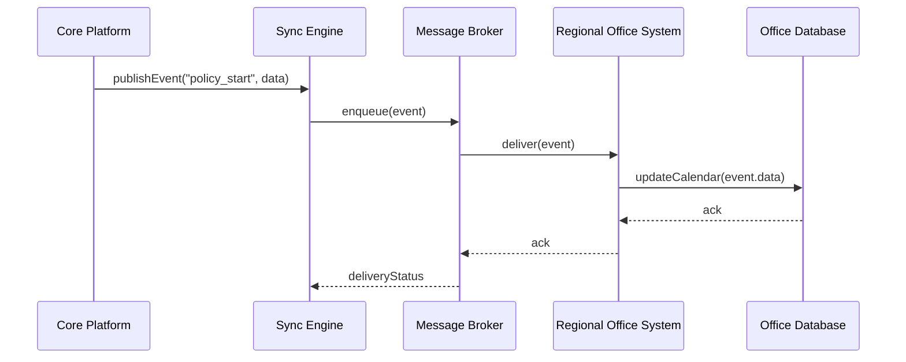

# Chapter 11: External System Synchronization

Welcome back! In [Chapter 10: Human-in-the-Loop (HITL) Mechanism](10_human_in_the_loop__hitl__mechanism_.md) we saw how AI suggestions get vetted by real people. Now we’ll learn **External System Synchronization**—keeping our core platform and outside calendars or data systems in perfect, real-time harmony, just like a federal-wide calendar sync whenever a new policy is adopted.

---

## Why External System Synchronization Matters

Imagine the President’s Council on Fitness adopts a new weekly meeting policy. Every regional office uses its own scheduling system:

- If one office updates the date, all others should update instantly.  
- No two offices should book conflicting events.  
- Compliance reports must reflect the latest approved schedule.

Without a central sync, offices end up with mismatched calendars, missed meetings, and audit headaches. Our **External System Synchronization** solves this by pushing updates as soon as a change happens.

---

## Central Use Case

**Scenario:**  
A new “Youth Sports Funding” policy is approved on April 1.  

1. The core platform publishes a “policy_start” event.  
2. All subscribed scheduling systems receive the event.  
3. Each system updates its local calendar and records.  
4. If two systems make conflicting changes, the sync engine resolves them.

By the end of this chapter, you’ll know how to:

- Register external systems for updates.  
- Publish policy-change events.  
- Let each system process and confirm updates.  
- Handle conflicts gracefully.

---

## Key Concepts

1. **Change Publisher**  
   Sends events (e.g., “policy_start”) when something changes in the core platform.

2. **Subscription Manager**  
   Keeps a list of external systems and their callback URLs or message queues.

3. **Synchronization Engine**  
   Coordinates event delivery and retry logic for reliability.

4. **Conflict Resolver**  
   Detects and resolves simultaneous updates or version mismatches.

5. **Event Listener (External Adapter)**  
   The code on each external system that handles incoming events and updates local data.

---

## High-Level Flow



1. CoreApp tells Sync Engine about a change.  
2. Sync Engine enqueues the event in a Broker (e.g., Kafka, RabbitMQ).  
3. Broker delivers it to each subscribed Office.  
4. The Office updates its DB and acknowledges.  
5. Sync Engine tracks delivery and retries if needed.

---

## Using External System Synchronization

Here’s a simple Python example showing how to register an external system and publish an event:

```python
# register_systems.py
from sync_engine import SyncEngine

engine = SyncEngine()

# 1. Register an external office with a callback URL
engine.subscribe(
    name="NMB-Office-1",
    callback_url="https://nmb-office1.gov/sync_callback"
)

# 2. Publish a new policy-start event
engine.publish_event(
    event_type="policy_start",
    payload={"policy_id": "YSP-2024", "start_date": "2024-04-01"}
)
```

Explanation:  
- `subscribe()` tells the Sync Engine where to send updates.  
- `publish_event()` sends a “policy_start” message with details.  
- Behind the scenes, the engine notifies all subscribers.

An example callback handler on the Regional Office’s side:

```python
# external_adapter.py
from flask import Flask, request

app = Flask(__name__)

@app.route("/sync_callback", methods=["POST"])
def sync_callback():
    event = request.get_json()
    # Update local calendar based on event
    update_local_calendar(event["payload"])
    return {"status": "ok"}, 200
```

Explanation:  
- The Office exposes `/sync_callback`.  
- When called, it reads the event and updates its own calendar.

---

## Inside the Code

### File: sync_engine.py

```python
# sync_engine.py
class SyncEngine:
    def __init__(self):
        self.subscribers = []  # list of {name, url}

    def subscribe(self, name, callback_url):
        self.subscribers.append({"name": name, "url": callback_url})

    def publish_event(self, event_type, payload):
        event = {"type": event_type, "payload": payload}
        for sub in self.subscribers:
            self._deliver(sub["url"], event)

    def _deliver(self, url, event):
        # In real code, use HTTP client or message broker
        print(f"Delivering {event['type']} to {url}")
```

Explanation:  
- `subscribe()` adds an external system.  
- `publish_event()` loops through subscribers and calls `_deliver()`.  
- `_deliver()` simulates sending the event (you’d replace with real HTTP or broker code).

### File: conflict_resolver.py

```python
# conflict_resolver.py
class ConflictResolver:
    def resolve(self, local_version, incoming_version):
        # Simple rule: pick the highest version timestamp
        return max(local_version, incoming_version)
```

Explanation:  
- If two updates collide, we choose the one with the newer timestamp.  
- In a real system, you might merge data or alert an admin.

---

## Conclusion

You’ve seen how **External System Synchronization** keeps multiple calendars and databases in lockstep—like a federal-wide calendar sync after each policy change. We covered:

- Subscribing external systems  
- Publishing events from the core platform  
- Delivering updates via HTTP or message brokers  
- Simple conflict resolution  

Next up, we’ll learn how to measure and monitor all these deliveries in the [Monitoring & Metrics Module](12_monitoring___metrics_module_.md).

---

Generated by [AI Codebase Knowledge Builder](https://github.com/The-Pocket/Tutorial-Codebase-Knowledge)