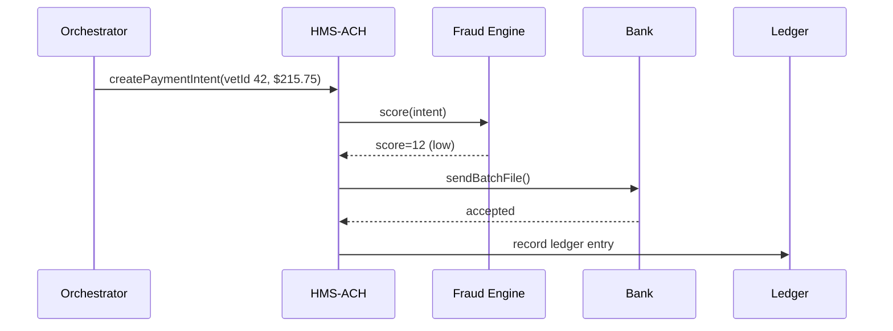

# Chapter 11: Financial Transaction Engine (HMS-ACH)

[← Back to Chapter&nbsp;10: Secure Inter-Agency Communication (HMS-A2A)](10_secure_inter_agency_communication__hms_a2a__.md)

> “Moving dollars with the same care we move data.”

---

## 1. Why Do We Need HMS-ACH?

Imagine Congress votes to **increase monthly housing stipends** for disabled veterans, retro-active to January 1.

1. An AI policy agent recalculates each veteran’s new amount.  
2. Our orchestration layer queues 62,000 “top-up” payments that must reach checking accounts next week.  
3. Treasury auditors insist on PCI-compliant logs and FFIEC fraud screens.  
4. Every ledger entry must reconcile with the bank at midnight.

That entire money dance lives inside **HMS-ACH**.  
To novices it’s *“PayPal for government.”*  
To auditors it’s a **real-time, PCI-compliant clearing-house** that never loses a penny.

---

## 2. Quick-Glance Analogy

| Real-World Analogy  | HMS-ACH Piece | One-Line Job |
|---------------------|---------------|--------------|
| Payroll Desk        | Disbursement Scheduler | Decides **who** gets **how much** and **when** |
| Bank Deposit Slip   | ACH Batch File | Standard text file the bank understands |
| Security Guard      | FFIEC Fraud Check | Blocks suspicious or duplicate payments |
| Accounting Ledger   | Double-Entry Log | Records “debit Treasury ➜ credit Veteran” |
| Nightly Bank Call   | Reconciliation Worker | Verifies bank totals match internal totals |

Keep these in mind—the rest is plumbing.

---

## 3. Key Concepts (Beginner Friendly)

| Term | Plain-English Meaning | Example |
|------|-----------------------|---------|
| Trigger | Event that starts a money move | “policy.update stipend” |
| Payment Intent | Row describing amount + recipient | `{vetId:42, amount:215.75}` |
| Batch | ZIP file of intents sent to a bank | `batch_2024-1101.zip` |
| Ledger Entry | One debit + one credit | `DR 1310 Treasury / CR 2310 VET42` |
| Fraud Score | 0–100 risk number | 87 → stop & review |
| Reconciliation | Balance bank totals vs. ledger totals | must equal *₵0* difference |

---

## 4. The 5-Step Money Journey



---

## 5. Using HMS-ACH (Beginner Code)

### 5.1 Scheduling a Payment (14 lines)

```js
// payVeteran.js
import axios from 'axios';

async function topUp(vetId, amount){
  const res = await axios.post('http://ach/pay', {
    vetId, amount, reason:'housing_topup_Jan'
  });
  console.log('🔖 paymentId', res.data.paymentId);
}

topUp('VET42', 215.75);
```

**What happens?**

1. Your call lands on HMS-ACH’s `/pay` endpoint.  
2. ACH stores a **Payment Intent** in its queue.  
3. You get a `paymentId` (`PAY-880012`) for tracking.

### 5.2 Checking Status (10 lines)

```js
// status.js
import axios from 'axios';
const {data:s} = await axios.get('http://ach/pay/PAY-880012');
console.log(s);               // { state:'sent', bankRef:'#123' }
```

States: `queued → batched → sent → settled` (or `blocked` if fraud score too high).

---

## 6. What Happens Inside `/pay`

Below 18 lines show the heart of `pay.js`.

```js
// routes/pay.js
import { fraudScore } from '../fraud.js';
import { ledger } from '../ledger.js';
import { queue }  from '../batch.js';

export async function pay(req,res){
  const intent = { ...req.body, id:'PAY-'+Date.now() };

  // 1. Anti-fraud screen (FFIEC)
  if(await fraudScore(intent) > 80)
     return res.status(403).send('blocked');

  // 2. Queue for nightly batch
  queue.push(intent);

  // 3. Tentative ledger entry
  ledger.debit('Treasury', intent.amount);
  ledger.credit(intent.vetId , intent.amount);

  res.status(202).json({paymentId:intent.id});
}
```

Line-by-line:  
1-3  Imports helpers.  
6-7  Reject high-risk intents.  
9     Queue intent (later written to bank file).  
12-13 Double-entry log, even **before** money moves.  
15     Respond to caller.

---

## 7. Inside the Fraud Engine (12 lines)

```js
// fraud.js
export async function fraudScore(i){
  // Toy rules: large + duplicate = risky
  let score = 0;
  if(i.amount > 10_000) score += 70;
  if(await seenToday(i.vetId, i.amount)) score += 40;
  return score;              // 0–100
}

async function seenToday(id, amt){ /* DB lookup – skipped */ }
```

Auditors can plug in a vendor model later; interface stays the same.

---

## 8. Nightly Batch Worker (16 lines)

```js
// batch.js
import fs from 'fs';
export const queue = [];

export function nightly(){
  const fname = `batch_${Date.now()}.txt`;
  const lines = queue.map(i => `${i.vetId},${i.amount}`);
  fs.writeFileSync(`/batches/${fname}`, lines.join('\n'));
  queue.length = 0;
  sendToBank(fname);
}

function sendToBank(file){
  // SFTP upload – details skipped
  console.log('🏦 Sent', file);
}
```

Every midnight a cron job calls `nightly()`:

1. Writes a **standard NACHA-formatted** text file.  
2. Securely uploads to the bank (SFTP, mTLS, or an A2A tunnel).  
3. Clears the in-memory queue.

---

## 9. Reconciliation Worker (15 lines)

```js
// reconcile.js
import { ledger } from './ledger.js';
import { bankApi } from './bank.js';

export async function reconcile(date){
  const bankTotal = await bankApi.totalFor(date); // $1 234 567.00
  const bookTotal = ledger.totalFor(date);        // same?

  if(bankTotal !== bookTotal){
     console.error('❌ Mismatch!', {bankTotal, bookTotal});
     alertAuditor();
  } else {
     console.log('✅ Balanced for', date);
  }
}
```

Runs at 02:00 AM; any mismatch pages Ops and auto-opens a [HITL ticket](05_human_in_the_loop__hitl__override_.md).

---

## 10. Folder Peek

```
/hms-ach
 ├─ routes/
 │    └─ pay.js
 ├─ fraud.js
 ├─ ledger.js         # simple SQLite + double-entry helpers
 ├─ batch.js          # nightly file builder
 ├─ reconcile.js
 └─ cron.yaml         # schedules nightly & reconcile jobs
```

*Nothing here is >100 lines; the magic is strict ordering and lots of audits.*

---

## 11. Security & Compliance Stack

1. **Transport:** All inbound calls arrive through [HMS-GOV](01_governance_layer__hms_gov__.md) using mTLS.  
2. **Policy:** Payment rules (caps, blackout dates) come from [HMS-CDF](02_policy_codification_engine__hms_cdf__.md).  
3. **Fraud:** FFIEC screen you just saw.  
4. **Ledger:** Every mutation auto-logs to [Activity Logging & Audit Trail](21_activity_logging___audit_trail_.md).  
5. **Reconciliation:** Automated & human-escalated via [HITL Override](05_human_in_the_loop__hitl__override_.md).

---

## 12. Frequently Asked Questions

**Q: Does HMS-ACH actually move cash?**  
Yes. It sends NACHA / ISO-20022 files or real-time wires depending on config.

**Q: Can I test without a real bank?**  
Use `BANK_MOCK=true`—ACH writes files to `/tmp/mockbank` instead of SFTP.

**Q: What happens if fraud score is high but legit?**  
Agent OR human can override by calling `POST /pay/PAY-id/approve`—all such overrides are captured in the audit log.

**Q: PCI compliance?**  
Card data never enters HMS-ACH. Tokenised PANs live in a hardware vault; logs store only the last 4 digits.

---

## 13. Key Takeaways

• **HMS-ACH turns policy triggers into real money, safely.**  
• Four small workers—`pay`, `fraud`, `batch`, `reconcile`—cover 95 % of the workflow.  
• Double-entry ledger + nightly bank check ensures pennies never vanish.  
• Fraud screens, audit hooks, and policy links make auditors smile.

---

### Up Next

Some agencies want to **sell** processed data or AI models to local governments and universities.  
We’ll open that storefront in [Chapter 12: Marketplace Service (HMS-MKT)](12_marketplace_service__hms_mkt__.md).

---

Generated by [AI Codebase Knowledge Builder](https://github.com/The-Pocket/Tutorial-Codebase-Knowledge)