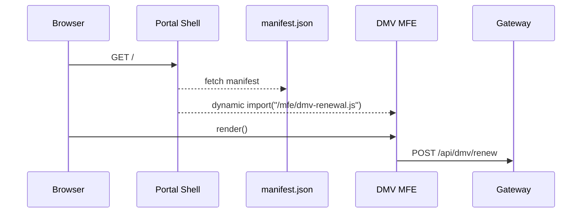

# Chapter 12: Interface Layer (HMS-MFE / Portals)

*Coming from [Backend API Gateway (HMS-API / HMS-MKT)](11_backend_api_gateway__hms_api___hms_mkt__.md).*

---

## 1. Why Do We Need a “Store-Front”? – A 90-Second Story  

Picture **Ms. Johnson**, a retiree who wants to:

1. Renew her driver’s license (DMV).  
2. File an “Elder Justice” complaint (HHS).  
3. Track her stimulus check (Treasury).

If each agency built its own website, Ms. Johnson would juggle three log-ins, three layouts, and three learning curves.  
The **Interface Layer** gives citizens **one, consistent portal** while letting each agency deploy updates independently.

*Result*: Users trust the site (“everything looks familiar”) and agencies ship features faster (“my change only touches my micro-frontend!”).

---

## 2. Key Concepts (Beginner-Friendly Table)

| City Analogy            | Interface Concept            | One-Sentence Explanation |
|-------------------------|------------------------------|--------------------------|
| Mall building           | **Portal Shell**             | The static HTML/JS that boots and orchestrates pages. |
| Individual shop         | **Micro-Frontend (MFE)**     | A small, self-contained bundle (React/Vue/etc.) that owns one page or widget. |
| Same paint & signage    | **Shared Component Library** | Buttons, headers, error boxes that guarantee a uniform look. |
| Wheelchair ramp & signs | **Accessibility & Branding** | Pre-approved fonts, colors, ARIA labels to satisfy Section 508 & agency style-guides. |
| Manager’s entrance      | **Admin / GOV Portal**       | A parallel shell where officials override AI decisions or approve workflows. |

Keep these five words in mind—everything else plugs into them.

---

## 3. Guided Walk-Through: “Add a DMV Renewal Page in 10 Minutes”  

### Goal  
Ship a brand-new *“DMV Vehicle Renewal”* page without touching the **Elder Justice** code and **without** re-deploying the whole portal.

### 3.1 Step-1: Scaffold a Micro-Frontend  

File: `dmv-renewal.jsx` (React, 17 lines)

```jsx
import { Page, Input, Button } from "@hms/ui";         // shared library
export default function DMVRenewal() {
  const [plate, setPlate] = React.useState("");
  const submit = () => fetch("/api/dmv/renew", {       // hits the Gateway
     method: "POST",
     headers: { "Content-Type": "application/json",
                Authorization: sessionStorage.token },
     body: JSON.stringify({ plate })
  }).then(()=>alert("✅ Renewal in progress"));
  return (
    <Page title="Vehicle Renewal">
      <Input label="Plate Number" value={plate}
             onChange={e=>setPlate(e.target.value)} />
      <Button onClick={submit}>Renew</Button>
    </Page>
  );
}
```

**What’s happening?**  
* `@hms/ui` gives us pre-styled **Page**, **Input**, **Button**—so the page already “looks like HMS.”  
* We POST to `/api/dmv/renew`, which the [API Gateway](11_backend_api_gateway__hms_api___hms_mkt__.md) will forward.

---

### 3.2 Step-2: Register the Page with the Portal Shell  

File: `manifest.json` (4 lines)

```json
{
  "route": "/dmv/renew",
  "module": "dmv-renewal.jsx",
  "title": "Vehicle Renewal"
}
```

*Explanation*: One JSON entry tells the shell **where** to lazy-load the bundle when a user hits `/dmv/renew`.

---

### 3.3 Step-3: Deploy **Only** the New Bundle  

```bash
# one-liner (CI/CD job)
aws s3 cp dmv-renewal.js s3://hms-static/mfe/dmv-renewal.js
aws s3 cp manifest.json  s3://hms-static/portal/manifest.json
```

The portal shell polls `manifest.json` every 60 seconds, sees the new route, and voilà—Ms. Johnson refreshes and the DMV page appears.

---

## 4. Under the Hood – What Really Happens?



Only **five** participants. The *Elder Justice* MFE never loads, and the shell never redeploys.

---

## 5. Tiny Internal Pieces for the Curious  

### 5.1 Dynamic Loader (portal shell, 12 lines)

```javascript
// loader.js
export async function loadRoute(path) {
  const manifest = await fetch("/portal/manifest.json").then(r=>r.json());
  const item = manifest.find(r => r.route === path);
  if (!item) return show404();
  const mod = await import(`/mfe/${item.module}`);     // <-- dynamic!
  document.getElementById("root").replaceChildren(mod.default());
}
```

*Every* route—DMV, Elder Justice, or future ones—travels through this same 12-line helper.

---

### 5.2 Shared Component Library Sketch (SCSS tokens + React)

```scss
/* tokens.scss */
$primary-blue: #005ea2;
$error-red:   #b50909;
$radius:      4px;
```

```jsx
// Button.jsx (9 lines)
export function Button({children, ...props}) {
  return <button style={{
    background: "var(--primary-blue)",
    borderRadius: "var(--radius)",
    color: "white", padding: "0.5rem 1rem"
  }} {...props}>{children}</button>;
}
```

All MFEs import these shared tokens so *every* button remains on-brand.

---

### 5.3 GOV/Admin Portal Toggle (Feature Flag, 6 lines)

```javascript
if (user.roles.includes("approver")) {
   addMenu({ path:"/gov/queue", title:"Approval Queue"});
}
```

A one-liner in the shell shows extra routes for officials, leveraging the same **RBAC** claims from [Role-Based Access Control](10_role_based_access_control__rbac__.md).

---

## 6. Accessibility & Compliance in Three Lines  

```jsx
<Input
  aria-label="License plate number"     // Section 508
  pattern="[A-Z0-9]{2,8}"               // client-side validation
  data-pii="plate" />                   // SCF auto-masks logs
```

• `aria-label` aids screen readers.  
• `data-pii` cooperates with the [Security & Compliance Framework](09_security___compliance_framework_.md) to mask sensitive data in logs.

---

## 7. Debugging Tips for Beginners  

* Hit `/portal/manifest.json` in the browser to confirm your page is listed.  
* Open DevTools → **Network** → filter `*.js` to see your MFE load lazily.  
* If styling looks off, verify `@hms/ui` is at the same version as the shell.  
* Remember CORS: MFEs always call `/api/*`—the Gateway takes care of cross-service URLs.

---

## 8. Key Takeaways  

1. **Portal Shell** + **Micro-Frontends** = independent deployments with a unified look.  
2. A tiny **manifest.json** controls routing—no redeploy of the shell required.  
3. The shared component library slashes design & accessibility work.  
4. Admin/GOV routes reuse the same mechanics, gated by RBAC roles.  
5. Everything you just saw involved only **~50 lines** of real code!

---

## 9. What’s Next?  

A good storefront is useful, but we can do better—what if the portal **guides** Ms. Johnson based on her *intent* (“I need to renew my license”)?  
In the next chapter we’ll add **AI-guided navigation** to personalize journeys:

[Intent-Driven Navigation / AI-Guided Journey](13_intent_driven_navigation___ai_guided_journey_.md)

---

Generated by [AI Codebase Knowledge Builder](https://github.com/The-Pocket/Tutorial-Codebase-Knowledge)