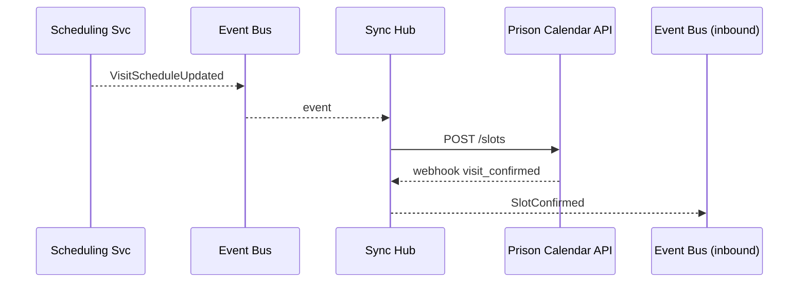

# Chapter 14: External System Synchronization  
*Coming from [Intent-Driven Navigation / AI-Guided Journey](13_intent_driven_navigation___ai_guided_journey_.md).*

---

## 1. Why Do We Need It? – A One-Minute Story  

The **Federal Bureau of Prisons** wants to modernize inmate-visitation booking.  
Inside HMS-SCM an AI engine optimizes time slots; **outside** the walls a 15-year-old state calendar (SOAP + nightly CSVs) still decides room allocations.

If the two systems fall out of sync:

* A family drives 300 miles only to discover the slot was double-booked.  
* A prison guard roster is wrong and overtime soars.  

**External System Synchronization (ESS)** is our *“conveyor belt”* that:

1. Pushes fresh HMS rules & data **out** to partners.  
2. Pulls confirmations or status **back in**—all in seconds, not days.

---

## 2. Key Concepts (Beginner-Friendly Table)

| Factory Analogy | ESS Term | One-Sentence Explanation |
|-----------------|----------|--------------------------|
| Conveyor belt section | **Outbound Lane** | Listens to HMS events and sends updates to partners. |
| Return chute | **Inbound Lane** | Accepts partner status and turns it into HMS events. |
| Universal plug | **Adapter** | Tiny file/function that converts “our JSON” ↔ “their CSV / SOAP / FTP”. |
| Baggage tag | **Correlation ID** | Same ID travels both directions so we match request ↔ response. |
| Reprint station | **Replay Buffer** | Keeps the last N messages for retries/idempotency. |

Keep those five in mind—everything else plugs into them.

---

## 3. Walk-Through: “Sync a Visit Schedule in 3 Steps”  

Goal: when HMS emits `VisitScheduleUpdated`, push it to the legacy calendar **and** ingest the prison’s `visit_confirmed` callback.

### 3.1 High-Level Flow



Five actors—easy to reason about.

---

## 4. Coding the Outbound Lane (18 Lines)

File: `outbound.py`

```python
import pika, json, requests, uuid

BUS = pika.BlockingConnection().channel()
BUS.queue_declare(queue="visit_updates")

def send_to_prison(ev):
    payload = {
       "id": ev["id"],                # correlation ID
       "inmate": ev["inmateId"],
       "slot": ev["slotUtc"]
    }
    # fake external REST call
    r = requests.post("https://prison.gov/api/slots", json=payload, timeout=3)
    print("➡️  pushed", ev["id"], r.status_code)

def on_msg(_ch,_m_props,_m,_body):
    ev = json.loads(_body)
    send_to_prison(ev)

BUS.basic_consume(queue="visit_updates", on_message_callback=on_msg, auto_ack=True)
print("Outbound lane running"); BUS.start_consuming()
```

What it does:  
1. Listens to RabbitMQ queue `visit_updates` (populated by the Scheduling Service from [Event-Driven Workflow Orchestration](06_event_driven_workflow_orchestration_.md)).  
2. Transforms JSON into the prison’s format and `POST`s it.  
3. Prints a tiny log—fancier retries live in [Monitoring, Telemetry, and KPIs](08_monitoring__telemetry__and_kpis_.md).

---

## 5. Coding the Inbound Lane (17 Lines)

File: `inbound.py`

```python
from fastapi import FastAPI, Request
import pika, uuid, json
app = FastAPI()
BUS = pika.BlockingConnection().channel()
BUS.exchange_declare(exchange="events", exchange_type="fanout")

@app.post("/webhook/prison")
async def prison_cb(req: Request):
    data = await req.json()          # {"id":"VIS-77", "status":"confirmed"}
    ev = {"type":"SlotConfirmed", "id":data["id"], "status":data["status"]}
    BUS.basic_publish(exchange="events", routing_key="", body=json.dumps(ev))
    return {"ok": True}
```

What happens:  
* The prison system calls this URL.  
* We wrap the payload in an HMS event and broadcast it—every subscribing service (notifications, analytics, etc.) reacts instantly.

---

## 6. Glue in the Scheduling Service (6 Lines)

```python
# schedule_service.py  (snippet)
def update_slot(slot):
    ev = {"type":"VisitScheduleUpdated", "id":slot.id,
          "inmateId":slot.inmate, "slotUtc":slot.time_utc}
    BUS.basic_publish(exchange="", routing_key="visit_updates",
                      body=json.dumps(ev))
```

One publish call—no direct knowledge of SOAP, CSV, or APIs.

---

## 7. Under the Hood – Step-By-Step Text Walkthrough  

1. **Scheduling Service** books a new slot and emits `VisitScheduleUpdated`.  
2. **Outbound Lane** adapter hears it, converts JSON → partner format, and calls the external API.  
3. The prison’s calendar accepts, then POSTs `visit_confirmed` to our **Inbound Lane** webhook.  
4. **Inbound Lane** emits `SlotConfirmed` inside HMS.  
5. **Notification Service** picks up `SlotConfirmed` and texts the family (“Your visit is confirmed!”).

---

## 8. Making Adapters Re-Usable  

You might sync with **three** different systems (SOAP, CSV via SFTP, and REST).  
Store each adapter as a simple Python module:

```
adapters/
 ├─ rest_prison.py
 ├─ csv_probation.py
 └─ soap_medical.py
```

Each must expose two tiny functions:

```python
def push(hms_event): ...
def pull(raw_payload): ...
```

The Sync Hub loads the correct adapter based on a config file—no code change to the hub.

---

## 9. Handling Retries & Idempotency (Replay Buffer)

```python
# replay.py (11 lines)
import collections, json, pika
BUF = collections.deque(maxlen=500)   # last 500 outbound events

def remember(ev): BUF.append(ev)

def resend_all():
    for ev in list(BUF):
        pika.BlockingConnection().channel().basic_publish(
            exchange="", routing_key="visit_updates", body=json.dumps(ev))
```

*Use case*: external SFTP was down overnight—ops runs `resend_all()` to replay missed bookings.

---

## 10. Security & Compliance Touch-Points  

* **PII Masking** – Outbound Lane uses the maskers from [Security & Compliance Framework](09_security___compliance_framework_.md) before logging.  
* **Audit Trail** – Both lanes publish `SyncAudit` events to the Audit Log Bus.  
* **RBAC** – Only the Sync Hub’s service account can call `/webhook/prison` as enforced by [Role-Based Access Control](10_role_based_access_control__rbac__.md).

---

## 11. Debugging Tips for Beginners  

1. **Print IDs** – Always log the correlation ID (`VIS-77`) in both lanes so you can grep logs.  
2. **Use “dry-run” flag** – Adapters accept `dry=True` to print payloads instead of sending.  
3. **Check replay buffer length** – A rising buffer length signals a downstream outage.  
4. **Watch dashboards** – The outbound success rate (%) lives in your Chapter 8 metrics.

---

## 12. Key Takeaways  

• ESS is a *two-way conveyor belt* with tiny adapters on the ends.  
• Inside HMS you talk events; adapters handle every messy CSV, SOAP, or FTP detail.  
• Correlation IDs + replay buffer = safe retries.  
• All guard-rails (security, RBAC, monitoring) you met in earlier chapters still apply.

---

## 13. What’s Next?  

Adapters are useful, but could an **AI Agent** write or tweak them automatically (“Hey, new partner switched to XML”)?  
Let’s meet that helper in [AI Representative Agent (HMS-A2A)](15_ai_representative_agent__hms_a2a__.md).

---

Generated by [AI Codebase Knowledge Builder](https://github.com/The-Pocket/Tutorial-Codebase-Knowledge)