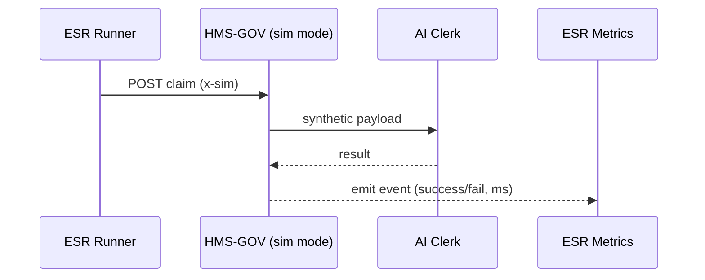

# Chapter 14: Simulation & Training Environment (HMS-ESR)

[← Back to Chapter 13: Extension & Specialty Capabilities](13_extension___specialty_capabilities__hms_agx__.md)

> “The flight-sim for civil-service AIs—crash here, not in production.”

---

## 1. Why Do We Need HMS-ESR?

Imagine we just built a brand-new AI claims clerk using  
[HMS-AGT](04_ai_representative_agent_framework__hms_agt__.md).  
Before we let it touch real veterans’ data we must answer:

* Can it handle a **blank** Social-Security field without falling over?  
* Does it give **equitable** answers when the applicant is 18 vs 78 years old?  
* Will it survive a day with **10× traffic** caused by a hurricane benefit surge?

HMS-ESR is the **sandbox** where we run those “what-ifs” with **synthetic citizens, clerks, and edge-cases**.  
Think of it as *Microsoft Flight Simulator*—but for government forms.

---

## 2. Starter Use-Case – “Stress-Test Education-Benefit Claims”

Goal: throw **10,000 fake Form 22-1990 claims** (some perfect, some messy) at our AI clerk and learn:

1. Success / failure rates  
2. Bias or policy violations  
3. Average processing time

We will:

1. Create a tiny synthetic-citizen generator.  
2. Spin up a simulation loop.  
3. Collect metrics—all in < 30 lines of code.

---

## 3. Key Concepts (Beginner Friendly)

| ESR Term          | City-Hall Analogy          | One-Line Job |
|-------------------|----------------------------|--------------|
| Scenario          | Drill in the fire-station  | “10k claims in 1 hour” |
| Actor             | Volunteer in the drill     | Synthetic citizen / clerk |
| Event Stream      | Stopwatch & checklist      | Records every step & timestamp |
| Reward Function   | Instructor’s score sheet   | Gives +1 for good answer, –1 for error |
| Replay File       | CCTV footage               | Lets us rewatch any simulation |

Hold onto these five; ESR is just **scenarios, actors, rewards, and replays.**

---

## 4. Running Your First Simulation

### 4.1 Generate Fake Citizens (≤ 14 lines)

```js
// genCitizen.js
export function fakeCitizen(id){
  return {
    id: `CIT${id}`,
    age: Math.floor(Math.random()*60)+18,
    ssn: Math.random()<0.1 ? null : '123-45-'+String(id).padStart(4,'0'),
    form: { school:'UVA', program:'Engineering' }
  };
}
```
Explanation  
• 10 % of citizens miss the SSN on purpose (edge-case).  
• Everything else is random but plausible.

### 4.2 Simulation Loop (≤ 18 lines)

```js
// runSim.js
import axios from 'axios';
import { fakeCitizen } from './genCitizen.js';

const RESULTS = [];

for(let i=1;i<=10000;i++){
  const citizen = fakeCitizen(i);

  const t0 = Date.now();
  const res = await axios.post(
    'http://agt-edu/claims',     // our AI clerk
    citizen,
    { headers:{ 'x-sim':'ESR' } } // flag so GOV knows it's fake
  );
  const dt = Date.now()-t0;

  RESULTS.push({ ok: res.data.ok, dt });
}

// quick summary
const fails = RESULTS.filter(r=>!r.ok).length;
console.log('✅',10000-fails,'success  ❌',fails,'failures');
console.log('⏱ avg ms', RESULTS.reduce((s,r)=>s+r.dt,0)/RESULTS.length);
```

What will happen?  
1. Loop creates 10 k synthetic citizens.  
2. Each POST bypasses real PII rules because `x-sim: ESR` tells  
   [HMS-GOV](01_governance_layer__hms_gov__.md) to route to **simulation mode**.  
3. We log success/failure and latency.

*Typical output*  
```
✅ 9642 success  ❌ 358 failures
⏱ avg ms 84
```

Now we know 3.6 % of claims failed—time to inspect why.

---

## 5. What Happens Under the Hood?



1. The special header routes traffic to **shadow copies** of services—no real DB writes.  
2. Each step emits an **event** (`esr.event`) captured by the Metrics store.  
3. ESR can **replay** or feed data into reinforcement learning later.

---

## 6. Peeking Inside HMS-ESR

```
/hms-esr
 ├─ router.js        # toggles real vs. sim
 ├─ metrics/
 │    ├─ store.js    # in-memory for demo
 │    └─ reward.js   # simple scoring fn
 ├─ replay/
 │    └─ writer.js   # saves ND-JSON
 └─ README.md
```

### 6.1 Router (≤ 16 lines)

```js
// router.js
export function simRouter(req,res,next){
  if(req.headers['x-sim']){
     req.url = '/sim'+req.url;  // hit shadow endpoints
     req.isSim = true;
  }
  next();
}
```
Inserted as the **first middleware** in HMS-GOV; real users are unaffected.

### 6.2 Metrics Store (≤ 14 lines)

```js
// metrics/store.js
const events = [];

export function record(e){ events.push(e); }

export function report(){
  const ok = events.filter(e=>e.ok).length;
  return { total:events.length, ok, fail:events.length-ok };
}
```

Every event pushed here can be **streamed into a Jupyter notebook** for deeper analysis.

---

## 7. Feeding a Reinforcement-Learning Loop (Optional, 12 lines)

```js
// reward.js
import { record } from './store.js';

export function rewardFn(event){
  const score = event.ok ? 1 : -1;
  record({ ...event, score });
  return score;
}
```

Now any RL algorithm can call `rewardFn` to evaluate agent actions **offline**—no citizen harmed.

---

## 8. Common Questions

**Q: Does ESR copy production data?**  
No. It **generates** synthetic inputs and writes results to an isolated buffer.

**Q: How do I replay a failure?**  
Each event has a `replayId`; run  
```bash
esr replay <replayId>
```  
and step through the exact HTTP calls.

**Q: Can I stress-test at 1000 rps?**  
Yes. Use `esr run --concurrency 1000 scenario.json`. The router keeps traffic off production.

**Q: How does ESR integrate with policy checks?**  
Shadow services still call [HMS-CDF](02_policy_codification_engine__hms_cdf__.md) and  
[HMS-ESQ](03_legal_reasoning_service__hms_esq__.md), so you catch policy bugs early.

---

## 9. Key Takeaways

• HMS-ESR is the **risk-free playground** for agents and specialty packs.  
• Scenarios, actors, rewards, and replays help you uncover bugs, bias, and bottlenecks **before** launch.  
• A single `x-sim` header detours calls into a full shadow stack—no extra coding in your agents.  
• Metrics and replay files feed both auditors and reinforcement-learning pipelines.

---

### Up Next

Agents are now trained and battle-tested; let’s build the **front-end micro-apps** citizens will actually click.  
Proceed to [Chapter 15: Micro-Frontend Interface Library (HMS-MFE)](15_micro_frontend_interface_library__hms_mfe__.md).

---

Generated by [AI Codebase Knowledge Builder](https://github.com/The-Pocket/Tutorial-Codebase-Knowledge)