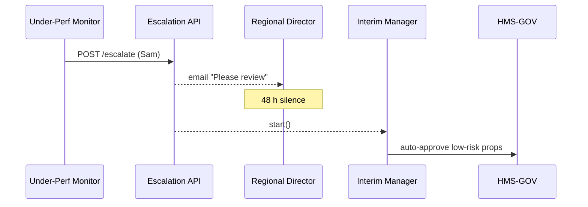

# Chapter 17: Replacement / Escalation Mechanism
*Coming from [Human-in-the-Loop (HITL) Oversight](16_human_in_the_loop__hitl__oversight_.md).*

---

## 1. Why Do We Need a “Safety Net Above the Safety Net”? – A 2-Minute Story  

The **National Park Service (NPS)** uses HMS-SCM to optimize campground fees.  
An AI Agent proposes:

> “Drop nightly fee at *Badlands* by \$4; occupancy will rise 20 %.”

Local Superintendent **Sam** hates changing prices and *always* clicks “Reject.”  
After the *fifth* veto—even though forecasts are solid—the park’s budget suffers, and Congress asks:  

*“Why is the system ignoring proven AI advice?”*

The **Replacement / Escalation Mechanism (REM)** kicks in when repeated human blocks threaten program goals.  
It automatically:

1. Detects **under-performance** (pattern of unjustified rejections).  
2. **Escalates** to higher leadership (Regional Director, HQ).  
3. As a last resort, assigns an **AI Interim Manager** that can apply low-risk fixes until humans respond.

Think of REM as the “ombudsman” of HMS-SCM—protecting citizens and agencies from both *rogue robots* **and** *stubborn humans*.

---

## 2. Key Concepts (Plain-English Cheat-Sheet)

| Everyday Analogy | REM Term | One-Sentence Explanation |
|------------------|---------|--------------------------|
| Speed-camera     | **Under-Performance Monitor** | Counts how often a human rejects AI proposals that later prove correct. |
| Warning light    | **Escalation Ladder** | Pre-defined chain of who gets notified next (Manager → Director → HQ). |
| Substitute teacher | **AI Interim Manager** | Temporarily allowed to apply low-risk changes when humans are unresponsive. |
| Black-box flight recorder | **Decision Ledger** | Immutable log of rejections, reasons, and outcomes. |
| Safety switch    | **Freeze & Override** | Lets HQ pause the Interim Manager at any time. |

---

## 3. Walk-Through: “Fee Change Blocked Five Times”  

### 3.1 Timeline

1. **AI Agent** sends “Drop fee by \$4” proposal (risk = 0.05).  
2. Superintendent **Sam** clicks **Reject**.  
3. Occupancy data later shows the AI was right.  
4. This pattern repeats 4 more times.  
5. **Under-Performance Monitor** raises a **Flag**.  
6. REM emails the **Regional Director** for review.  
7. Director ignores for 48 h → **AI Interim Manager** auto-applies the fee change (with freeze option for HQ).

We’ll build a demo of steps 5-7 in **< 60 lines** total.

---

## 4. Detecting Under-Performance (18 Lines)

```python
# monitor.py
import collections, time, json, requests, pika
BUS = pika.BlockingConnection().channel()
THRESH = 5                       # 5 bad rejections
WINDOW = 30*24*3600              # 30 days
REJECTS = collections.defaultdict(list)   # id -> [timestamps]

def on_log(_c,_m,_p,body):
    log=json.loads(body)         # from Decision Ledger
    if log["action"]=="REJECT" and log["ai_correct"]:
        REJECTS[log["human"]].append(time.time())
        # purge old
        REJECTS[log["human"]] = [t for t in REJECTS[log["human"]] if time.time()-t<WORLDOW]
        if len(REJECTS[log["human"]])>=THRESH:
            escalate(log["human"])

def escalate(human):
    requests.post("https://rem.hms.gov/escalate", json={"user":human})

BUS.basic_consume(queue="decision_logs", on_message_callback=on_log, auto_ack=True)
BUS.start_consuming()
```

**Explanation**  
• Listens to the **Decision Ledger** (created in Chapter 16).  
• If the same human wrongly rejects AI advice **5× in 30 days**, calls the REM API.

---

## 5. Escalation Ladder Service (17 Lines)

```python
# rem_api.py
from fastapi import FastAPI, BackgroundTasks
import uuid, time, requests
app = FastAPI()
CHAIN = {                       # who to ping next
   "superintendent": "regional_dir",
   "regional_dir":   "agency_hq"
}

ESCALATIONS = {}                # id -> state

@app.post("/escalate")
def create(req: dict, bg: BackgroundTasks):
    eid = "ESC-"+uuid.uuid4().hex[:4]
    ESCALATIONS[eid] = {"user":req["user"], "level":"superintendent", "ts":time.time()}
    bg.add_task(notify_next, eid)
    return {"id":eid}

def notify_next(eid):
    esc = ESCALATIONS[eid]
    next_role = CHAIN.get(esc["level"])
    if not next_role: return start_interim(eid)
    # send email / Teams message (stub)
    print(f"📣 Escalation {eid} → {next_role}")
    esc["level"] = next_role
    # if no human action in 48h, escalate further
    time.sleep(48*3600)
    notify_next(eid)
```

**What it does**  
* Creates an escalation record.  
* Notifies the next role.  
* Recursively escalates every 48 hours until top of chain, then triggers Interim Manager.

---

## 6. AI Interim Manager (19 Lines)

```python
# interim_manager.py
import requests, time, json
ACTIVE = False
def start(eid):
    global ACTIVE; ACTIVE=True; print("🤖 Interim Manager ON", eid)

def stop(): 
    global ACTIVE; ACTIVE=False; print("🛑 Interim Manager OFF")

def loop():
    while True:
        if ACTIVE:
            # fetch low-risk pending proposals
            props = requests.get("https://gov.hms.gov/proposals?status=pending&risk<0.1").json()
            for p in props:
                requests.post(f"https://gov.hms.gov/proposals/{p['id']}/approve",
                              headers={"X-System":"InterimAI"})
        time.sleep(600)       # every 10 min
```

*Runs forever.* HQ can call `stop()` through an API endpoint secured by [RBAC](10_role_based_access_control__rbac__.md).

---

## 7. What Happens Under the Hood?



Five participants—easy to trace.

---

## 8. Guard-Rail Integration

| Existing Chapter | REM Dependency |
|------------------|----------------|
| [Security & Compliance Framework](09_security___compliance_framework_.md) | Escalation emails omit PII; Interim Manager token scoped to `low_risk_only`. |
| [Role-Based Access Control](10_role_based_access_control__rbac__.md) | Only HQ roles can `POST /interim/stop`. |
| [Change Management & Versioning](04_change_management___versioning_.md) | Interim approvals still create version entries → instant rollback. |
| [Monitoring & KPIs](08_monitoring__telemetry__and_kpis_.md) | Emits `REM_ACTIVE=1` metric so dashboards glow red when an Interim Manager is in charge. |

---

## 9. Debugging Tips for Beginners  

1. **Print escalation IDs**—grep logs for `ESC-` to follow a case.  
2. To test quickly, set `THRESH = 2` and `time.sleep(10)` in `notify_next()`.  
3. Use `GET /escalations` (add a debug endpoint) to see open cases.  
4. Dashboards showing `REM_ACTIVE=1` mean humans need to act—fast.

---

## 10. Recap  

• **REM** ensures neither AI **nor** humans can stall critical reforms.  
• Detects repeated *bad* human decisions → climbs an **Escalation Ladder**.  
• If leaders stay silent, an **AI Interim Manager** safely applies **low-risk** fixes.  
• All actions are auditable, reversible, and respect the same security rails you’ve learned.

---

🎉 **Congratulations!** You’ve completed the HMS-SCM beginner tutorial series.  
You now know how every layer—from microservices to governance, AI agents, HITL, and escalation—works together to deliver fast, safe, and accountable public-sector services.

---

Generated by [AI Codebase Knowledge Builder](https://github.com/The-Pocket/Tutorial-Codebase-Knowledge)