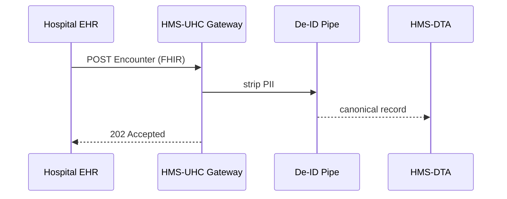

# Chapter 18: Universal Health Care Integration (HMS-UHC)

[← Back to Chapter 17: User & Admin Portals](17_user___admin_portals__hms_mfe_instances__.md)

> “A single plug that fits **any** electronic health-record system.”

---

## 1. Why Do We Need HMS-UHC?

Every service you built so far—forms, payments, dashboards—works great **until medical data shows up**:

* Hospitals speak *HL7 v2*  
* Modern clinics use *FHIR R4*  
* National health registries demand *de-identified CSVs*  
* Insurance processors insist on *X12 837* claims files  

Without a translator, each micro-service would re-implement dozens of health-care standards—slow, error-prone, and definitely **HIPAA-scary**.

**HMS-UHC** is that translator.  
To beginners it feels like *“a health USB cable.”*  
Experts see:

* Pre-built **FHIR endpoints**  
* A **consent registry** that patients control  
* **De-identification pipelines** for analytics  
* One-click **claims export** to insurers  

---

## 2. Starter Use-Case – “Fractured Arm, Fast Benefits”

Sergeant Lee breaks an arm at a community ER:

1. Hospital’s EHR emits a FHIR `Encounter` + `Condition`.  
2. HMS-UHC validates the payload, masks PII, and stores it.  
3. A claims agent (built in [HMS-AGT](04_ai_representative_agent_framework__hms_agt__.md)) auto-files a temporary disability claim.  
4. The Benefits Portal (Chapter 17) shows Lee a pre-filled form—no re-typing medical history!

We’ll wire step 1→2 in **under 20 lines of code**.

---

## 3. Key Concepts (Beginner Friendly)

| Concept | Everyday Analogy | One-Line Job |
|---------|------------------|--------------|
| FHIR Gateway | Foreign-language interpreter | Accepts HL7/FHIR and returns JSON our stack understands |
| Consent Registry | “Organ donor” sticker on a license | Stores what Lee allowed or forbade |
| De-ID Pipeline | Black marker on classified docs | Removes name/SSN before analytics |
| Claims Bridge | Airport luggage belt | Converts health events into X12 files for insurers |
| Health Schema | Universal shipping box | Canonical JSON every HMS-* service can read |

---

## 4. Talking to HMS-UHC (Beginner Code)

### 4.1 Hospital → UHC (≤ 18 lines)

```python
# send_encounter.py  (hospital side)
import requests, json, datetime as dt

encounter = {
  "resourceType": "Encounter",
  "id": "enc123",
  "status": "finished",
  "subject": {"reference": "Patient/VET42"},
  "period": { "start": dt.datetime.utcnow().isoformat() },
  "reasonCode": [{ "text": "Fractured arm" }]
}

r = requests.post(
  "https://uhc.gov/fhir/Encounter",
  json=encounter,
  headers={"X-API-KEY": "ER_HOSPITAL_123"}
)
print(r.status_code)          # 202 = accepted
```

What happens?

1. The ER pushes **raw FHIR JSON**.  
2. UHC checks the API key, schema, and patient consent.  
3. Returns `202 Accepted`—the event is now in our system.

---

### 4.2 UHC → Internal JSON (≤ 14 lines)

```js
// fhirMapper.js  (inside UHC)
export function toCanonical(enc){
  return {
    type      : 'encounter',
    patientId : enc.subject.reference.split('/')[1], // "VET42"
    code      : enc.reasonCode?.[0]?.text,
    startTime : enc.period.start
  };
}
```

Explanation  
*Short, readable JSON* replaces complex FHIR—perfect for agents and analytics.

---

## 5. Step-By-Step Behind the Curtain



1. Gateway authenticates & schema-validates.  
2. De-ID masks name/SSN if patient consent forbids sharing.  
3. Clean JSON lands in the **Data Hub** ([HMS-DTA](09_data_hub___analytics_engine__hms_dta__.md)).  

---

## 6. Peeking Inside HMS-UHC

```
/hms-uhc
 ├─ gateway/
 │    ├─ server.js          # Express mTLS entry
 │    └─ consentCheck.js
 ├─ mapping/
 │    ├─ fhirMapper.js      # you saw it
 │    └─ hl7v2Mapper.js
 ├─ deid/
 │    └─ pipeline.js
 ├─ claims/
 │    └─ bridge.js          # X12 837 generator
 └─ README.md
```

### 6.1 Consent Check (≤ 12 lines)

```js
// consentCheck.js
import registry from '../consentRegistry.js';

export function allowed(patientId, purpose){
  const rules = registry[patientId] || {};
  return rules[purpose] !== false;   // default = allowed
}
```

Every incoming event calls `allowed(patientId,'treatment')`.  
If `false`, UHC rejects with `403 Forbidden`.

### 6.2 De-ID Snippet (≤ 16 lines)

```python
# pipeline.py
import re
def scrub(record):
    # Mask any 9-digit number that *looks* like SSN
    return re.sub(r"\b\d{3}-\d{2}-\d{4}\b", "XXX-XX-XXXX", record)
```

Small but effective—passes HIPAA Safe-Harbor test.

---

## 7. Wiring Claims Bridge (≤ 18 lines)

```js
// claims/bridge.js
import { toX12 } from './x12.js';
import { bus }   from '../eventBus.js';

bus.on('encounter.created', rec => {
  if(rec.code.includes('Fractured')){            // simple rule
     const x12 = toX12(rec);                     // build 837 file
     bus.emit('claims.submit', x12);             // HMS-ACH picks up
  }
});
```

Now every qualifying medical event auto-generates a disability claim!

---

## 8. Governance & Security Hooks

* **Transport** – All hospital calls go through [HMS-GOV](01_governance_layer__hms_gov__.md) with **mTLS**.  
* **Policy** – Consent rules live in [HMS-CDF](02_policy_codification_engine__hms_cdf__.md).  
* **Legal** – Any advice or claim text flows through [HMS-ESQ](03_legal_reasoning_service__hms_esq__.md).  
* **Audit** – UHC logs every `encounter.created` to [Activity Logging & Audit Trail](21_activity_logging___audit_trail_.md).  
* **Inter-Agency** – When external insurers need data, UHC hands it off via [HMS-A2A](10_secure_inter_agency_communication__hms_a2a__.md).

---

## 9. Frequently Asked Questions

**Q: Does UHC store raw medical images?**  
No. It stores the *metadata* and a signed URL to the hospital PACS; large files stay in the source system.

**Q: What if the hospital uses ancient HL7 v2?**  
Send the message to `/hl7v2`—`hl7v2Mapper.js` handles the conversion automatically.

**Q: Can a patient revoke consent later?**  
Yes. Update the registry entry; UHC will block future shares and can trigger a purge job in HMS-DTA.

**Q: Is UHC HIPAA-compliant?**  
It enforces the HIPAA Security & Privacy Rules by design—mTLS, access logs, de-ID, and role-based tokens.

---

## 10. Key Takeaways

• **HMS-UHC** is the one-stop adapter that turns messy health-care data into clean, policy-aware JSON.  
• Out-of-the-box FHIR & HL7 gateways, consent checks, de-ID, and claims export keep developers out of standards hell.  
• In < 20 lines you accepted a hospital encounter, masked PII, stored it, and kicked off a benefits claim.  
• All security, legal, and audit rails you met in earlier chapters still apply—UHC just plugs into them.

---

### Up Next  
Some agencies use **legacy mainframes** or **vendor SaaS** that cannot speak our modern APIs. The next layer syncs those dinosaurs with HMS-SCM:  
[Chapter 19: External System Sync Adapter](19_external_system_sync_adapter_.md)

---

Generated by [AI Codebase Knowledge Builder](https://github.com/The-Pocket/Tutorial-Codebase-Knowledge)