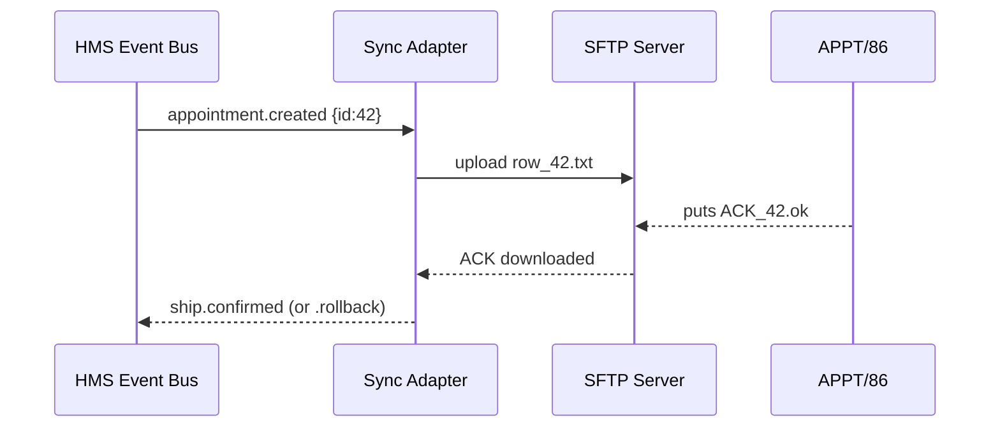

# Chapter 19: External System Sync Adapter
[← Back to Chapter 18: Universal Health Care Integration](18_universal_health_care_integration__hms_uhc__.md)

> “The UN-interpreter that keeps legacy mainframes, vendor data-warehouses, and cloud SaaS in perfect step with HMS-SCM.”

---

## 1 . Why Do We Need a Sync Adapter?

Picture this – the Veterans Health Administration (VHA) still runs an on-prem mainframe called **APPT/86** for surgery schedules.  
Meanwhile, every change made in our modern platform (HMS-SCM) must also appear in that mainframe because:

* Hospital shift rosters are printed from APPT/86 every night.  
* The Office of Inspector General audits that roster.  
* Missing or duplicate rows trigger real-world chaos (patients arriving on wrong days).

Without a bridge, engineers would copy-paste CSV files or write one-off scripts.  
The **External System Sync Adapter (ESSA)** makes the copy automatic, safe, and reversible.

---

## 2 . Key Concepts (Beginner Friendly)

| Concept               | Analogy                            | One-Line Job                                                     |
|-----------------------|------------------------------------|------------------------------------------------------------------|
| Event Listener        | Court stenographer                 | Hears every change inside HMS-SCM                                |
| Dialect Transformer   | UN interpreter                     | Converts JSON → the foreign system’s format (CSV, XML, EDI …)    |
| Delivery Channel      | FedEx truck                        | Ships the converted file (SFTP, message queue, HTTPS)            |
| Idempotency Token     | Package tracking number            | Ensures a re-send never creates duplicates                       |
| Roll-Back Hook        | “Return to sender” form            | Deletes or reverts data if downstream rejects it                 |

Keep these five in mind—ESSA is basically **listen → translate → deliver → confirm (or roll back).**

---

## 3 . Starter Use-Case – “Sync New Surgeries to the APPT/86 Mainframe”

Goal: every time a surgeon books a knee replacement in HMS-SCM:

1. An `appointment.created` event is fired.  
2. ESSA converts it to the 1986 fixed-width record.  
3. Sends the record via secure SFTP to APPT/86.  
4. Waits for an ACK file. If ACK says “error,” ESSA reverses the HMS record.

We will build this in two tiny files—each **< 20 lines**.

---

### 3.1 Minimal Adapter Listener (Node.js, 18 lines)

```js
// adapter/listen.js
import { bus } from 'hms-event-bus';   // emits every HMS event
import { send } from './deliver.js';   // handles SFTP upload
import { toFixed } from './xform.js';  // JSON -> mainframe row

const SENT = new Set();                // idempotency memory

bus.on('appointment.created', async ev => {
  if (SENT.has(ev.id)) return;         // already shipped
  const row = toFixed(ev);             // 1 Translate
  const ok  = await send(row);         // 2 Deliver & wait ACK
  if (ok) SENT.add(ev.id);             // 3 Mark success
  else bus.emit('appointment.rollback', ev.id); // 4 Trigger rollback
});
```

What happens?

1. Listens for every new appointment.  
2. Skips if the event was already shipped (idempotent).  
3. Transforms JSON → fixed-width string.  
4. Sends via SFTP + blocks until the mainframe drops an ACK file.  
5. Emits a rollback event if ACK is negative.

---

### 3.2 Translator (Fixed-Width, 14 lines)

```js
// adapter/xform.js
export function toFixed(ev){
  const pad = (s,l) => (s||'').toString().padEnd(l,' ');
  return (
    pad(ev.id,10)   +       // APPT_ID
    pad(ev.patientId,12) +  // PATIENT_ID
    pad(ev.date,10) +       // YYYY-MM-DD
    pad(ev.type,20) +       // "KNEE REPLACEMENT"
    pad(ev.surgeonId,10)    // SURGEON
  );
}
```

Fixed-width output exactly matches APPT/86’s age-old spec.

---

## 4 . Step-By-Step – What Happens Under the Hood



Only four actors, so it’s easy to reason about and debug.

---

## 5 . Internal Files & Folders

```
/adapter
 ├─ listen.js      # main loop
 ├─ deliver.js     # SFTP helper
 ├─ xform.js       # dialect translator
 ├─ ackWatcher.js  # polls for ACK files
 └─ README.md
```

### 5.1 Delivery Helper (SFTP + ACK Wait, 18 lines)

```js
// adapter/deliver.js
import SFTP from 'ssh2-sftp-client';
import { waitAck } from './ackWatcher.js';

const sftp = new SFTP();
await sftp.connect({ host:'mf.dhs.local', user:'sync', key:process.env.KEY });

export async function send(row){
  const fname = `APPT_${Date.now()}.dat`;
  await sftp.put(Buffer.from(row), `/inbox/${fname}`);
  return await waitAck(fname.replace('.dat','.ok')); // true/false
}
```

*All creds come from environment variables set by [HMS-GOV](01_governance_layer__hms_gov__.md).*

---

### 5.2 ACK Watcher (Polling, 12 lines)

```js
// adapter/ackWatcher.js
import { promisify } from 'util'; import SFTP from 'ssh2-sftp-client';
const sftp = new SFTP(); await sftp.connect(/*…same creds…*/);

export async function waitAck(file){
  for(let i=0;i<10;i++){             // retry 10×
    if(await sftp.exists(`/ack/${file}`)) return true;
    await promisify(setTimeout)(3000); // wait 3 s
  }
  return false;                      // timeout => failure
}
```

*In real life you’d use event-driven SFTP or message queues, but this 12-liner illustrates the idea.*

---

## 6 . Relationship to Other HMS Layers

| Need                             | Who Provides It | Linked Chapter |
|----------------------------------|-----------------|----------------|
| Secure network & API keys        | HMS-GOV         | [Governance Layer](01_governance_layer__hms_gov__.md) |
| Policy: which fields may leave   | HMS-CDF         | [Policy Codification Engine](02_policy_codification_engine__hms_cdf__.md) |
| Legal rollback reason logging    | HMS-ESQ         | [Legal Reasoning Service](03_legal_reasoning_service__hms_esq__.md) |
| Event source & rollback trigger  | HMS-ACT & DTA   | [Agent Orchestration](07_agent_orchestration_service__hms_act__.md) |
| Audit trail of every transfer    | Audit Service   | [Activity Logging & Audit Trail](21_activity_logging___audit_trail_.md) |

All rails you’ve met before stay intact; ESSA simply plugs into them.

---

## 7 . Frequently Asked Questions

**Q: What if the mainframe is down?**  
`deliver.js` retries; after N failures the adapter emits `appointment.rollback` so HMS-SCM can notify staff.

**Q: What prevents duplicate rows on a retry?**  
The mainframe’s file name plus the idempotency `SENT` set ensure each HMS event maps to **exactly one** external row.

**Q: Can I sync *to* cloud SaaS instead of a mainframe?**  
Yes—swap `deliver.js` for an HTTPS client or AWS SQS sender; `listen.js` stays the same.

**Q: Where do transformation rules live?**  
In small mapper files (`xform.js`, `hl7Mapper.js`, `csvMapper.js`) version-controlled and reviewed like any code.

---

## 8 . Key Takeaways

• **External System Sync Adapter** listens to HMS events, speaks the foreign dialect, confirms delivery, and rolls back on failure—no duplicate data, no manual CSVs.  
• Core loop is tiny (< 20 lines), yet powerful when paired with idempotency tokens and ACK checks.  
• Security, policy, and audit hooks come “for free” by leaning on earlier HMS layers.  
• Swap transport (SFTP → HTTPS) or format (fixed-width → XML) without touching business logic.

---

### Up Next

Now that data reliably flows **in both directions**, we must keep an eye on uptime, latency, and error rates.  
Time to meet our dashboards and alerting tools in  
[Chapter 20: Operational Monitoring & Reliability (HMS-OPS)](20_operational_monitoring___reliability__hms_ops__.md)

---

Generated by [AI Codebase Knowledge Builder](https://github.com/The-Pocket/Tutorial-Codebase-Knowledge)