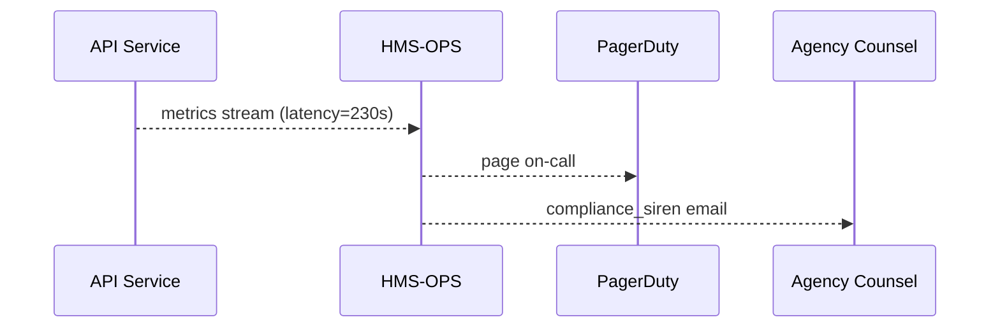

# Chapter 20: Operational Monitoring & Reliability (HMS-OPS)

[← Back to Chapter&nbsp;19: External System Sync Adapter](19_external_system_sync_adapter_.md)

> “911 for software health, equipped with compliance sirens.”

---

## 1. Why Do We Need HMS-OPS?

Imagine the Office of Special Education and Rehabilitative Services (**OSERS**) promises—by law—to answer disability-benefit calls in **< 60 seconds**.  
At 10 AM on Monday traffic spikes, average wait time hits **230 seconds**, and:

* Citizens post complaints on social media.  
* The Department’s Inspector General starts counting violations.  
* A hidden bug in the Sync Adapter (last chapter) clogs the queue.

Without **real-time monitoring** OSERS discovers the problem **tomorrow** in the newspaper.  
With **HMS-OPS** the platform:

1. Detects latency crossing the legal **Service Level Agreement (SLA)**.  
2. Fires a “compliance siren” only if the breach lasts > 2 minutes.  
3. Pages the on-call engineer **and** notifies the agency counsel.  
4. Auto-creates an incident ticket with logs, policy pack versions, and AI bias metrics attached.

**Bottom line:** OPS is the nervous system that keeps every heartbeat, log line, and policy metric in view.

---

## 2. Key Concepts (Beginner Friendly)

| Term                | City-Hall Analogy              | One-Line Job                          |
|---------------------|--------------------------------|---------------------------------------|
| Sensor              | Thermometer in each office     | Measures things (latency, CPU, bias)  |
| SLO                 | “Reply to citizens in 60 s” sign | Target the agency must meet          |
| Policy Drift Check  | Clerk comparing today’s rulebook to yesterday’s | Catches misconfigurations |
| Compliance Siren    | Red flashing light             | Alert sent only when legal metrics fail |
| Incident Playbook   | Fire-drill checklist           | Auto actions when a siren triggers    |
| Reliability Board   | Wall dashboard                | Shows green/yellow/red status at a glance |

Keep these six handy—OPS is simply **sensors + rules + sirens + dashboards**.

---

## 3. 60-Second Quick-Start

Below is a **working OPS mini-monitor** that:

1. Polls API latency every 5 s.  
2. Pages the team if the 1-minute average > 60 s.  
3. Adds the **policy version ID** to the alert payload.

### 3.1 `monitor.js` (18 lines)

```js
// monitor.js  • run with: node monitor.js
import axios from 'axios';

let samples = [];

setInterval(async () => {
  const t0 = Date.now();
  await axios.get('http://svc.gov/ping');          // 1  probe
  samples.push(Date.now() - t0);                   // 2

  // keep last 60 seconds
  samples = samples.slice(-12);                    // 3
  const avg = samples.reduce((a,b)=>a+b,0)/samples.length;

  if (avg > 60_000) {                              // 4 SLO breach
    const pack = await axios.get('http://cdf/policy/version')
                             .then(r=>r.data.id);  // 5 policy drift meta
    await pageTeam({ avg, pack });                 // 6 siren!
    samples = [];                                  // reset
  }
}, 5_000);

function pageTeam(msg){
  return axios.post('http://ops/pager', msg);      // 7 stub
}
```

**What happens?**  
1️⃣ Probe `/ping` → record latency.  
4️⃣ If average latency > 60 000 ms (60 s), trigger `pageTeam`.  
5️⃣ Attach current Policy Pack ID so responders know if a rule change caused the slowdown.

---

## 4. Life of a Compliance Siren



Only four actors—easy to trace during an audit.

---

## 5. Under the Hood

### 5.1 Folder Peek

```
/hms-ops
 ├─ sensors/       # collects data
 │    ├─ latency.js
 │    └─ heartbeat.js
 ├─ rules/
 │    └─ slo.yml   # SLO & legal SLA definitions
 ├─ siren/
 │    ├─ pager.js  # pages humans
 │    └─ playbook.js
 ├─ board/
 │    └─ dash.js   # tiny express dashboard
 └─ README.md
```

### 5.2 SLO Rule File (`rules/slo.yml`, 8 lines)

```yaml
sla_wait_time:
  target_ms : 60000          # 60 seconds
  window    : 60             # seconds
  onFail    : compliance_siren
```

Policy analysts edit YAML—no code deploy needed.

### 5.3 Playbook Snippet (≤ 14 lines)

```js
// siren/playbook.js
import { log }   from '../audit.js';
import { page }  from './pager.js';

export async function compliance_siren(ctx){
  await page(`Wait-time breach ${ctx.avg}ms  pack:${ctx.pack}`);
  log('siren', ctx);   // saved by Activity Logging (next chapter)
}
```

---

## 6. How Sensors Feed Everything Else

1. **Sensors** (`latency.js`, `heartbeat.js`, bias metrics) push events to a local **Redis stream**.  
2. A **Rule Engine** (20 lines using `yaml` + `eval`) evaluates SLOs every 5 s.  
3. On failure it triggers the configured **playbook**.  
4. Each playbook step emits an `ops.incident` event captured by  
   [Activity Logging & Audit Trail](21_activity_logging___audit_trail_.md) for permanent evidence.  
5. The **Reliability Board** (`dash.js`) simply reads Redis and paints green/yellow/red bulbs via WebSockets.

---

## 7. Connecting to Other HMS Layers

| Need                              | Who Provides It | Chapter |
|-----------------------------------|-----------------|---------|
| Secure inbound metric push        | [HMS-GOV](01_governance_layer__hms_gov__.md) |
| Rule definitions & version IDs    | [HMS-CDF](02_policy_codification_engine__hms_cdf__.md) |
| Legal context for alerts          | [HMS-ESQ](03_legal_reasoning_service__hms_esq__.md) |
| Incident ticket workflow          | [HITL Override](05_human_in_the_loop__hitl__override_.md) |
| Historical logs & evidence        | [Activity Logging & Audit Trail](21_activity_logging___audit_trail_.md) |

---

## 8. Frequently Asked Questions

**Q: How is OPS different from ordinary DevOps tools?**  
It blends classic metrics **and** governance data—policy drift, AI bias flags, legal SLA timers—into one alerting pipeline.

**Q: Does every micro-service need its own sensor?**  
No. The generic `heartbeat.js` auto-discovers services via the Kubernetes API and probes `/healthz`.

**Q: Can OPS auto-rollback a bad deploy?**  
Yes. Add `onFail: rollback` in `slo.yml`; the playbook will call the CI/CD API.

**Q: Will OPS spam me during planned maintenance?**  
Set `maintenance_window` tags; the rule engine suppresses alerts inside those windows.

---

## 9. Key Takeaways

• **HMS-OPS watches everything**—from CPU spikes to policy mismatches—and sounds a siren only when it matters.  
• A < 20-line monitor plus an 8-line YAML file is enough to protect a legally-binding SLA.  
• Sensors, rules, sirens, and dashboards sit on top of the governance, policy, and audit rails you’ve already met.  
• When an incident fires, engineers, lawyers, and auditors all receive the same context packet—latency numbers **plus** policy pack ID.

---

## 10. Up Next

Alerts are only half the story—auditors need an immutable history of **who did what, when, and why**.  
In the final chapter we’ll build that ledger in  
[Chapter&nbsp;21: Activity Logging & Audit Trail](21_activity_logging___audit_trail_.md)

---

Generated by [AI Codebase Knowledge Builder](https://github.com/The-Pocket/Tutorial-Codebase-Knowledge)