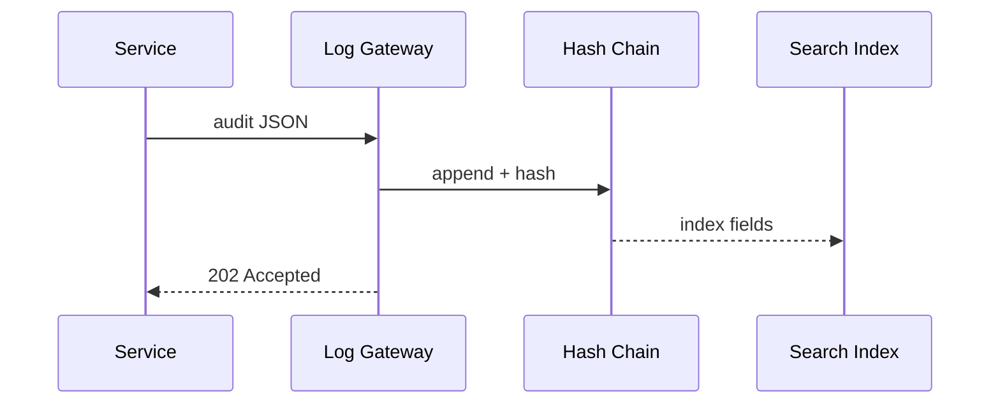

# Chapter 21: Activity Logging & Audit Trail  
[← Back to Chapter 20: Operational Monitoring & Reliability](20_operational_monitoring___reliability__hms_ops__.md)

> “If someone blames the system, the ledger answers: *‘Here is exactly what happened.’*”

---

## 1. Why Do We Need an Immutable Audit Trail?

Imagine an investigative journalist files a **FOIA** request:

> “Provide every change to Sergeant Lee’s disability-benefit claim between  
>  March 1 and March 10, including which AI model or employee made the edit.”

Without a **trust-worthy, tamper-evident** log we might:

* Miss a critical change → legal trouble  
* Spend weeks stitching data from 12 micro-services → overtime  
* Fail to prove integrity → public mistrust

The **Activity Logging & Audit Trail (HMS-LOG)** solves this once and for all.  
To beginners: “Everything is recorded.”  
To experts: “An append-only, hash-chained ledger with full-text search and policy-aware redaction.”

---

## 2. Starter Use-Case – “Who Denied Lee’s Claim?”

Goal: within seconds show

* **Who** denied the claim (AI agent or human)  
* **Why** (policy pack & rationale)  
* **Exactly what data** was seen and changed

We’ll:

1. Emit an audit event from the service that processed the claim.  
2. Query the ledger for those events.

---

## 3. Key Concepts (Beginner Friendly)

| Concept             | City-Hall Analogy                 | One-Line Job                                   |
|---------------------|-----------------------------------|------------------------------------------------|
| Audit Event         | Clerk’s logbook line              | Immutable record: *who, what, when, where*    |
| Hash Chain          | Tamper-proof page numbers         | Each event hash signs the next                |
| Redaction Policy    | Black-bar marker                  | Masks PII for unauthorised viewers            |
| Proof-Of-Integrity  | Notary stamp                      | Shows a hash that can be independently checked|
| Log Index           | Card-catalog                      | Lets you search “all events for claim 123”    |

Keep these five in mind—everything else is plumbing.

---

## 4. Writing to the Log (≤ 18 Lines)

```js
// denyClaim.js   (runs inside HMS-SVC)
import { log } from 'hms-log-client';

export async function denyClaim(claimId, reason){
  // ... business logic to deny ...
  await log({
    type      : 'claim.denied',
    actor     : 'AGT_DENIAL_01',         // envelope from Chapter 4
    claimId,
    reason,
    policyPack: 'cdf_ssn_masking_v1',    // Chapter 2
  });
}
```

**What happens?**

1. The client library serialises the JSON.  
2. Adds timestamp, sequence number, and previous-hash.  
3. Sends it to the **Log Ingest API** over mTLS (via [HMS-GOV](01_governance_layer__hms_gov__.md)).  
4. Service continues—logging is non-blocking.

---

## 5. Reading the Log (≤ 14 Lines)

```js
// whoDidIt.js
import { find } from 'hms-log-client';

const events = await find({
  type   : 'claim.denied',
  claimId: 'CLM-2024-0017'
});
events.forEach(e => console.log(
  `${e.actor} denied on ${new Date(e.ts).toUTCString()} because ${e.reason}`
));
```

Expected output:

```
AGT_DENIAL_01 denied on Thu, 07 Mar 2024 14:22:11 GMT because incomeAboveLimit
```

If a human had overridden the AI you’d see a second event: `HITL_MANAGER_44.override`.

---

## 6. What Happens Under the Hood?



1. Gateway validates signature & role.  
2. Appends event to **Hash Chain** (append-only file in object storage).  
3. Indexer stores searchable keys (`type`, `claimId`, `actor`, …).  
4. Call returns in ~10 ms—no service slow-down.

---

## 7. Peeking into the Code Base

```
/hms-log
 ├─ gateway/
 │    └─ server.js        # 70 lines
 ├─ chain/
 │    ├─ append.js        # hash-chain writer
 │    └─ verify.js
 ├─ index/
 │    └─ lucene.js        # tiny full-text wrapper
 └─ client/
      ├─ log.js
      └─ query.js
```

### 7.1 Hash-Chain Append (≤ 18 Lines)

```js
// chain/append.js
import fs from 'fs';
import crypto from 'crypto';

export function append(ev){
  const prev = fs.readFileSync('last.hash','utf8') || '';
  const str  = JSON.stringify(ev);
  const hash = crypto.createHash('sha256')
                     .update(prev + str).digest('hex');

  fs.appendFileSync('ledger.log', str+'\n');
  fs.writeFileSync('last.hash',   hash);
  return hash;            // returned to caller for receipts
}
```

Simple yet tamper-evident: change any prior line and every later hash fails.

---

### 7.2 Redaction on Query (≤ 14 Lines)

```js
// client/query.js  (fragment)
export function sanitize(ev, viewerRole){
  if(viewerRole!=='auditor'){
    delete ev.ssn;             // mask PII
    ev.actor = ev.actor.replace(/AGT_.+/,'[redacted]');
  }
  return ev;
}
```

Policy rules for redaction come from [HMS-CDF](02_policy_codification_engine__hms_cdf__.md).

---

## 8. Integrity Proof for Auditors (≤ 12 Lines)

```bash
# verify.sh
tail -n1 ledger.log | openssl dgst -sha256
cat last.hash
```

If both hashes match, the file is intact. Auditors can reproduce this offline.

---

## 9. Relationship with Other Chapters

| Need                                   | Provided By | Where We Met It |
|----------------------------------------|-------------|-----------------|
| Secure transport & auth                | HMS-GOV     | [Chapter 1](01_governance_layer__hms_gov__.md) |
| Policy-based redaction                 | HMS-CDF     | [Chapter 2](02_policy_codification_engine__hms_cdf__.md) |
| Legal context for each event           | HMS-ESQ     | [Chapter 3](03_legal_reasoning_service__hms_esq__.md) |
| AI actor envelopes                     | HMS-AGT     | [Chapter 4](04_ai_representative_agent_framework__hms_agt__.md) |
| HITL overrides                         | HITL        | [Chapter 5](05_human_in_the_loop__hitl__override_.md) |
| Ops incidents writing to the log       | HMS-OPS     | [Chapter 20](20_operational_monitoring___reliability__hms_ops__.md) |

Everything—API calls, AI prompts, policy pack IDs—funnels into one **verifiable timeline**.

---

## 10. Frequently Asked Questions

**Q: Does logging slow down my service?**  
No. The client batches events; a background worker writes to the Gateway.

**Q: How long are logs kept?**  
Default 7 years to meet Federal records rules; retention is a YAML setting.

**Q: Can logs be deleted for GDPR “right to be forgotten”?**  
Events stay, but redaction can permanently mask personal fields while keeping hashes intact.

**Q: Is this a blockchain?**  
It’s a **single-writer hash chain**, not a multi-party blockchain—simpler, faster, 100 % under agency control.

---

## 11. Key Takeaways

• **Every keystroke, decision fork, and model weight update** lands in an immutable, searchable ledger.  
• Hash chaining + policy-aware redaction = tamper-evident **and** privacy-compliant.  
• Writing or querying the log is < 20 lines of code; performance impact ≈ zero.  
• FOIA officers, inspectors general, and engineers all share a **single source of truth**.

---

### 12. You’ve Reached the End!

Congratulations—you now have a complete tour of HMS-SCM: from governance gates to audit ledgers.  
Spin up the sample repo, deny a test claim, and run `whoDidIt.js`; you’ll see the entire story stitched together.

*Happy (and accountable) coding!*

---

Generated by [AI Codebase Knowledge Builder](https://github.com/The-Pocket/Tutorial-Codebase-Knowledge)