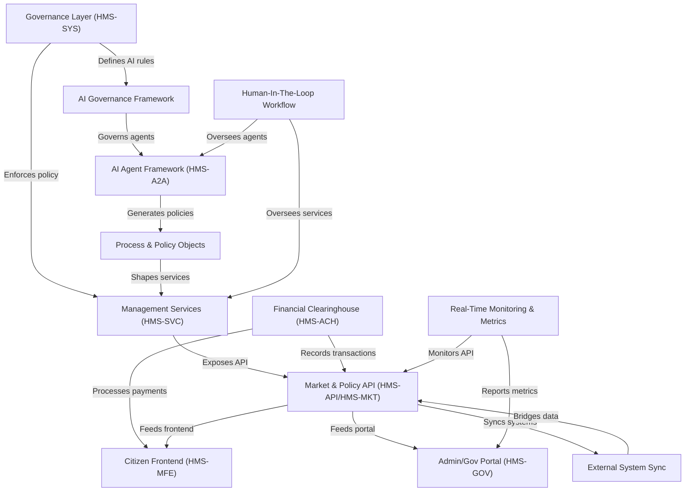

# Tutorial: HMS-SCM

HMS is a unified, *AI-powered* and **data-driven** platform for governments to design, manage, and monitor citizen programs.  
It combines **policy APIs**, **front-end portals** for citizens and administrators, **secure financial clearing**, and **AI agents** to automate workflows, ensure compliance, and deliver transparent, real-time services.

**Source Repository:** [None](None)

## Chapters

1. [Citizen Frontend (HMS-MFE)
](01_citizen_frontend__hms_mfe__.md)
2. [Admin/Gov Portal (HMS-GOV)
](02_admin_gov_portal__hms_gov__.md)
3. [Market & Policy API (HMS-API/HMS-MKT)
](03_market___policy_api__hms_api_hms_mkt__.md)
4. [Management Services (HMS-SVC)
](04_management_services__hms_svc__.md)
5. [Financial Clearinghouse (HMS-ACH)
](05_financial_clearinghouse__hms_ach__.md)
6. [External System Sync
](06_external_system_sync_.md)
7. [Process & Policy Objects
](07_process___policy_objects_.md)
8. [AI Agent Framework (HMS-A2A)
](08_ai_agent_framework__hms_a2a__.md)
9. [AI Governance Framework
](09_ai_governance_framework_.md)
10. [Governance Layer (HMS-SYS)
](10_governance_layer__hms_sys__.md)
11. [Human-In-The-Loop Workflow
](11_human_in_the_loop_workflow_.md)
12. [Real-Time Monitoring & Metrics
](12_real_time_monitoring___metrics_.md)

---

Generated by [AI Codebase Knowledge Builder](https://github.com/The-Pocket/Tutorial-Codebase-Knowledge)