# Chapter 1: Gov / Admin Portal (HMS-GOV)

> “A single cockpit for every public-sector captain.”

---

## 1. Why Does HMS-GOV Exist?

Imagine **Clara**, a policy analyst at the *Bureau of Labor Statistics (BLS)*.  
Her daily checklist:

1. Check unemployment-claim metrics.  
2. Draft a small regulation update.  
3. Route that draft through legal & AI review.  
4. Publish—*without breaking the live benefit-payment system*.

Before HMS-GOV, Clara juggled **five** separate tools: a data dashboard, a Word template, a legal e-mail chain, an internal ticketing system, and a release spreadsheet.  
With **HMS-GOV** she logs into **one web portal** that combines:

* Real-time dashboards  
* A “policy editor” connected to production rules  
* An AI assistant that pre-screens her draft for conflicts  

Result: faster turn-around, fewer errors, happier claimants.

---

## 2. Portal at a Glance

```mermaid
graph TD
    A[Dashboards<br/>“What’s happening?”]
    B[Policy Editor<br/>“Change the rules”]
    C[AI Proposal Review<br/>“Is it safe?”]
    A -->|Live data| B
    B -->|Draft JSON| C
    C -->|Approval/Issues| B
```



Key Areas (all are low-code, form-based to help beginners):

| Area | What it shows | Why it matters |
|------|---------------|----------------|
| Dashboard | KPIs, charts, alerts | Stay aware of live citizen impact |
| Policy Editor | Friendly forms → JSON policy blob | Non-tech staff can edit rules |
| AI Review | GPT-like assistant + checklists | Catches legal / data issues early |

> Analogy: Think of HMS-GOV as the *“content management system”* (CMS) of a government ERP—but wired directly into transactions rather than a static website.

---

## 3. Quick-Start Playground

Let’s spin up a *local* HMS-GOV instance and create a tiny “holiday pay” rule.

### 3.1 Install

```bash
# 1. Grab the CLI (pretend NPM package)
npm install -g @hms-sme/gov-cli
# 2. Start dev server
hms-gov dev
```

Your browser opens `http://localhost:3000` with a blank portal.

### 3.2 Create a Policy (10-line snippet)

```js
// file: holiday-pay-rule.js
import { Policy } from '@hms-sme/gov-sdk';

export const holidayPay = new Policy({
  id: 'bls.holiday.pay.v1',
  description: 'Pay overtime on federal holidays',
  condition: ctx => ctx.date.isFederalHoliday,
  action:    ctx => ctx.payRate *= 1.5
});
```

Run:

```bash
hms-gov deploy holiday-pay-rule.js
```

What happens?  
– The rule is **validated** locally,  
– **Sent** to the AI Review service,  
– **Queued** for a human approver (Clara) inside the portal.

---

## 4. Decomposing HMS-GOV

### 4.1 Dashboards

*Source*: Live metrics from [Metrics & Monitoring Pipeline](12_metrics___monitoring_pipeline_.md).  
*Beginners’ view*: Select a metric → drag onto canvas → done.

### 4.2 Policy Editor

*Source*: Schema definitions served by [Policy & Process Modules (HMS-SVC)](07_policy___process_modules__hms_svc__.md).  
Fields auto-generate from JSON Schema, so no front-end coding.

### 4.3 AI Proposal Review

*Source*: [AI Representative Agent (HMS-A2A)](04_ai_representative_agent__hms_a2a__.md) running in “reviewer” mode.  
Outputs a YAML report like:

```yaml
complianceRisk: LOW
conflicts:
  - id: bls.overtime.standard.v2
    detail: "Overlaps holiday definition"
recommendation: "Approve with note"
```

Clara sees this inside the portal before pressing **Publish**.

---

## 5. Under the Hood (Step-By-Step)


Plain-English Flow:

1. User uploads or edits policy in UI.  
2. Validator checks JSON schema.  
3. AI agent predicts risks.  
4. Human approver clicks *Approve*.  
5. Policy service version-controls & propagates to runtime services.

---

## 6. Tiny Peek at the Code

### 6.1 Route Controller (Express-style)

```ts
// src/routes/policy.ts
router.post('/policy', async (req, res) => {
  const draft = req.body;
  if (!schemaValid(draft)) return res.status(400).send('Bad schema');

  const aiReport = await aiReview(draft);       // <5s
  await queueForHitl(draft, aiReport);

  res.status(202).json({msg: 'Awaiting approval', aiReport});
});
```

Explanation:

1. **schemaValid** – local JSON schema check.  
2. **aiReview** – HTTP call to HMS-A2A micro-service.  
3. **queueForHitl** – stores draft + report in DB for a human.

### 6.2 Activation Listener

```ts
events.on('policy.approved', async (policy) => {
  await svcStore.save(policy);      // versioned save
  await svcBus.publish('policy.live', policy);
});
```

When a human (or escalation path) emits `policy.approved`, the rule is stored and broadcast to downstream services such as calculation engines.

---

## 7. Where Does HMS-GOV Sit in the Big Picture?


* You’re here (HMS-GOV).  
* Next layer down: [Frontend Micro-Frontend Layer (HMS-MFE)](02_frontend_micro_frontend_layer__hms_mfe__.md) handles component loading.  
* All calls flow through [Backend API Gateway](08_backend_api_gateway_.md) for security and logging.

---

## 8. Recap & Next Steps

You just:

• Learned why HMS-GOV simplifies government workflows.  
• Deployed a rule with 10 lines of code.  
• Saw how AI + human approval keep things safe.  

In the next chapter we’ll peek behind the curtain to see **how the UI itself is composed out of micro-frontends.**

👉 Continue to [Frontend Micro-Frontend Layer (HMS-MFE)](02_frontend_micro_frontend_layer__hms_mfe__.md)

---

Generated by [AI Codebase Knowledge Builder](https://github.com/The-Pocket/Tutorial-Codebase-Knowledge)