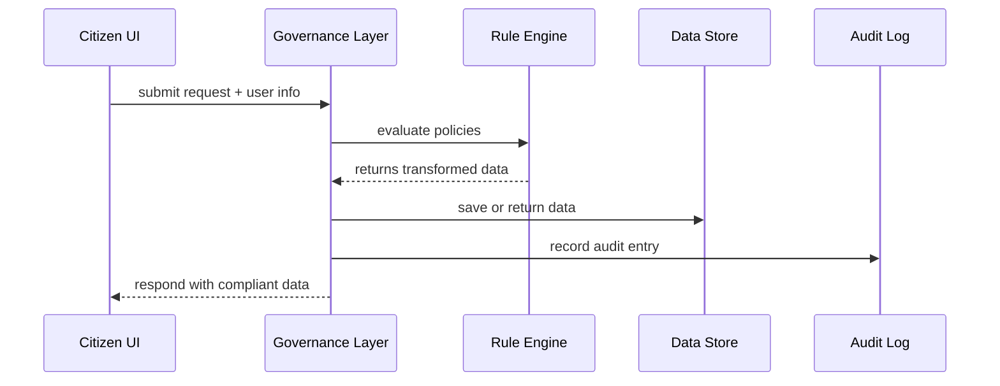

# Chapter 1: Governance Layer

Welcome to the first chapter of HMS-SME! Here we introduce the **Governance Layer**, the “city council” of our platform. It sets the rules, policies, and compliance checks that every part of the system must follow.

---

## 1. Why We Need a Governance Layer

Imagine a citizen fills out a form on a federal website—say, requesting a building permit from the National Capital Planning Commission. They submit personal data, and the system should:

1. Keep Social Security Numbers encrypted.  
2. Log every access for later audits.  
3. Ensure only authorized staff can view sensitive fields.

Without a Governance Layer, each module would have to re-implement encryption, logging, and role checks. That’s error-prone and hard to maintain.

**The Governance Layer solves this** by centralizing:

- Policy definitions (e.g., “encrypt PII”)  
- Compliance enforcement (e.g., “only auditors can view logs”)  
- Audit trails (timestamps, who saw what)  

---

## 2. Key Concepts

1. **Policy**  
   A rule or set of rules (e.g., “Mask SSN except for compliance officers”).

2. **Rule Engine**  
   Evaluates incoming requests against active policies.

3. **Compliance Checker**  
   Verifies that the outcome meets regulatory standards (e.g., FISMA, GDPR).

4. **Audit Trail**  
   Immutable logs of who did what and when.

---

## 3. Solving Our Use Case

### 3.1 Defining a Policy

Below is a minimal policy that masks PII and logs every access:

```json
{
  "id": "mask-pii",
  "description": "Mask SSN; allow full only for auditors",
  "conditions": {
    "field": "ssn",
    "action": "mask",
    "allowedRoles": ["auditor"]
  }
}
```
> This JSON says: for field `ssn`, by default mask it, unless user has role `auditor`.

### 3.2 Enforcing the Policy in Code

```javascript
// governance.js
class GovernanceLayer {
  constructor() {
    this.policies = [];
    this.auditLog = [];
  }
  registerPolicy(policy) {
    this.policies.push(policy);
  }
  enforce(request, user) {
    let data = { ...request.data };
    this.policies.forEach(p => {
      if (p.conditions.field in data) {
        if (!p.conditions.allowedRoles.includes(user.role)) {
          data[p.conditions.field] = "***-**-****";
        }
      }
    });
    this.auditLog.push({
      user: user.name,
      action: 'access',
      timestamp: new Date(),
    });
    return data;
  }
}
```
> We register policies, then call `.enforce()` to mask PII and record an audit entry.

### 3.3 Example Input & Output

```javascript
const gov = new GovernanceLayer();
gov.registerPolicy(policyJson);

const request = { data: { name: "Alice", ssn: "123-45-6789" } };
const user = { name: "Bob", role: "clerk" };

const safeData = gov.enforce(request, user);
// safeData ➔ { name: "Alice", ssn: "***-**-****" }
```

---

## 4. What Happens Under the Hood?

Let’s follow a simple sequence when a request arrives:



1. **UI → GL**: Citizen app sends data.  
2. **GL → RE**: Governance hands data and user role to the rules engine.  
3. **RE → GL**: Rules engine masks or approves fields.  
4. **GL → DB**: Approved data is stored or forwarded.  
5. **GL → LOG**: Every access is appended to the audit log.  
6. **GL → UI**: The citizen sees only compliant results.

---

## 5. A Peek Inside: Implementation Sketch

File: `governance_layer.js`

```javascript
// Load policies from a JSON file (e.g., config/policies.json)
const policies = require('./config/policies.json');

function loadPolicies() {
  // In real code: validate, version-check, handle updates
  return policies;
}

function evaluate(data, user) {
  // See earlier .enforce() logic
}

module.exports = { loadPolicies, evaluate };
```

1. **loadPolicies** reads and validates your policies file.  
2. **evaluate** applies each rule, transforms the data, and returns it.

---

## 6. Summary & What’s Next

You’ve learned how the **Governance Layer**:

- Centralizes policy definitions  
- Enforces data privacy and compliance  
- Records audit trails automatically  

In the next chapter, we’ll see how the **[Management Layer](02_management_layer_.md)** interacts with Governance to deploy and update these policies across services.

---

Generated by [AI Codebase Knowledge Builder](https://github.com/The-Pocket/Tutorial-Codebase-Knowledge)