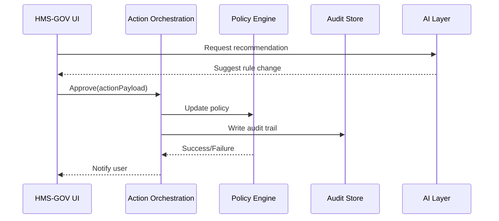

# Chapter 1: Government/Admin Portal (HMS-GOV)


Welcome to HMS-SME!  
In this opening chapter we will explore the Government/Admin Portal, the control-tower where public-sector leaders see what is happening, decide what *should* happen, and record why a decision was made.

---

## 1. Why do we need HMS-GOV?

Imagine you are a program officer at the **Minority Business Development Agency (MBDA)**.  
A new bill has just passed, directing agencies to fast-track grants for minority-owned clean-tech startups. You log into the HMS-GOV portal and immediately see:

* A live dashboard showing current grant-application volumes.
* An AI recommendation suggesting a temporary rule tweak that trims the review window from **30** to **14** days.
* A “one-click” button to approve, reject, or roll back that recommendation, with the full legal citation and impact analysis attached.

Without leaving the screen you can:

1. Compare the suggestion against existing policy.
2. Approve it, instantly publishing the change to downstream systems.
3. Generate an audit note so Congress or the public can see the reasoning.

HMS-GOV is therefore the digital equivalent of an executive briefing binder—only interactive and real-time.

---

## 2. Key Building Blocks

| Concept | What it means (plain English) |
| --- | --- |
| Dashboard Widgets | Live charts and tables showing KPIs. E.g., “Average grant-processing days.” |
| Policy Editor | A low-code form where officials can tweak rules (numbers, thresholds, on/off switches). |
| AI Recommendation Pane | The portal asks, “Want me to optimize this?”—powered by analytics and ML. |
| Decision Buttons | Approve · Override · Roll Back. Each logs a permanent audit record. |
| Audit Timeline | A scrollable history—*who* changed *what*, *why*, and *when*. |

---

## 3. A 10-Minute Tour (Hands-On)

Below is a minimal TypeScript-flavored pseudocode snippet that fetches dashboard data and displays an AI recommendation. (All snippets are <20 lines.)

```ts
// hms-gov-demo.ts
import { fetchKPIs, getAIHints, decide } from "hms-gov-sdk";

// 1. Load dashboard numbers
const kpis = await fetchKPIs("MBDA");      // e.g., {avgDays: 32, openApps: 415}

// 2. Ask AI for suggestions
const hint = await getAIHints(kpis);       // e.g., {proposal: "Cut review to 14 days"}

// 3. Render (framework-agnostic pseudo-UI)
console.log("Current Avg Days:", kpis.avgDays);
console.log("AI says:", hint.proposal);

// 4. Officer decides
await decide("approve", hint);             // sends action downstream
```

Explanation:

1. `fetchKPIs` queries the **Unified Data Fabric** (see [Unified Data Fabric (HMS-DTA)](09_unified_data_fabric__hms_dta__.md)) for real-time metrics.  
2. `getAIHints` calls into the **AI Governance Layer** (see [AI Governance Layer](04_ai_governance_layer_.md)) to suggest optimizations.  
3. `decide` forwards the approval to the **Action Orchestration Service** (see [Action Orchestration Service (HMS-ACT)](07_action_orchestration_service__hms_act__.md)).  

Run the script and you would see console output similar to:

```
Current Avg Days: 32
AI says: Cut review to 14 days
```

Approving records an audit line and pushes the change to policy storage.

---

## 4. What Happens Behind the Scenes?

Let’s walk through the same “approve” click with a bird’s-eye view.



Step-by-step (plain English):

1. UI asks the AI layer for advice.  
2. Officer hits “Approve”, sending a structured payload to the **Action Orchestration Service (HMS-ACT)**.  
3. HMS-ACT updates the canonical policy in the **Policy & Legislation Engine (HMS-CDF)**.  
4. An immutable log is stored for oversight.  
5. User gets a success toast.

---

## 5. Peek Under the Hood (Tiny Code Samples)

### 5.1 Route Handler

```ts
// src/routes/approve.ts
import { orchestrate } from "../services/act";  // wrapper over HMS-ACT

export async function POST(req, res) {
  const decision = req.body; // {proposalId, officerId, action}
  await orchestrate(decision); // <10 lines inside; abstracts retries, auth, etc.
  res.status(202).send("Queued");
}
```

### 5.2 Orchestration Stub

```ts
// src/services/act.ts
import axios from "axios";
export async function orchestrate(decision){
  /* pseudo-implementation */
  await axios.post(process.env.ACT_URL+"/execute", decision);
}
```

Both snippets gloss over security details (handled by [Operations & Observability Suite (HMS-OPS)](15_operations___observability_suite__hms_ops__.md)), but illustrate the thin layer keeping portal code simple.

---

## 6. Extending the Example

Want to test a **rollback**? Just flip the action:

```ts
await decide("rollback", {policyId: "reviewWindow"});
```

All dependencies (CDF, LOG) keep versions, so the previous setting (30 days) is reinstated, and every change stays traceable.

---

## 7. Summary

In this chapter you:

• Discovered why HMS-GOV is the “situation room” for agency officials.  
• Explored its core widgets: dashboards, policy editor, AI hints, and audit timeline.  
• Ran a 10-minute demo approving an AI-suggested rule tweak.  
• Saw a behind-the-scenes sequence and micro-code implementing the flow.

Ready to learn how the rules themselves are stored and validated? Jump to the next chapter: [Policy & Legislation Engine (HMS-CDF)](02_policy___legislation_engine__hms_cdf__.md)

---

Generated by [AI Codebase Knowledge Builder](https://github.com/The-Pocket/Tutorial-Codebase-Knowledge)