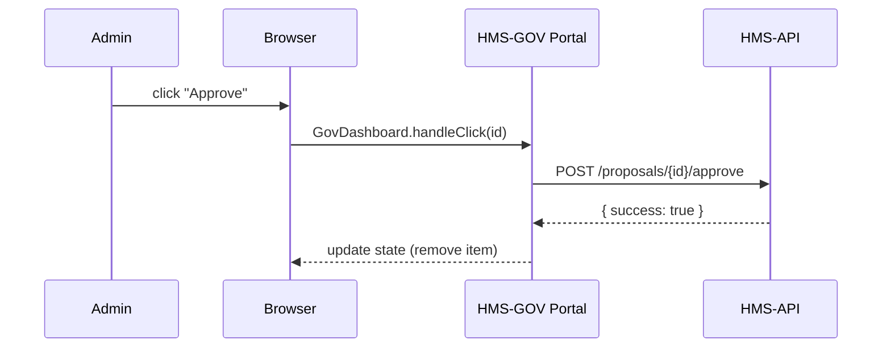

# Chapter 2: HMS-GOV Admin/Gov Portal

Welcome back! In [Chapter 1: HMS-MFE Frontend Components](01_hms_mfe_frontend_components_.md) you learned how to build buttons, inputs, and dropdowns. Now we’ll snap those pieces together into the **HMS-GOV Admin/Gov Portal**—the “mayor’s office” dashboard for administrators and policymakers.

---

## 1. Motivation & Central Use Case

Imagine you’re on the **Chief Financial Officers Council** overseeing federal budget proposals. An AI agent has generated several spending plans, but you need a neat interface to:

- Review each proposal’s title and summary  
- Approve or reject individual items  
- Adjust high-level policies  
- Keep an eye on system health and compliance

The **HMS-GOV portal** is that control room. It lets officials:
1. See a list of AI-generated policy or budget proposals  
2. Click “Approve” or “Request Changes”  
3. Tweak policy sliders (e.g., “Max Spend %”)  
4. Monitor API uptime and audit logs  

---

## 2. Key Concepts

1. **Dashboard**  
   A single page where admins see proposals, policy controls, and system stats at a glance.

2. **Proposal Review**  
   A list or table of items (AI suggestions) with “Approve”/“Reject” buttons.

3. **Policy Editor**  
   Sliders or toggles to adjust global settings (e.g., maximum grant size).

4. **Health & Compliance Monitor**  
   Simple panels showing API status, error rates, and recent audit entries.

---

## 3. Building a Simple Admin Dashboard

Below is a minimal example using HMS-MFE’s `Button` component and `axios` to fetch proposals:

```jsx
// src/pages/GovDashboard.tsx
import React, { useState, useEffect } from 'react';
import { Button } from 'hms-mfe-components';
import axios from 'axios';

export default function GovDashboard() {
  const [proposals, setProposals] = useState([]);
  useEffect(() => {
    axios.get('/api/proposals').then(res => setProposals(res.data));
  }, []);
  function approve(id) {
    axios.post(`/api/proposals/${id}/approve`).then(() =>
      setProposals(ps => ps.filter(p => p.id !== id))
    );
  }
  return (
    <div>
      {proposals.map(p => (
        <div key={p.id}>
          <h3>{p.title}</h3>
          <p>{p.summary}</p>
          <Button onClick={() => approve(p.id)}>Approve</Button>
        </div>
      ))}
    </div>
  );
}
```

Explanation:
- We fetch `proposals` from `/api/proposals`.
- Each proposal shows a title, summary, and an **Approve** button.
- Clicking **Approve** sends `POST /api/proposals/{id}/approve` then removes it from the list.

---

## 4. Under the Hood: Sequence Walkthrough

Here’s what happens step-by-step when an admin clicks **Approve**:



1. **Browser** detects the click on our `Button`.  
2. `GovDashboard` calls `approve(id)`.  
3. We hit the **HMS-API** endpoint to mark it approved in the database.  
4. On success, we update React state to refresh the list.

---

## 5. Glimpse at the Backend Route

On the backend (**HMS-API**), a simple Express route handles approvals:

```ts
// hms-api/src/routes/proposals.ts
import express from 'express';
const router = express.Router();

// Approve a proposal by ID
router.post('/:id/approve', (req, res) => {
  // …update database record here…
  res.json({ success: true });
});

export default router;
```

This route updates the proposal’s status in your datastore. In real life, you’d also log the action for compliance and notify audit services.

---

## 6. What You’ve Learned

- How the **HMS-GOV Admin Portal** acts like a mayor’s office dashboard for policy review.  
- Key portal pieces: **proposal list**, **approve button**, **policy editor**, and **health monitor**.  
- A minimal React example fetching and approving proposals using HMS-MFE components.  
- Internal flow from admin click to backend approval and UI update.

Up next, we’ll see how this portal communicates with other modules in the system.  
[Chapter 3: Interface Layer](03_interface_layer_.md) will show how data travels between frontend and backend services.

---

Generated by [AI Codebase Knowledge Builder](https://github.com/The-Pocket/Tutorial-Codebase-Knowledge)