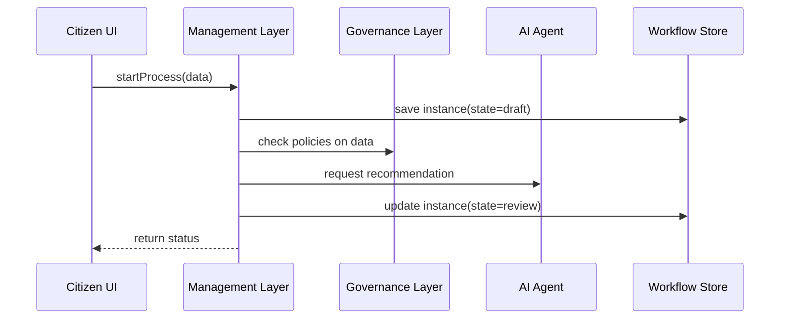

# Chapter 2: Management Layer

In [Chapter 1: Governance Layer](01_governance_layer_.md) we learned how policies and compliance checks are centralized. Now, we move “up one floor” to the **Management Layer**, which takes those policies and turns them into real‐world processes and workflows.

---

## 1. Why We Need a Management Layer

Imagine a city manager’s office. The city council (our Governance Layer) sets rules like “build more parks” or “reduce traffic.” The city manager’s office then plans budgets, schedules, and assigns teams to actually **do** the work. 

For a commission like MedPAC, the Management Layer answers questions such as:

- How does a draft policy proposal move from “submitted” → “under review” → “approved”?  
- Who needs to sign off at each stage (human or AI)?  
- When should we trigger notifications, allocate budgets, or lock records?

Without a Management Layer, each department would reinvent process tracking. It’s messy and error‐prone.

---

## 2. Key Concepts

1. **Workflow Definition**  
   A blueprint for a process (e.g., “Policy Approval”). Lists steps and who or what performs them.

2. **Process Instance**  
   One running copy of a workflow (e.g., Proposal #123 is in “Review” step).

3. **Task**  
   A single action in the workflow (e.g., “Assign reviewer”, “Gather AI recommendation”).

4. **State Transition**  
   Moving from one task to the next (e.g., from `draft` → `review`).

5. **Integration Points**  
   Hooks where we call Governance for compliance, AI for analysis, or send human‐in‐the‐loop notifications.

---

## 3. Solving Our Use Case

### 3.1 Defining a Policy Workflow

Below is a minimal workflow that moves a policy proposal through three steps:

```json
{
  "id": "policy-approval",
  "steps": [
    { "name": "draft",   "next": "review" },
    { "name": "review",  "next": "finalize" },
    { "name": "finalize", "next": null }
  ]
}
```
> Each step has a name and points to the next. `null` means the process ends.

### 3.2 Starting a Process in Code

```javascript
// management_layer.js
const mgmt = new ManagementLayer();
const workflowDef = require('./workflows/policy-approval.json');

mgmt.registerWorkflow(workflowDef);
const instance = mgmt.startProcess('policy-approval', { proposalId: 123 });
console.log(instance.state);
// ➔ draft
```
> We register our workflow, start it with some data, and see it in the `draft` state.

### 3.3 Advancing a Task

```javascript
// A reviewer finishes their part:
mgmt.advanceStep(instance.id);
// The layer applies Governance checks, maybe calls an AI recommendation,
// then moves state from 'draft' → 'review'.
console.log(mgmt.getStatus(instance.id));
// ➔ review
```

---

## 4. What Happens Under the Hood?



1. **UI → ML**: A user or service starts a process.  
2. **ML → DB**: Management Layer persists a new process instance.  
3. **ML → GL**: It calls the Governance Layer to enforce compliance on input data.  
4. **ML → AI**: Optionally asks the AI Agent for recommendations.  
5. **ML → DB**: Updates the process state to the next step.  
6. **ML → UI**: Responds with the current status.

---

## 5. Inside the Management Layer

Non-code walkthrough:

1. **registerWorkflow(def)** loads the blueprint into memory.  
2. **startProcess(id, data)**  
   - Create a new instance record  
   - Set `state = firstStep`  
   - Persist to a store  
3. **advanceStep(instanceId)**  
   - Load instance, find its current step  
   - Run before/after hooks (Governance, AI, notifications)  
   - Move to `next` state, save  

File: `management_layer.js`

```javascript
class ManagementLayer {
  constructor() {
    this.workflows = {};
    this.instances = {};
  }

  registerWorkflow(def) {
    this.workflows[def.id] = def;
  }

  startProcess(id, data) {
    const wf = this.workflows[id];
    const instance = { id: Date.now(), state: wf.steps[0].name, data };
    this.instances[instance.id] = instance;
    return instance;
  }

  advanceStep(instanceId) {
    const inst = this.instances[instanceId];
    const wf = this.workflows[inst.data.workflowId];
    // 1) compliance check
    // 2) AI recommendation
    // 3) move to next
    const step = wf.steps.find(s => s.name === inst.state);
    inst.state = step.next;
    return inst;
  }

  getStatus(instanceId) {
    return this.instances[instanceId].state;
  }
}

module.exports = ManagementLayer;
```

> This simple skeleton manages workflows in memory. In production you’d swap `instances` for a database and add real Governance/AI calls.

---

## 6. Summary & Next Steps

You now know how the **Management Layer**:

- Registers workflow definitions  
- Starts and tracks process instances  
- Coordinates between Governance checks and AI suggestions  
- Advances tasks and updates state  

Next up, we’ll dive deeper into how individual policies and processes are defined and plugged into these workflows in the [Policy/Process Module](03_policy_process_module_.md). 

Enjoy building!

---

Generated by [AI Codebase Knowledge Builder](https://github.com/The-Pocket/Tutorial-Codebase-Knowledge)