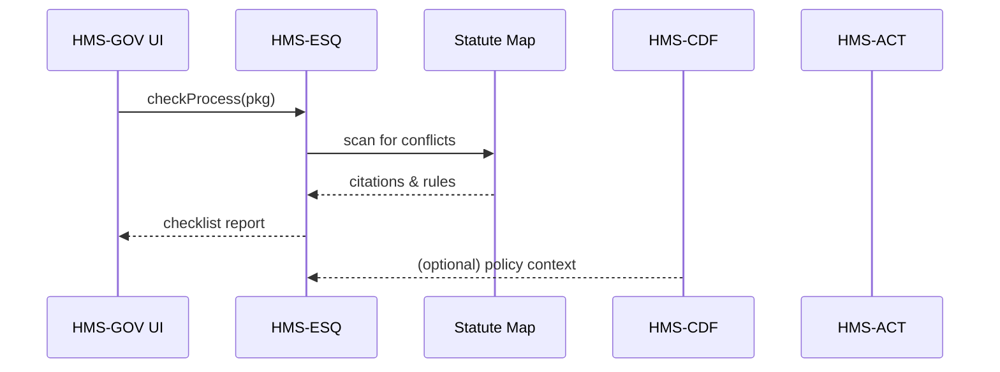

# Chapter 3: Compliance & Legal Reasoning Module (HMS-ESQ)

*(If you just finished drafting policy rules in [Policy & Legislation Engine (HMS-CDF)](02_policy___legislation_engine__hms_cdf__.md), you’re probably wondering “Will this survive the lawyers?”  Good news—HMS-ESQ is here to help.)*

---

## 1. Why Do We Need HMS-ESQ?

Picture the **Nuclear Waste Technical Review Board (NWTRB)**.  
Engineers want to introduce a new **underground-storage cooling protocol** next month. Before flipping the switch they must prove:

* It complies with the National Environmental Policy Act (NEPA).  
* It does not violate any Freedom of Information Act (FOIA) disclosure rules.  
* It respects half-a-dozen Nuclear Regulatory Commission (NRC) mandates.

Historically this meant weeks of back-and-forth memos with agency counsel.

**HMS-ESQ acts like an always-on spell-checker, but for laws.**  
Feed it the proposed process; it instantly returns a **legal checklist** with every conflict, citation, and suggested fix.

---

## 2. Key Concepts (Plain English)

| Concept | Think of it as | Why it matters |
|---------|---------------|----------------|
| Process Package | A JSON blob describing the new workflow or rule | The “document” you hand to HMS-ESQ. |
| Statute Map | An indexed library of laws & regulations | The legal dictionary HMS-ESQ consults. |
| Conflict Highlighter | Red underlines for statutes | Shows exactly *where* a clash occurs. |
| Legal Checklist | A to-do list for lawyers & engineers | E.g., “Add NEPA §102(c) environmental assessment.” |
| Mitigation Suggestion | Auto-generated patch note | Concrete wording that would make the process safe. |

You only need the first and last two to start using the module.

---

## 3. A 5-Minute Hands-On Walk-Through

### 3.1 Describe Your Process

```ts
// cooling_protocol.json  (simplified)
{
  "name": "Deep-Bore Cooling v2",
  "agency": "NWTRB",
  "steps": [
    "Insert canisters 1500m deep",
    "Pump coolant mixture X",
    "Seal boreholes within 12 hrs"
  ]
}
```

This file is our **Process Package**.

---

### 3.2 Ask HMS-ESQ for a Legal Check

```ts
// check_protocol.ts  (≤15 lines)
import { checkProcess } from "hms-esq-sdk";

const pkg = await import("./cooling_protocol.json");
const report = await checkProcess(pkg);

console.log(report.summary);
```

What happens:

1. `checkProcess` uploads the JSON to HMS-ESQ.  
2. The service scans the Statute Map.  
3. You get a `report` object.

---

### 3.3 Read the Output

Example console output:

```
⚖️  Legal Checklist for "Deep-Bore Cooling v2"
────────────────────────────────────────────
❌ NEPA §102(c): Environmental Impact Statement missing
❌ NRC 10 CFR Part 60.133: Borehole seal time < required 24 hrs
✅ FOIA compliance: OK
Suggested Fixes:
 • Attach draft EIS template (linked)
 • Change seal-time to ≥24 hrs
```

Green checkmarks mean you’re fine; red X’s need attention.

---

## 4. What Happens Behind the Scenes?



Five hops, all automatic.

---

## 5. Peeking Inside HMS-ESQ (Tiny Code)

### 5.1 Conflict Detector (simplified)

```py
# esq/conflict_detector.py  (≈18 lines)
def detect(pkg, statutes):
    issues = []
    for law in statutes:
        if law.trigger(pkg):          # runs small predicate
            if not law.requirement(pkg):
                issues.append({
                    "law": law.citation,
                    "message": law.message,
                    "fix": law.suggestion
                })
    return issues
```

Explanation:

* `trigger` decides if a law is relevant.  
* `requirement` checks compliance.  
* Non-compliant laws are added to `issues`.

---

### 5.2 Building the Checklist

```py
# esq/report.py  (≤15 lines)
from conflict_detector import detect
from statute_map import load_statutes

def build_checklist(pkg):
    statutes = load_statutes(pkg["agency"])
    issues = detect(pkg, statutes)
    return {
        "summary": f"{len(issues)} issue(s) found",
        "issues": issues,
        "ok": len(issues) == 0
    }
```

A real implementation caches statutes and supports 1000+ laws, but the idea is the same.

---

## 6. Where Does the Statute Map Come From?

HMS-ESQ periodically ingests:

* **U.S. Code** via the Government Publishing Office API.  
* **CFR (Code of Federal Regulations)** via FDsys bulk download.  
* **Agency-specific guidance** published in [HMS-CDF](02_policy___legislation_engine__hms_cdf__.md).

Each entry is converted into small **“if-then” predicates** (as shown in `trigger` / `requirement` above). Lawyers author these predicates once; HMS-ESQ reuses them forever.

---

## 7. Mini-FAQ

**Q: Do I need to be a lawyer to read the output?**  
A: Nope. The checklist is plain English with links to full citations.

**Q: What if the law changes next month?**  
A: The Statute Map auto-updates nightly; you’ll get fresh warnings without changing code.

**Q: Can I integrate HMS-ESQ into CI/CD?**  
A: Yes. A simple `npm run esq-check` gate can block deployment if any ❌ remain.

---

## 8. Summary & What’s Next

In this chapter you:

• Learned why HMS-ESQ is the “general counsel bot” for every release.  
• Ran a live check on a nuclear-storage protocol in under 20 lines of code.  
• Looked inside the conflict-detection loop and the Statute Map.

Ready to see how AI recommendations themselves stay ethical and bias-free? Continue to [AI Governance Layer](04_ai_governance_layer_.md).

---

Generated by [AI Codebase Knowledge Builder](https://github.com/The-Pocket/Tutorial-Codebase-Knowledge)