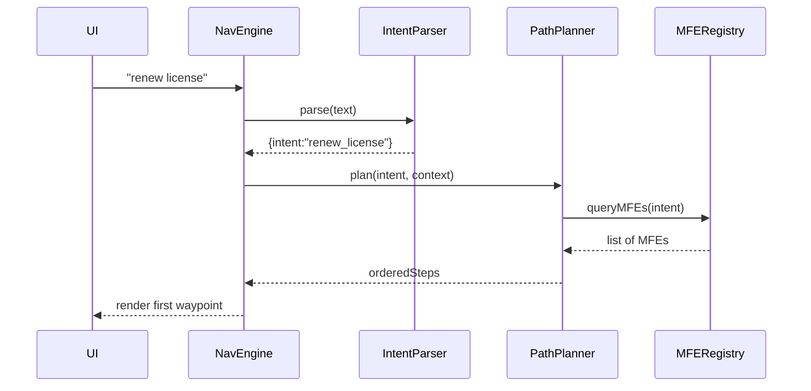
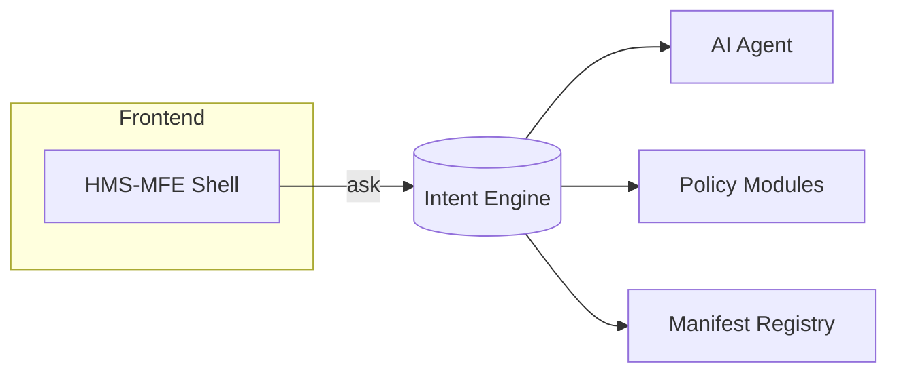

# Chapter 3: Intent-Driven Navigation Engine  

*(Sequel to [Frontend Micro-Frontend Layer (HMS-MFE)](02_frontend_micro_frontend_layer__hms_mfe__.md))*  

---

## 1. Why Do We Need an “Intent GPS”?

Meet **Eleanor**, a small-business owner who must **renew her FCC spectrum license** issued by the *National Telecommunications and Information Administration (NTIA)*.  

Old portal journey:  

1. Home → “Permits”  
2. Drop-down → “Wireless Services”  
3. Hidden link → “Spectrum Renewal Form 400-E”  
4. Call the help-desk because step 3 moved last week.  

Help-desk calls like these bury agencies in repetitive questions.  
**The Intent-Driven Navigation Engine (IDNE) lets Eleanor simply type or say:**  

> “Renew my spectrum license.”  

…and the system teleports her to the correct wizard, skipping the scavenger hunt.

Think of IDNE as **Google Maps for government forms**—you enter a destination, not the turn-by-turn route.

---

## 2. Key Concepts in Plain English

| Term | Analogy | One-Sentence Meaning |
|------|---------|----------------------|
| Intent | Desired destination | “Renew license”, “Change address”, “Report lost card” |
| Context | Passenger profile | User role, agency, language, current page |
| Path Planner | GPS brain | Chooses the quickest, policy-compliant route |
| Waypoint | Road intersection | A single micro-frontend or API call |
| Fallback | Manual detour | Human or chatbot help when GPS is unsure |

---

## 3. 3-Minute Hands-On: Calling the Engine

### 3.1 Minimal Setup

```ts
import { idne } from '@hms-sme/sdk';   // Pretend NPM

// Eleanor's session
const ctx = { agency: 'NTIA', role: 'citizen' };

const plan = await idne.navigate('renew license', ctx);
console.log(plan);
```

**Output (simplified)**

```json
[
  "ntia.license.lookup.mfe",
  "ntia.license.renewalForm.mfe",
  "common.payment.mfe",
  "common.receipt.screen"
]
```

Explanation:  
1. **lookup** verifies license ID,  
2. **renewalForm** collects new data,  
3. **payment** processes the fee,  
4. **receipt** shows confirmation.

The calling code is only 7 lines; IDNE hides the maze.

---

## 4. How Does It Work Under the Hood?

### 4.1 Bird’s-Eye Sequence



Plain English:  
1. UI sends the raw text.  
2. NLP labels it “renew_license”.  
3. Planner consults allowed micro-frontends.  
4. Steps are sent back; UI loads them via the [HMS-MFE layer](02_frontend_micro_frontend_layer__hms_mfe__.md).

---

### 4.2 Tiny Implementation Nuggets

#### A. Intent Parser (wrapper around an LLM)

```ts
// intentParser.ts
export async function parse(text: string) {
  // Call HMS-A2A agent (Chapter 4)
  const res = await fetch('/a2a/parse', {method:'POST', body: text});
  return await res.json();   // {intent, confidence}
}
```

Beginners’ notes: It’s just an HTTP POST; the AI magic lives in the next chapter’s [AI Representative Agent](04_ai_representative_agent__hms_a2a__.md).

---

#### B. Path Planner

```ts
// planner.ts
export async function plan(intent: string, ctx: Context) {
  const mfes = await registry.getByIntent(intent, ctx.agency);
  // Naïve ordering rule: lookup → form → payment → receipt
  return mfes.sort(byStage);
}
```

*Registry* is the same service the shell uses, ensuring UI and routing stay in sync.

---

#### C. Engine Facade

```ts
// idne.ts
export async function navigate(text: string, ctx: Context){
  const {intent, confidence} = await parse(text);
  if (confidence < 0.6) throw 'Need clarification';

  const steps = await plan(intent, ctx);
  bus.emit('route.ready', steps);    // front-end listens
  return steps;
}
```

If confidence is low, the caller can open a chatbot or fallback to [Human-in-the-Loop Oversight](05_human_in_the_loop_oversight__hitl__.md).

---

## 5. Wiring It Into Your Micro-Frontend

Inside any MFE you can subscribe to the route bus:

```ts
import { bus } from '@hms-sme/sdk';

bus.on('route.ready', (steps) => {
  // steps[0] is me?
  if (steps[0] === manifest.name) mount();
});
```

The first waypoint mounts instantly; others are pre-fetched for snappy transitions.

---

## 6. Safety Guardrails

1. **Role & Identity Check**  
   Every waypoint is verified through [Role & Identity Management (HMS-SYS Auth)](10_role___identity_management__hms_sys_auth__.md).  
   Example: a citizen cannot hit an internal “Audit Override” screen.

2. **Policy Constraints**  
   The planner calls [Policy & Process Modules (HMS-SVC)](07_policy___process_modules__hms_svc__.md) to ensure the path obeys current regulations.

3. **Audit Trail**  
   Each navigation decision is logged to [Data Governance & Audit Trail](11_data_governance___audit_trail_.md) for accountability.

---

## 7. Extending the Map: Adding a New Intent

Suppose the *National Agricultural Statistics Service (NASS)* wants a **“Submit crop report”** flow.

1. Build MFEs (`nass.report.start`, `nass.report.form`, `common.receipt.screen`).  
2. Add an **intent map** entry:

```json
// nav-map.json
{
  "submit_crop_report": [
    "nass.report.start",
    "nass.report.form",
    "common.receipt.screen"
  ]
}
```

3. Deploy via CLI:

```bash
hms-nav map add nav-map.json
```

IDNE instantly recognizes the new destination—no portal redeploy.

---

## 8. Putting It All Together



You now see the marriage of Chapters 1-3:  
HMS-GOV (portal) hosts MFEs, HMS-MFE loads them, and **IDNE stitches them into coherent trips**.

---

## 9. Recap & Next Steps

In this chapter you:  
• Learned why intent-based routing beats menu digging.  
• Ran a 7-line demo that mapped “renew license” to four MFEs.  
• Peeked under the hood at parsers, planners, and registries.  

Ready to see the AI brains that parse free-text intents?  
👉 Continue to [AI Representative Agent (HMS-A2A)](04_ai_representative_agent__hms_a2a__.md)  

---

---

Generated by [AI Codebase Knowledge Builder](https://github.com/The-Pocket/Tutorial-Codebase-Knowledge)