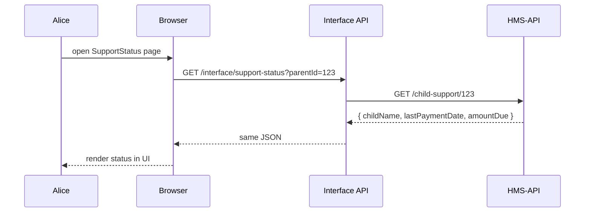

# Chapter 3: Interface Layer

Welcome back! In [Chapter 2: HMS-GOV Admin/Gov Portal](02_hms_gov_admin_gov_portal_.md) you saw how to assemble UI components into an admin dashboard. Now we’ll zoom out to the **Interface Layer**—the “public service counters” where citizens and officers come to submit requests and view data.

---

## 1. Motivation & Central Use Case

Imagine the **Child Support Office** at city hall.  
- **Parent** Alice logs in to check her child’s support payment status.  
- **Child Support Officer** Bob uses an admin dashboard to update payment records.

The **Interface Layer** provides the web portal (and mobile app) “counters” where Alice and Bob interact with the system. Behind the scenes, it forwards their requests to the right backend services.

---

## 2. Key Concepts

1. **Portals & Apps**  
   Web pages or mobile screens built with reusable UI parts ([HMS-MFE Components](01_hms_mfe_frontend_components_.md)).  
2. **Interface API (Gateway)**  
   A thin server that routes UI requests to backend services (e.g., HMS-API).  
3. **Authentication & Routing**  
   Ensures only authorized users see or change data, then forwards calls to the correct endpoints.

---

## 3. Building a Parent Status Page

Below is a minimal React page using HMS-MFE’s `Card`, `TextItem`, and `Button`. It calls our Interface API at `/support-status`.

```jsx
// src/pages/SupportStatus.tsx
import React, { useState, useEffect } from 'react';
import { Card, TextItem, Button } from 'hms-mfe-components';
import axios from 'axios';

export default function SupportStatus() {
  const [status, setStatus] = useState(null);

  useEffect(() => {
    // Fetch child support status for parentId=123
    axios.get('/interface/support-status?parentId=123')
      .then(res => setStatus(res.data));
  }, []);

  return (
    <Card title="Child Support Status">
      {status ? (
        <>
          <TextItem label="Child Name" value={status.childName}/>
          <TextItem label="Last Payment" value={status.lastPaymentDate}/>
          <TextItem label="Amount Due" value={`$${status.amountDue}`}/>
        </>
      ) : <div>Loading...</div>}
      <Button onClick={() => alert('Download PDF')}>Download Report</Button>
    </Card>
  );
}
```

Explanation:  
- We fetch data from `/interface/support-status`.  
- On success, we show fields using `TextItem`.  
- A button lets the parent download a report (stubbed as an alert here).

---

## 4. Inside the Interface Call: Sequence Walkthrough

Here’s what happens when Alice’s browser loads the page:



1. **Browser** calls our Interface API.  
2. **Interface API** forwards to the **HMS-API**.  
3. Data flows back and the UI renders it.

---

## 5. Under the Hood: Interface API Code

Here’s a simple Express server that lives in the **Interface Layer**. It handles authentication, routing, and error handling before talking to HMS-API.

```js
// interface-layer/src/server.js
import express from 'express';
import axios from 'axios';
const app = express();

// Parent checks support status
app.get('/interface/support-status', async (req, res) => {
  const { parentId } = req.query;
  // (Auth check would go here)
  const apiRes = await axios.get(
    `https://api.gov/hms-api/child-support/${parentId}`
  );
  res.json(apiRes.data);
});

app.listen(4000, () =>
  console.log('Interface Layer running on port 4000')
);
```

Explanation:  
- We define `/interface/support-status`.  
- We forward the request to `https://.../hms-api/child-support/{parentId}`.  
- We return the JSON directly to the browser.

---

## 6. What You’ve Learned

- The **Interface Layer** is your “service counter” for parents and officers.  
- How to build a minimal parent portal page with HMS-MFE components and Axios.  
- A step-by-step sequence from browser → Interface API → HMS-API → back.  
- A simple Express example that routes and forwards requests.

Next up, we’ll dive deeper into those backend endpoints in  
[Chapter 4: Backend API (HMS-API)](04_backend_api__hms_api__.md).

---

Generated by [AI Codebase Knowledge Builder](https://github.com/The-Pocket/Tutorial-Codebase-Knowledge)