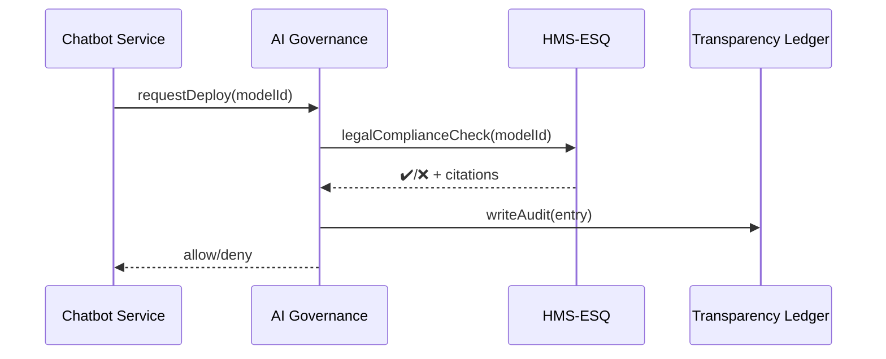

# Chapter 4: AI Governance Layer  

*(Coming from the “legal spell-checker” you just met in [Compliance & Legal Reasoning Module (HMS-ESQ)](03_compliance___legal_reasoning_module__hms_esq__.md))*  

---

## 1. Why Do We Need an AI Governance Layer?

Imagine the **Department of Veterans Affairs (VA)** is piloting an AI chatbot that:

* Answers benefits questions 24/7.
* Auto-fills claim forms for veterans.

Sounds great—until someone asks:

1. “Is the bot leaking my medical history?“  
2. “Why did it deny *my* disability claim but approve my friend’s?”  
3. “Who approved the new algorithm that changed last night?”

The **AI Governance Layer (AIGL)** is the agency’s **constitution for software**.  
Before any micro-service, ML model, or script:

* **Runs** – AIGL verifies it passed privacy & bias tests.  
* **Changes a record** – AIGL logs *who/what/when/why*.  
* **Makes a decision** – AIGL stores a human-readable explanation.

Think of the FAA’s safety regulations, but for code instead of airplanes.

---

## 2. A Concrete Use-Case

### Story in 3 bullets

1. The VA chatbot wants to shorten a long intake form to 10 questions.  
2. It calls AIGL: “May I remove fields 11–14?”  
3. AIGL checks: *legal?* ✔️  *bias?* ❌ (drops questions used for disability scoring) → **Request denied** and logged.

Without AIGL, the change might silently harm certain disability categories.

---

## 3. Key Building Blocks (Plain English)

| Concept | What it is | Why beginners care |
|---------|------------|--------------------|
| Policy Guardrail | A rule like “never store SSN in logs.” | Prevents accidental violations. |
| Ethics Checklist | Auto-tests for fairness, bias, safety. | Flags risky model releases early. |
| Transparency Ledger | Immutable timeline of every AI action. | Anyone can see *who did what* later. |
| Real-Time Switchboard | Dashboard knobs to pause, roll back, or escalate. | Gives leadership an “emergency brake.” |
| Explainability API | Returns a short “because…” for each decision. | Required for FOIA, IG audits, or the public. |

You only need **Guardrails** and **Explainability** to get started; the rest come free.

---

## 4. First Steps: Let’s Approve (or Block) a Model Release

Below is a **14-line** TypeScript-flavored demo of registering a model and asking permission to deploy.

```ts
// aigl_demo.ts
import { registerModel, requestDeploy } from "hms-aigl-sdk";

// 1. Describe the new model
const modelId = await registerModel({
  name: "VA_BenefitBot_v2",
  owner: "VA-Digital-Service",
  inputs: ["age", "medical_history"],
  outputs: ["claim_recommendation"]
});

// 2. Ask AIGL for clearance
const ok = await requestDeploy(modelId);

console.log(ok ? "✅ Deployed" : "⛔️ Blocked");
```

Explanation (beginner-friendly):

1. `registerModel` = filing a “flight plan.”  
2. `requestDeploy` performs all guardrail checks.  
3. The console prints whether the model can go live.

---

### What happens if it’s blocked?

Sample console output:

```
⛔️ Blocked
Reason: Uses medical_history without HIPAA exception (§164.508)
```

The developer knows exactly what to fix.

---

## 5. Behind the Curtain (Step-by-Step)



5 hops, all automatic.  

*If denied*, the audit entry still records the attempt—helpful during Inspector General reviews.

---

## 6. Peeking Inside the Governance Engine

### 6.1 Guardrail Evaluator (Python, 18 lines)

```py
# aigl/guardrails.py
def evaluate(model):
    """Return (ok, reason)."""
    rules = [
        lambda m: ("SSN" not in m.inputs, "SSN input forbidden"),
        lambda m: (m.owner in TRUSTED_TEAMS, "Owner not whitelisted"),
    ]
    for rule in rules:
        ok, reason = rule(model)
        if not ok:
            return False, reason
    return True, "All guardrails passed"
```

Beginner notes:

* A list of tiny lambdas = guardrails.  
* First failure short-circuits with an English message.

---

### 6.2 Deployment Gate (TypeScript, 16 lines)

```ts
// aigl/service.ts
export async function requestDeploy(modelId:string){
  const model = await db.get(modelId);

  // 1. Run guardrails
  const {ok, reason} = await callPy("evaluate", model);
  if(!ok) return deny(reason);

  // 2. Ask HMS-ESQ for legal check
  const legal = await esq.checkModel(model);
  if(!legal.ok) return deny(legal.summary);

  // 3. Log + approve
  await ledger.write({modelId, action:"deploy", by:userId});
  return approve();
}
```

The “big scary governance layer” is really ~15 lines calling two helpers.

---

## 7. How Do I See the Logs?

Call the **Explainability API**:

```bash
curl GET /aigl/ledger?model=VA_BenefitBot_v2
```

Typical JSON response:

```json
[
  {
    "timestamp": "2024-04-18T12:03Z",
    "action": "deploy_denied",
    "reason": "HIPAA §164.508 violation",
    "by": "AIGL automatic"
  }
]
```

Citizens, auditors, or agency staff can verify every decision without special access.

---

## 8. Mini-FAQ

**Q: Who writes the guardrails?**  
A: Policy teams create or edit them via the real-time switchboard inside [Government/Admin Portal (HMS-GOV)](01_government_admin_portal__hms_gov__.md).

**Q: How is bias measured?**  
A: AIGL can plug into fairness libraries (e.g., Aequitas). Each test is just another lambda in `guardrails.py`.

**Q: Can I pause a model instantly?**  
A: Yes. Flip the toggle in HMS-GOV; the next request hits `requestDeploy`, sees the pause flag, and blocks execution.

---

## 9. Summary & What’s Next

In this chapter you:

• Learned why the AI Governance Layer is the **constitution** for every model and micro-service.  
• Registered a model, requested deployment, and saw how guardrails & legal checks interact—*all in <20 lines of code*.  
• Peeked at the minimal internals: a list of lambdas + an audit write.  

Ready to see how these rules power **autonomous agents** that actually *do* the work? Jump to [Agent Framework (HMS-AGT/AGX)](05_agent_framework__hms_agt_agx__.md).

---

Generated by [AI Codebase Knowledge Builder](https://github.com/The-Pocket/Tutorial-Codebase-Knowledge)