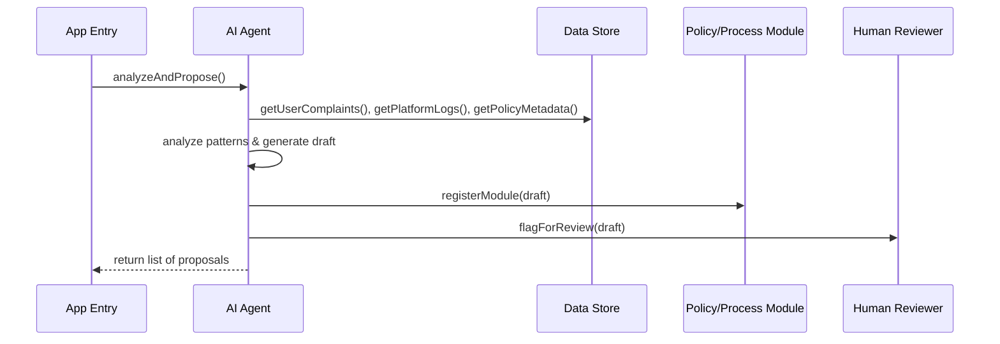

# Chapter 4: AI Representative Agent

In the previous chapter we saw how a single policy or process is defined in the [Policy/Process Module](03_policy_process_module_.md). Now it’s time to meet our virtual consultant: the **AI Representative Agent**, an autonomous software “agent” that digests data and proposes process optimizations—all before a human even sees it.

---

## 1. Why We Need an AI Representative Agent

Imagine the U.S. Food and Drug Administration (FDA) is tracking citizen food‐safety complaints submitted via a public portal. Every month, hundreds of complaints about “slow inspections” and “unclear forms” pour in. Manually sifting through each message and log is slow and error‐prone.

What if a **virtual consultant** could:

1. Read all complaints and platform logs.  
2. Spot that “inspection scheduling” is a bottleneck.  
3. Draft a new process module that adds extra weekend shifts.  
4. Flag it for human review or even push it live automatically.

That’s exactly what our **AI Representative Agent** does in HMS-SME.

---

## 2. Key Concepts

1. **Agent**  
   A standalone service that runs without constant human direction. Think of it like an assistant that wakes up, checks data, and works for you.

2. **Data Ingestion**  
   How the agent gathers inputs: user complaints, system logs, policy metadata.

3. **Analysis Engine**  
   The “brain” where simple rules or machine‐learning models spot patterns (e.g., many “delay” complaints on Fridays).

4. **Proposal Generator**  
   Takes insights and drafts new process definitions (e.g., tweak inspection schedules).

5. **Flagging Mechanism**  
   Marks proposals for human review or, if safe, pushes them live.

---

## 3. Using the AI Representative Agent

Below is a minimal example showing how to kick off analysis and get back proposals.

```javascript
// app.js
const { AIRepresentativeAgent } = require('./ai_agent');
const dataService = new DataService();              // wraps complaints/log APIs
const policyModuleService = require('./policy_module').Service;

async function main() {
  // 1) Instantiate the agent with its dependencies
  const agent = new AIRepresentativeAgent({ dataService, policyModuleService });

  // 2) Ask it to analyze and propose
  const proposals = await agent.analyzeAndPropose();

  console.log('Agent proposals:', proposals);
}

main();
```
> After `analyzeAndPropose()`, you might see:
> `[ { moduleId: 'inspection-schedule', suggestion: 'Add weekend shift', flagForReview: true } ]`

---

## 4. What Happens Under the Hood?

Here’s a simple sequence when `analyzeAndPropose()` is called:



1. **UI → AG**: App calls the agent.  
2. **AG → DS**: Agent fetches data.  
3. **AG**: Runs analysis logic.  
4. **AG → PM**: Drafts a new or updated policy/process.  
5. **AG → HR**: Flags it for a human to accept or modify.  
6. **AG → UI**: Returns proposal objects.

---

## 5. Inside the AI Representative Agent

### 5.1 Agent Skeleton

File: `ai_agent.js`

```javascript
class AIRepresentativeAgent {
  constructor({ dataService, policyModuleService }) {
    this.dataService = dataService;
    this.policyModuleService = policyModuleService;
  }

  async analyzeAndPropose() {
    const complaints = await this.dataService.getUserComplaints();
    const logs = await this.dataService.getPlatformLogs();
    const metadata = await this.dataService.getPolicyMetadata();
    const proposal = this.createProposal(complaints, logs, metadata);
    if (proposal) {
      // Register the draft with our policy system
      await this.policyModuleService.registerModule(proposal);
      return [proposal];
    }
    return [];
  }
}
module.exports = { AIRepresentativeAgent };
```
> This method collects data, builds a proposal, registers it, and returns it.

### 5.2 Drafting a Simple Proposal

Still in `ai_agent.js`:

```javascript
createProposal(complaints, logs, metadata) {
  // Simple rule: if >10 complaints mention "delay", add weekend shift
  const delayCount = complaints.filter(c => /delay/.test(c.text)).length;
  if (delayCount > 10) {
    return {
      id: 'inspection-schedule',
      description: 'Add weekend inspection shifts',
      steps: [
        { name: 'draft', next: 'review' },
        { name: 'review', next: 'approve' },
        { name: 'approve', next: null }
      ],
      flagForReview: true
    };
  }
  return null;
}
```
> If our basic threshold is met, we auto‐draft a new schedule process.

---

## 6. Summary & What’s Next

You’ve learned how the **AI Representative Agent**:

- Acts like a virtual consultant to spot patterns in complaints, logs, and policies  
- Generates draft process modules in the same format you saw in [Policy/Process Module](03_policy_process_module_.md)  
- Flags new designs for human review or pushes them straight into the system  

Next, in [Human-in-the-Loop (HITL) Override](05_human_in_the_loop__hitl__override_.md), we’ll see how real people can review, tweak, and approve these AI‐generated proposals before they go live.

---

Generated by [AI Codebase Knowledge Builder](https://github.com/The-Pocket/Tutorial-Codebase-Knowledge)