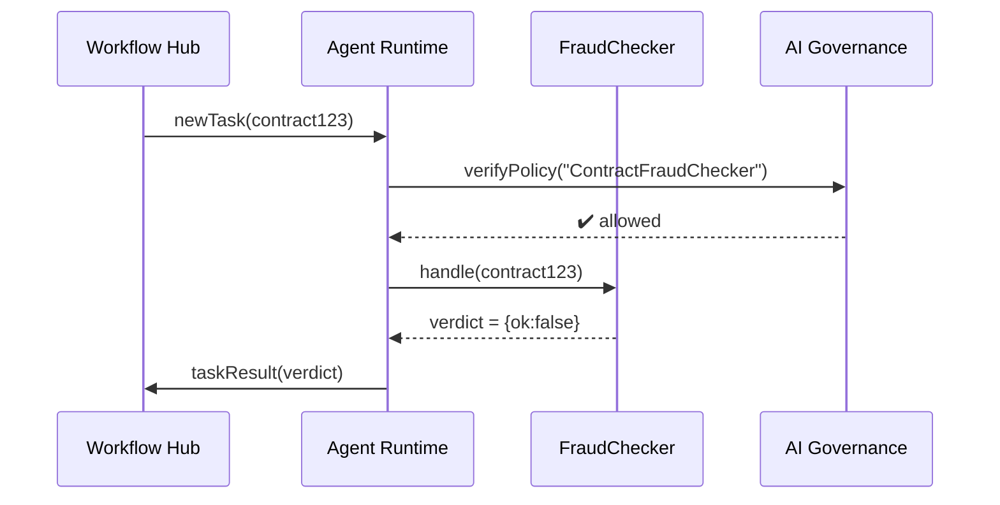

# Chapter 5: Agent Framework (HMS-AGT/AGX)

*(Coming from the guardrails & ethics you just saw in [AI Governance Layer](04_ai_governance_layer_.md). Now let’s meet the “employees” who will live under those rules.)*

---

## 1. Why Do We Need an Agent Framework?

Imagine the **Defense Contract Management Agency (DCMA)** receives **2,000** new procurement files each night.  
Humans currently:

1. Copy‐paste vendor data into three different portals.  
2. Run a fraud-detection spreadsheet.  
3. Email anything suspicious to an auditor.

That is slow **and** error-prone.

What if we could hire a squad of **digital civil servants** that:

* Read each file the moment it arrives.  
* Check for anomalies.  
* Escalate only the risky ones—while logging every step for oversight.

The **Agent Framework (HMS-AGT)** is how we hire, train, and supervise those software employees.  
Think of it as:

* The **uniform** → common SDK & security model.  
* The **training manuals** → lifecycle hooks and best-practice templates.  
* The **radios** → APIs to talk to humans, other agents, and services.

When the missions get complicated (e.g., ten agents negotiating how to schedule scarce inspectors), we move up to **AGX**—the “special-forces” layer for multi-agent collaboration.

---

## 2. Mental Model in 60 Seconds

| Real Civil Service | HMS Equivalent | One-Line Explanation |
|--------------------|---------------|----------------------|
| Job Classification | `AgentType`   | Fraud-Checker, Chat Assistant, Scheduler, … |
| Hiring Paperwork   | `manifest.yml`| Declares skills, data access, guardrails. |
| Daily Briefing     | `init()`      | Sets context & pulls fresh policy. |
| Work Shift         | `handle(task)`| Executes one unit of work. |
| Supervisor Review  | `report()`    | Sends result & metadata to audit log. |

If you can grasp this table, you already get 80 % of HMS-AGT.

---

## 3. Hello, World! Building Your First Agent

Below is a **16-line** TypeScript-flavored example: a *“Contract Fraud-Checker”*.

```ts
// agents/fraud_checker.ts
import { Agent } from "hms-agt";                  // uniform
import { checkRules } from "fraud-lib";           // your skill

export class FraudChecker extends Agent {
  async init() {
    this.policy = await this.loadPolicy("DCMA");  // daily briefing
  }

  async handle(contract){                         // one task
    const verdict = checkRules(contract, this.policy);
    if(!verdict.ok) this.flag("suspect", verdict.reason);
    return verdict;                               // report()
  }
}
```

Explanation in plain English:

1. `Agent` base class = the uniform (auth, logging, error handling pre-wired).  
2. `init()` pulls the freshest anti-fraud policy.  
3. `handle()` is called for each contract; it returns a *verdict* that HMS logs automatically.

### Registering the Agent

Add a **manifest** so HMS knows how to deploy and govern it:

```yaml
# agents/fraud_checker.manifest.yml
name: ContractFraudChecker
type: FraudChecker
owner: DCMA
inputs:  contract_json
outputs: fraud_verdict
permissions:
  data: ["contracts.read"]
  network: ["a2a.dcma.gov"]
```

Upload both files to the **Marketplace & Capability Registry** (see [Marketplace & Capability Registry (HMS-MKT)](12_marketplace___capability_registry__hms_mkt__.md)).  
HMS-AGT will do the rest.

---

## 4. What Happens When a Task Arrives?



1. **Workflow & Task Management Hub (HMS-OMS)** dispatches a contract file.  
2. Agent Runtime double-checks guardrails with the **AI Governance Layer**.  
3. Your `handle()` code runs.  
4. Result returns to OMS; audit log writes happen automatically.

---

## 5. Under the Hood: The Agent Lifecycle (Skeleton Code)

```py
# hms_agt/runtime.py  (≤20 lines, simplified)
class Runtime:
    def __init__(self, agent_cls):
        self.agent = agent_cls()
    async def boot(self):
        await self.agent.init()
    async def process(self, task):
        try:
            ok = await governance.verify(self.agent)
            if not ok: raise Exception("Policy block")
            result = await self.agent.handle(task)
            await audit.log(self.agent, task, result)
            return result
        except Exception as e:
            await audit.log(self.agent, task, str(e))
            raise
```

Key takeaways for beginners:

* Runtime calls `init()` **once** at boot.  
* Each task flows through `handle()` and auto-auditing.  
* If Governance rejects, the task is skipped but still logged.

---

## 6. Level-Up: From AGT to AGX (Multi-Agent Swarms)

Single agents are powerful, but some missions need teamwork.  
Example: **Federal Executive Boards (FEBs)** coordinating 28 city offices during a hurricane.

With **AGX** you can:

1. Define *roles* (Logistics Agent, Health Agent, Comms Agent).  
2. Let agents negotiate via an internal **Message Bus**.  
3. Use a *consensus protocol* so they agree before issuing public alerts.

### Mini-Snippet: Starting a Swarm

```ts
// agx/hurricane_swarm.ts  (≤18 lines)
import { Swarm } from "hms-agx";
import { Logistics, Health, Comms } from "./roles";

const swarm = new Swarm({
  members: [new Logistics(), new Health(), new Comms()],
  quorum: 2                      // need 2 of 3 to agree
});

await swarm.dispatch("stormAlert", {category: 4});
```

AGX handles:

* Routing messages.  
* Counting votes.  
* Failing fast if quorum isn’t met (again, all logged).

---

## 7. Frequently Asked Questions

**Q: Do I need Docker or Kubernetes knowledge?**  
A: No. HMS-AGT wraps container orchestration; you only write `init()` and `handle()`.

**Q: How does an agent call external APIs safely?**  
A: Use `this.fetch(url)`—a Governance-aware wrapper that strips secrets and signs requests.

**Q: Can citizens see agent decisions?**  
A: Yes. Each `report()` entry is stored in the **Transparency Ledger** you saw in [AI Governance Layer](04_ai_governance_layer_.md).

---

## 8. Quick Recap

You just:

• Met the **Agent Framework**—uniform + training + radios for digital civil servants.  
• Wrote a 16-line *Fraud-Checker* and its 8-line manifest.  
• Saw the full runtime flow and a peek into AGX multi-agent swarms.

Ready to test agents in a no-risk environment before production? Head to the sandbox:  
[Simulation & Training Sandbox (HMS-ESR / HMS-EDU)](06_simulation___training_sandbox__hms_esr___hms_edu__.md)

---

Generated by [AI Codebase Knowledge Builder](https://github.com/The-Pocket/Tutorial-Codebase-Knowledge)