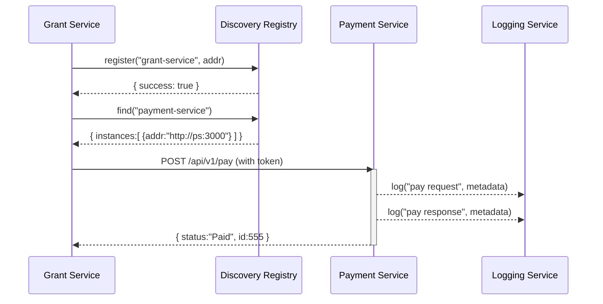

# Chapter 5: HMS-SYS Core Infrastructure

Welcome back! In [Chapter 4: Backend API (HMS-API)](04_backend_api__hms_api__.md) we built and secured our data endpoints. Now it’s time to lay the “roads and utilities” that every module—APIs, services, and agents—will share. Welcome to **HMS-SYS Core Infrastructure**.

---

## 1. Motivation & Central Use Case

Imagine a federal grant program that must:
1. Check applicant eligibility (Eligibility Service).  
2. Disburse funds (Payment Service).  
3. Record every step for auditors (Audit Service).  

Without a shared foundation, each service would reinvent:
- How to find and talk to other services  
- How to secure calls  
- How to record logs for compliance  
- How to retry on failure  

**HMS-SYS** provides all these under the hood—so your grant service can focus on business logic.

---

## 2. Key Concepts

1. **Service Discovery**  
   Automatically register and look up service addresses (like a phone directory).  

2. **Security**  
   Mutual authentication and encryption for every inter-service call.  

3. **Logging & Audit**  
   Centralized logs with timestamps and unique request IDs for compliance.  

4. **Resilience**  
   Automatic retries and circuit breakers to handle temporary failures.

---

## 3. Using HMS-SYS in Your Service

Here’s a minimal example of a “Grant Service” that uses HMS-SYS to discover a payment service, call it with retries, and log everything automatically.

```js
// src/grant-service.js
import { Core } from 'hms-sys-core';

const core = new Core({
  serviceName: 'grant-service',
  discoveryUrl: 'http://hms-sys:8500',
  authToken: process.env.SYS_TOKEN,
  logLevel: 'info'
});

core.start(); // Register service, start health checks

core.onReady(async () => {
  // Find the payment-service
  const payment = await core.discovery.find('payment-service');

  // Call payment endpoint with built-in retry & logging
  const receipt = await payment.request('POST', '/api/v1/pay', {
    grantId: 101,
    amount: 5000
  });

  console.log('Payment completed:', receipt.status);
});
```

Explanation:
- `core.start()` registers your service in the discovery registry and begins health checks.  
- `core.discovery.find('payment-service')` returns a client with `request()` that:
  - Encrypts/authenticates the call  
  - Retries on transient errors  
  - Logs request and response details  

---

## 4. Under the Hood: Sequence Walkthrough



1. Grant Service registers itself with the **Discovery Registry**.  
2. It looks up **Payment Service**’s address.  
3. It sends an authenticated `POST` to `/pay`.  
4. Payment Service logs each step to the central **Logging Service**.  
5. Response flows back to Grant Service.

---

## 5. HMS-SYS Implementation Highlights

Below are simplified snippets from the `hms-sys-core` package.  

a) **Discovery Client**  
File: `hms-sys-core/src/discovery.js`
```js
export class Discovery {
  constructor({ url, token }) { /* save config */ }
  async register(name, address) {
    // POST to registry: { name, address, token }
  }
  async find(name) {
    // GET from registry: /services/name
    return { request: this._makeHttpClient(instances) };
  }
}
```
b) **Logging Middleware**  
File: `hms-sys-core/src/logging.js`
```js
export function logMiddleware(req, res, next) {
  const id = generateRequestId();
  console.log(`[${id}] ${req.method} ${req.url}`);
  res.on('finish', () =>
    console.log(`[${id}] Completed ${res.statusCode}`)
  );
  next();
}
```
c) **Resilient HTTP Client**  
File: `hms-sys-core/src/httpClient.js`
```js
export async function request(method, url, body) {
  for (let i = 1; i <= 3; i++) {
    try {
      // Add auth header, send fetch
      return await fetchWithAuth(method, url, body);
    } catch (err) {
      if (i === 3) throw err;
      await wait(500 * i); // backoff
    }
  }
}
```

These pieces combine so your code just calls `payment.request(...)` without re-implementing discovery, security, logging, or retry logic.

---

## 6. What You’ve Learned

- **Why** a shared core (HMS-SYS) prevents duplication and secures inter-service communication.  
- **How** to register, discover, and call services with automatic logging and retries.  
- A high-level diagram of a request flow through discovery and logging.  
- Peeked at the internals: discovery client, logging middleware, and retry logic.

Up next, we’ll see how governance rules plug into these cores in  
[Chapter 6: Governance Layer](06_governance_layer_.md).

---

Generated by [AI Codebase Knowledge Builder](https://github.com/The-Pocket/Tutorial-Codebase-Knowledge)