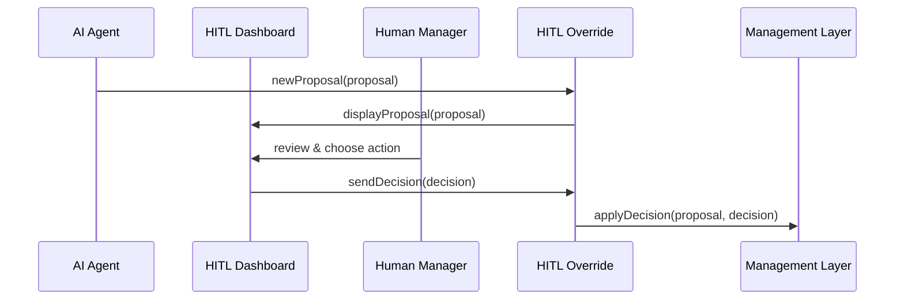

# Chapter 5: Human-in-the-Loop (HITL) Override

_In the previous chapter, we saw how the [AI Representative Agent](04_ai_representative_agent_.md) drafts new policy or process proposals automatically. Now let’s add a safety net: a built-in checkpoint where a real person reviews, tweaks, approves, or rejects those AI ideas before they go live. This is the **Human-in-the-Loop (HITL) Override**._

---

## 1. Why We Need HITL Override

Imagine the Department of Education portal uses AI to suggest a simpler student-loan application form. It proposes reordering fields or removing questions. Before we swap in that new form for millions of applicants, a program manager (our “human decision maker”) needs to:

- See exactly what the AI changed  
- Tweak any wording or parameters  
- Approve the final design or send it back for revisions  

This built-in checkpoint ensures:

- Accountability: a named official signs off on changes  
- Control: humans always have the final say  
- Transparency: we record who did what, when  

---

## 2. Key Concepts

1. **Proposal Queue**  
   A list of AI-generated drafts waiting for human review.

2. **Human Decision Maker**  
   The official or staff member who inspects, modifies, and decides.

3. **Override Actions**  
   - **Approve**: accept the AI draft as-is  
   - **Tweak**: make small edits then re-submit  
   - **Reject**: send back to AI or drop entirely

4. **Accountability Record**  
   A log entry capturing who made the decision and why.

---

## 3. Solving Our Use Case

Let’s walk through a minimal code example showing how to send an AI proposal for review and handle the human’s decision. We’ll use a simple `HITLOverride` class.

### 3.1 Send an AI Proposal for Review

```javascript
// app.js
const HITLOverride = require('./hitl_override');
const proposal = { id: 'form-update-42', changes: { reorder: ['name','address','dob'] } };

async function kickoffReview() {
  const hitl = new HITLOverride({ notificationService, reviewService });
  // Send the proposal to the human queue and wait for a decision
  const decision = await hitl.sendForReview(proposal);
  console.log('Human decision:', decision);
}

kickoffReview();
```

Explanation:
- We create `HITLOverride` with services to notify and collect reviewer input.
- `sendForReview` pushes the proposal to the manager and waits for “approved”, “tweaked”, or “rejected”.

### 3.2 Apply the Human’s Decision

```javascript
// continuing in app.js
async function processDecision(proposal, decision) {
  if (decision === 'approved') {
    console.log('Activating proposal in system…');
    // call backend or management layer to apply changes
  } else if (decision === 'rejected') {
    console.log('Proposal rejected; notifying AI agent.');
  } else if (decision.type === 'tweaked') {
    console.log('Saving tweaks:', decision.changes);
    // merge decision.changes into proposal and re-send
  }
}
```

Explanation:
- Based on `decision`, we either launch the changes, drop them, or merge tweaks and loop back.

---

## 4. What Happens Under the Hood?



1. **AI Agent → HITL Override**: submits a draft proposal.  
2. **HITL Override → Dashboard**: shows proposal to human manager.  
3. **Human Manager → Dashboard**: picks “approve”, “tweak”, or “reject.”  
4. **Dashboard → HITL Override**: returns the decision.  
5. **HITL Override → Management Layer**: applies or discards the proposal.

---

## 5. Inside the HITL Override Module

### 5.1 Non-Code Walkthrough

1. **Accept Proposal**  
   Store it in a review queue and notify the user (via email, Slack, portal).  
2. **Wait for Decision**  
   Block (or poll) until the human records a choice.  
3. **Dispatch Outcome**  
   If approved, trigger the rest of the system; if tweaked, update and requeue; if rejected, log and end.

### 5.2 Minimal Implementation

File: `hitl_override.js`

```javascript
class HITLOverride {
  constructor({ notificationService, reviewService }) {
    this.notify = notificationService;     // sends alerts
    this.review = reviewService;           // collects human input
  }

  async sendForReview(proposal) {
    // 1) Notify the human manager
    this.notify.send(`Please review proposal ${proposal.id}`);
    // 2) Wait (or poll) until the manager decides
    const decision = await this.review.waitForDecision(proposal.id);
    return decision; // e.g., 'approved', 'rejected', or {type:'tweaked',changes:{…}}
  }

  async applyDecision(proposal, decision) {
    if (decision === 'approved') {
      // Hook into the [Management Layer](02_management_layer_.md) or Backend API
    }
    // handle other cases similarly…
  }
}

module.exports = HITLOverride;
```

Explanation:
- `notificationService` might send an email or UI alert.  
- `reviewService` provides a `waitForDecision` method that resolves when the manager picks an action.

---

## 6. Summary & Next Steps

You’ve learned how **Human-in-the-Loop Override**:

- Inserts a checkpoint for real people to review AI drafts  
- Provides clear actions: approve, tweak, or reject  
- Records accountability for every change  

Next up, we’ll cover how to track and verify the impact of these changes in [Metrics Monitoring & Verification](06_metrics_monitoring___verification_.md).

---

Generated by [AI Codebase Knowledge Builder](https://github.com/The-Pocket/Tutorial-Codebase-Knowledge)