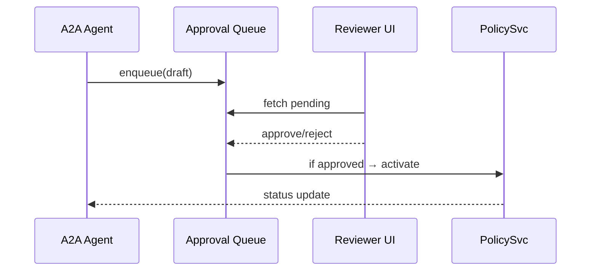
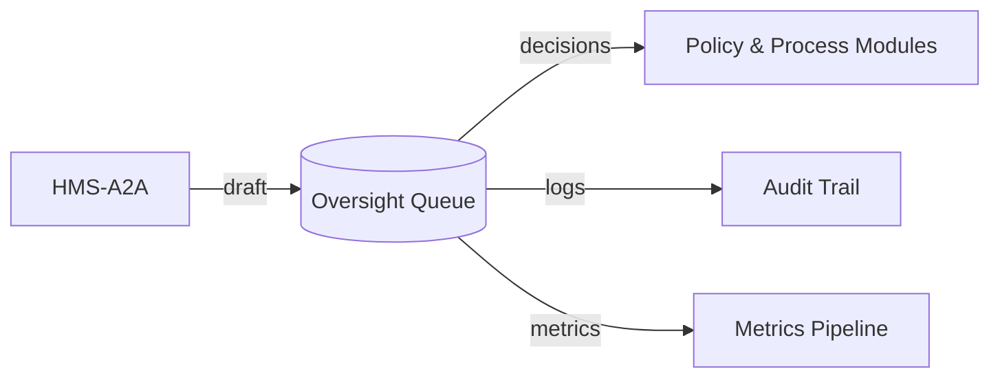

# Chapter 5: Human-in-the-Loop Oversight (HITL)

*(Follow-up to [AI Representative Agent (HMS-A2A)](04_ai_representative_agent__hms_a2a__.md))*  

---

## 1. Why Bother? – A 60-Second Story

**Scenario:**  
The *Energy Information Administration (EIA)* releases a weekly *Natural Gas Outlook*.  
Last night HMS-A2A auto-drafted a report saying:

> “Prices will drop 40 % next quarter.”

That claim, if wrong, could rattle markets.  
Before the PDF hits eia.gov, **Sasha**, a senior analyst, must:

1. Preview the AI draft.  
2. Tweak the numbers or wording.  
3. Approve (or veto) publication.

**HITL is the safety net** that lets Sasha jump in—exactly like an air-traffic controller ready to grab the yoke from an autopilot.

---

## 2. Key Concepts in Plain English

| Term | Beginner Analogy | What It Means in HMS-SME |
|------|------------------|--------------------------|
| Oversight Gate | Airport security gate | A checkpoint every AI proposal must pass. |
| Approval Queue | Todo list | Where pending items wait for a human. |
| Escalation Path | “Ask to speak to manager” | Route for high-risk items needing senior sign-off. |
| Audit Stamp | Rubber stamp with date | Cryptographic record of who approved what & when. |
| Sandbox | Practice field | Safe environment to test the AI proposal before going live. |

---

## 3. Quick-Start: Approving a Draft in 3 Commands

We’ll reuse the DMV “overbook slots” policy that HMS-A2A created in Chapter 4.

### 3.1 See What’s Waiting

```bash
# list the queue
hms-hitl list --agency dmv
```

Sample output:

```
ID    TYPE      SUMMARY                       RISK
42    policy    "Overbook road-test by 10%"   LOW
```

### 3.2 Inspect Details

```bash
hms-hitl show 42
```

Truncated JSON:

```json
{
  "policyId": "dmv.overbook.v1",
  "diff": "+ allowOverbook(0.10)",
  "aiConfidence": 0.82,
  "sandboxUrl": "https://sandbox.dmv.gov/preview/42"
}
```

### 3.3 Approve (or Reject)

```bash
# approve with a comment
hms-hitl approve 42 --note "Looks safe. Monitor wait times."
```

Result:

```
✅ Policy activated. Audit stamp: 712e…ff9c
```

That’s it—Sasha (or any reviewer) needed **three tiny commands**.

---

## 4. How Do I Plug HITL Into My Code?

### 4.1 Enqueue From Any Service

```ts
// services/dmvQueue.ts
import { hitl } from '@hms-sme/sdk';

export async function enqueueDraft(policy) {
  await hitl.add({
    type: 'policy',
    blob: policy,
    risk: 'LOW',          // computed earlier
    sandbox: makePreview(policy)
  });
}
```

Explanation:

1. `type` classes the item (policy, content, dataset…).  
2. `blob` is the raw proposal.  
3. `sandbox` URL lets reviewers play safely.

### 4.2 Listen for The Final Decision

```ts
// anywhere in DMV backend
hitl.on('approved', async item => {
  if (item.policyId.startsWith('dmv.')) applyPolicy(item.blob);
});
```

When a reviewer clicks **Approve**, your service automatically rolls the change into production.

---

## 5. What Happens Behind the Curtain?



Step-by-step (non-tech speak):

1. An AI agent (or any service) **drops** a proposal into the queue.  
2. Reviewers pull items in their dashboard.  
3. A click sends **approve** or **reject** back.  
4. Approved items flow to the relevant service, then go live.  
5. Everyone is notified; the log is sealed in the audit trail.

---

## 6. Minimal Internal Implementation

### 6.1 Queue Schema (very short)

```ts
// models/QueueItem.ts
export interface QueueItem {
  id: number;
  type: 'policy' | 'content' | 'data';
  blob: object;
  risk: 'LOW' | 'MEDIUM' | 'HIGH';
  status: 'pending' | 'approved' | 'rejected';
  createdBy: string;          // service ID
  approvedBy?: string;        // user ID
  auditStamp?: string;        // hash
}
```

Beginners’ note: It’s just a plain TypeScript interface—works with any DB.

### 6.2 REST Endpoints (condensed)

```ts
// routes/hitl.ts
router.get('/queue', auth, (req, res) => {
  res.json(db.find({status:'pending', agency:req.user.agency}));
});

router.post('/queue/:id/approve', auth, (req, res) => {
  const item = db.update(req.params.id, {
    status:'approved',
    approvedBy: req.user.id,
    auditStamp: sha256(JSON.stringify(req.body))
  });
  bus.emit('approved', item);
  res.json(item);
});
```

Key takeaways:

1. `auth` middleware plugs into [Role & Identity Management (HMS-SYS Auth)](10_role___identity_management__hms_sys_auth__.md).  
2. A SHA-256 `auditStamp` guarantees tamper-proof logs stored in [Data Governance & Audit Trail](11_data_governance___audit_trail_.md).

---

## 7. Safety & Compliance Features Out-of-the-Box

1. **Risk-Based Routing**  
   • `LOW` risk → Any reviewer in the same agency.  
   • `HIGH` risk → Auto-escalate to agency director + legal.  

2. **Time-Boxed Holds**  
   Items auto-expire after *N* days, default 14, to avoid “stale drafts.”

3. **Reproducible Sandboxes**  
   Each queue item stores a Docker image hash so reviewers see *exactly* what will deploy.

4. **Reg-Track Links**  
   Buttons open relevant guidelines (GDPR, OMB A-130, etc.) in context for quick checks.

---

## 8. Adding Your Own Review Rules (Optional)

```ts
// reviewerRules/additional.ts
hitl.beforeDisplay(item => {
  if (item.type === 'data' && item.risk === 'HIGH')
    item.extraDocs = ['https://doi.gov/data-privacy-handbook.pdf'];
});
```

A single hook injects an extra document link before the reviewer sees the item.

---

## 9. Putting HITL in the Big Picture



HITL is the **hinge** between AI suggestions and real-world impact, guaranteeing accountability demanded by regulations.

---

## 10. Recap & What’s Next

You now know:

• The **why** of Human-in-the-Loop Oversight.  
• How to enqueue, review, approve, and audit AI proposals with just a few lines of code.  
• The internal flow that keeps regulators and citizens confident the AI isn’t driving blind.

Ready to formalize all those guardrails into a cohesive policy?  
Jump into [AI Governance Framework](06_ai_governance_framework_.md).

---

---

Generated by [AI Codebase Knowledge Builder](https://github.com/The-Pocket/Tutorial-Codebase-Knowledge)