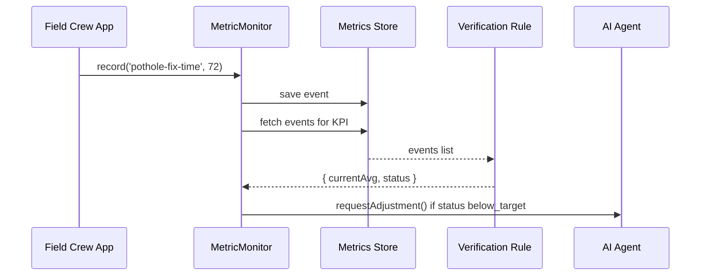

# Chapter 6: Metrics Monitoring & Verification

In the last chapter we added a safety‐net step where a human reviews AI proposals in [Human-in-the-Loop (HITL) Override](05_human_in_the_loop__hitl__override_.md). Now that changes are live, how do we know they’re actually helping? Enter **Metrics Monitoring & Verification**, our “performance review” subsystem.

---

## 1. Why We Need Metrics Monitoring & Verification

Imagine the Federal Highway Administration rolls out a new process to repair potholes faster. How can they tell if the average repair time really dropped below 48 hours? Or the Office of Surface Mining wants to verify if dust‐complaint resolutions improved after new weekend crews. Without tracking and validating, we’re flying blind.

**Metrics Monitoring & Verification** lets us:

- Collect real‐world data (e.g., repair times, complaint resolutions)  
- Compare against targets (e.g., 48 hours)  
- Trigger alerts or adjustments when targets aren’t met  

---

## 2. Key Concepts

1. **Metric**  
   A single measurement (e.g., “time to fix a pothole”).

2. **KPI Definition**  
   Describes a metric’s goal (e.g., “average ≤ 48 hours”).

3. **Data Collector**  
   Code that ingests raw events (repair completed at T1 vs request at T0).

4. **Dashboard / Reporter**  
   Aggregates and displays current values vs targets.

5. **Verification Rule**  
   Logic that checks whether a KPI is within an acceptable range, and triggers an alert or adjustment.

---

## 3. Solving Our Use Case

We’ll walk through:

1. Defining a KPI.  
2. Recording metrics.  
3. Verifying outcomes and alerting the AI agent for next steps.

### 3.1 Define a KPI

First, we declare what to watch. Here’s a JSON for “pothole-fix-time”:

```json
{
  "id": "pothole-fix-time",
  "description": "Average time (hours) to repair a reported pothole",
  "target": 48
}
```

> We want the average repair time to be 48 hours or less.

### 3.2 Record Metric Events

Whenever a crew finishes a repair, we record the elapsed time:

```javascript
// app.js
const monitor = new MetricMonitor();
monitor.defineKPI({ id: 'pothole-fix-time', target: 48 });

// A repair that took 72 hours
monitor.record('pothole-fix-time', 72);

// Another repair took 36 hours
monitor.record('pothole-fix-time', 36);
```

> Every `.record()` call stores one data point for later aggregation.

### 3.3 Verify Against the Target

At intervals (e.g., daily), we check if we’re meeting our goal:

```javascript
const result = monitor.verify('pothole-fix-time');
console.log(result);
// ➔ { currentAvg: 54, target: 48, status: 'below_target' }
```

> `status` tells us if we’re on track. Here the average is 54 hours—above our 48-hour goal.

### 3.4 Trigger an Alert

When a KPI misses its target, we can alert the AI agent to propose fixes:

```javascript
if (result.status === 'below_target') {
  aiAgent.requestAdjustment('pothole-fix-time', result);
}
```

> This sends our AI agent back to analyze and rework the process (e.g., add more crews).

---

## 4. What Happens Under the Hood?



1. **Crew → MM**: A repair completion event arrives.  
2. **MM → DB**: Stores the raw data.  
3. **MM → DB**: Periodically fetches all events for this KPI.  
4. **DB → VR**: Passes data points to the verification logic.  
5. **VR → MM**: Returns average and a `status` (on track or not).  
6. **MM → AI**: If we missed the target, we ask the AI agent to propose process tweaks.

---

## 5. Inside the Metrics Monitoring Module

### 5.1 Non-Code Walkthrough

1. **defineKPI**: Register your goal.  
2. **record**: Save each metric event.  
3. **verify**:  
   a. Fetch events.  
   b. Compute average.  
   c. Compare to `target`.  
   d. Return a verdict.  

### 5.2 Minimal Implementation

File: `metrics_monitor.js`

```javascript
class MetricMonitor {
  constructor() {
    this.kpis = {};
    this.data = {}; // in-memory: { kpiId: [values] }
  }

  defineKPI({ id, target }) {
    this.kpis[id] = { target };
    this.data[id] = [];
  }

  record(kpiId, value) {
    this.data[kpiId].push(value);
  }

  verify(kpiId) {
    const values = this.data[kpiId];
    const avg = values.reduce((a,b)=>a+b,0)/values.length;
    const status = avg <= this.kpis[kpiId].target ? 'on_track' : 'below_target';
    return { currentAvg: avg, target: this.kpis[kpiId].target, status };
  }
}

module.exports = MetricMonitor;
```

> In a real system you’d replace the in-memory store with a database and add error handling, but this shows the core logic.

---

## 6. Summary & Next Steps

In this chapter you learned how **Metrics Monitoring & Verification**:

- Defines KPIs and targets for key city services  
- Records raw data points from field operations  
- Aggregates and checks performance against goals  
- Alerts the AI agent to trigger further improvements  

Up next, we’ll see how these components expose endpoints for other services in the [Backend API](07_backend_api_.md).

---

Generated by [AI Codebase Knowledge Builder](https://github.com/The-Pocket/Tutorial-Codebase-Knowledge)