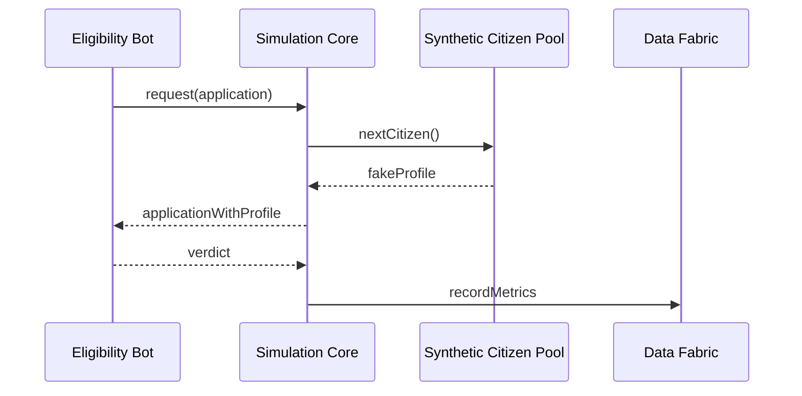

# Chapter 6: Simulation & Training Sandbox (HMS-ESR / HMS-EDU)

*(Just finished hiring digital civil-servants in [Agent Framework (HMS-AGT/AGX)](05_agent_framework__hms_agt_agx__.md)?  
Great! Now let’s put them in a flight-simulator before they meet real citizens.)*

---

## 1. Why Do We Need a Sandbox?

Picture the **Department of Housing & Urban Development (HUD)**.  
They want an agent that:

1. Reads rental-assistance requests.  
2. Calculates eligibility in minutes, not weeks.  

Before letting that bot touch real wallets, HUD leaders ask:

“Will vulnerable families **actually** get help faster?  
Could new rules accidentally leave seniors behind?”

HMS-ESR (Environment for **S**imulation & **R**ehersal) lets you run the whole program in a **parallel universe** filled with synthetic citizens.  
HMS-EDU layers tutorials, scoreboards, and badges on top—so newcomers and agents learn **without breaking anything**.

Think of the FAA’s flight simulators, but for public-benefit algorithms.

---

## 2. Key Concepts (Plain English)

| Concept | What it means | Why beginners care |
|---------|---------------|--------------------|
| Scenario | A “movie script” of events (applications, economic shocks). | Tells ESR what to throw at your agents. |
| Synthetic Citizen | Fake person w/ income, zip code, demographics. | Lets you measure equity & bias safely. |
| Scoreboard | Live metrics: approval rate, average wait time, error count. | Shows if policy goals are met. |
| Rewind Button | Time-travel to any tick and retry with new settings. | Explore “what-ifs” without risk. |
| HMS-EDU Module | Interactive lessons + certification quizzes. | Human staff (and even agents!) train here. |

Beginners usually touch just the first three; the rest come free.

---

## 3. Hands-On Walk-Through (≤ 20 Lines Each)

### 3.1 Set Up a Scenario

```ts
// 01_define_scenario.ts
import { createScenario } from "hms-esr-sdk";

export const scenarioId = await createScenario({
  name: "HUD_RentAid_Pilot",
  days: 30,
  population: 5000,           // synthetic citizens
  shocks: ["endOfMonthBills"] // extra stress on day 28
});
```

Explanation  
• We’ll simulate one month of rent-aid requests from 5 000 virtual citizens.  
• A “shock” spikes demand near rent-due day.

---

### 3.2 Attach Your Agent

```ts
// 02_attach_agent.ts
import { attachAgent } from "hms-esr-sdk";

await attachAgent({
  scenarioId,
  agentName: "RentAidEligibilityBot_v1", // built in Chapter 5
  version: "1.0.0"
});
```

ESR now knows **who** will process applications in the sandbox.

---

### 3.3 Run the Simulation

```ts
// 03_run.ts
import { runScenario, getScoreboard } from "hms-esr-sdk";

await runScenario(scenarioId);               // real time ≈ 5 s
const stats = await getScoreboard(scenarioId);

console.log("Avg wait (hrs):", stats.avgWait);
console.log("Approval %   :", stats.approvalRate);
```

Sample output:

```
Avg wait (hrs): 2.4
Approval %   : 78.6
```

Now you know—*on day 1*—what would have taken a month (and angry calls) in production.

---

### 3.4 Try a Quick “What-If”

```ts
// 04_tweak_policy.ts
import { rewind, changeParameter } from "hms-esr-sdk";

await rewind(scenarioId, day = 0);            // back to start
await changeParameter("income_threshold", 150); // raise bar
await runScenario(scenarioId);

console.log(await getScoreboard(scenarioId).approvalRate);
// → maybe drops from 78 % to 62 %
```

Policy makers see trade-offs instantly, long before signing a memo.

---

## 4. What Happens Behind the Curtain?



1. ESR feeds the **agent** fake applications.  
2. The agent replies as if it were live.  
3. ESR tallies metrics and stores them in the [Unified Data Fabric (HMS-DTA)](09_unified_data_fabric__hms_dta__.md).  
4. Nothing touches real production systems—safe!

---

## 5. A Peek Inside the Engine (Tiny Code)

### 5.1 Event Loop (Python, 18 Lines)

```py
# esr/event_loop.py
async def run(scenario):
    clock = 0
    while clock < scenario.days:
        events = scheduler.tick(clock)      # generate apps, shocks
        for evt in events:
            result = await agent.handle(evt)
            scoreboard.update(result)
        clock += 1
```

Beginner notes:  
• `scheduler.tick` emits today’s synthetic events.  
• `agent.handle` is the same method you wrote in Chapter 5—no changes!  
• `scoreboard.update` keeps rolling metrics.

---

### 5.2 Synthetic Citizen Factory (TS, 12 Lines)

```ts
// esr/factory.ts
export function makeCitizen(seed:number){
  return {
    id: seed,
    age: rand(18, 90),
    income: rand(0, 300),            // % of area median
    veteran: chance(0.08),
    zipcode: pickWeighted(ZIPS_BY_RENT),
  };
}
```

Here’s where diversity & edge cases are born, letting you test fairness.

---

## 6. HMS-EDU: Training Humans & Agents Alike

### 6.1 Interactive Notebook

```py
# edu/notebook_demo.py  (15 lines)
from hms_edu import lesson, quiz

await lesson.open("Basic HUD Rent Rules")
score = await quiz.take("income_thresholds")
print("Your score:", score)
```

Pass the quiz? HMS-EDU writes a **badge** to your personnel record—and can even gate agent deployments until at least one human teammate is certified.

---

### 6.2 Agent Self-Training (Auto-Curriculum)

```ts
// edu/agent_tutor.ts
import { trainAgent } from "hms-edu-sdk";

await trainAgent("RentAidEligibilityBot_v1", {
  practiceQuestions: 500,
  passMark: 0.9
});
```

The bot improves its own rule interpretations inside a sandboxed quiz—no real citizens harmed.

---

## 7. Mini-FAQ

**Q: Is ESR “just” unit testing?**  
A: Bigger than that—ESR spins up entire **populations** and policy environments, measuring systemic outcomes (equity, timeliness, budget).

**Q: Can I import real historical data?**  
A: Yes. Point ESR to anonymized records in [HMS-DTA](09_unified_data_fabric__hms_dta__.md); it blends them with synthetic agents for richer realism.

**Q: How do guardrails apply in the sandbox?**  
A: All calls still pass through the [AI Governance Layer](04_ai_governance_layer_.md). If your agent tries something disallowed, ESR blocks and logs it—just like production.

---

## 8. Recap & What’s Next

In this chapter you:

• Created a 30-day rent-aid scenario in three small files.  
• Attached your Chapter 5 agent and saw instant results.  
• Used the **Rewind Button** to explore policy “what-ifs.”  
• Peeked inside the event loop and citizen factory.  
• Tested both *humans* and *agents* through HMS-EDU lessons.

Ready to let successful simulations promote real-world actions?  
Jump to [Action Orchestration Service (HMS-ACT)](07_action_orchestration_service__hms_act__.md).

---

Generated by [AI Codebase Knowledge Builder](https://github.com/The-Pocket/Tutorial-Codebase-Knowledge)