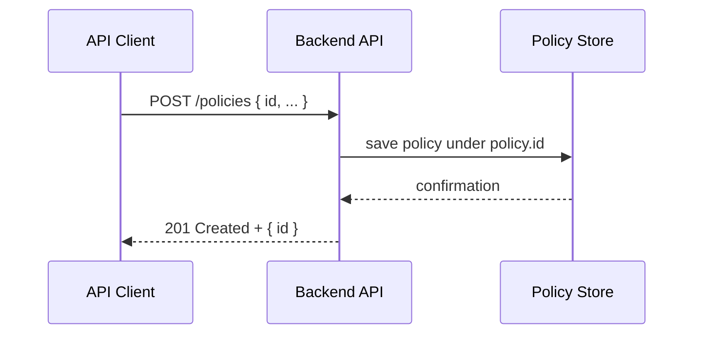

# Chapter 7: Backend API

In the previous chapter we learned how to monitor real-world performance and trigger adjustments with **Metrics Monitoring & Verification** ([Chapter 6: Metrics Monitoring & Verification](06_metrics_monitoring___verification_.md)). Now we need a way for every part of HMS-SME—AI agents, portals, and back-office tools—to **talk to** our system of policies and processes. Enter the **Backend API**, the central mailroom that accepts, updates, and delivers policy and process data on demand.

---

## 1. Why We Need a Backend API

Imagine the Library of Congress wants to roll out an updated data-management policy across its staff portals. Instead of each portal hard-coding JSON files, they can call a **single HTTP interface**:

- A policy-authoring tool does **POST /policies**  
- A web portal uses **GET /policies/:id** to fetch the latest rules  
- The AI Agent pushes tweaks via **PUT /processes/:id**  

This keeps everything in sync and avoids duplicated code.  Think of it like a postal service: clients drop off “letters” (requests), and our Backend API routes them to the correct “department” (data store) and returns the answer.

---

## 2. Key Concepts

1. **Endpoint**  
   A URL path (e.g., `/policies`) clients call to perform actions.

2. **Resource**  
   The object you manage (e.g., a “policy” or a “process definition”).

3. **CRUD Operations**  
   - **Create** (POST)  
   - **Read**   (GET)  
   - **Update** (PUT)  
   - **Delete** (DELETE)

4. **Request / Response**  
   Clients send JSON in the request body; API returns JSON plus HTTP status codes.

5. **API Client**  
   A simple wrapper in your app that calls these endpoints so you don’t write raw `fetch` everywhere.

---

## 3. A Minimal Use Case

Let’s walk through a beginner-friendly example:

1. **Create** a new policy  
2. **Fetch** it back  
3. **Update** an existing process  

### 3.1 Creating a Policy

```javascript
// apiClient.js
class ApiClient {
  constructor(baseUrl) { this.baseUrl = baseUrl; }
  async createPolicy(policy) {
    const resp = await fetch(`${this.baseUrl}/policies`, {
      method: 'POST',
      headers: { 'Content-Type':'application/json' },
      body: JSON.stringify(policy)
    });
    return resp.json(); // { id: 'policy-123' }
  }
}

// Usage
const api = new ApiClient('https://hms-sme.example.com');
await api.createPolicy({
  id: 'mask-ssn',
  description: 'Mask SSN except auditors',
  conditions: { field:'ssn', action:'mask', allowedRoles:['auditor'] }
});
```

After this call, the policy is stored in our central system.

### 3.2 Reading a Policy

```javascript
// In ApiClient class:
async getPolicy(id) {
  const resp = await fetch(`${this.baseUrl}/policies/${id}`);
  return resp.json(); // full policy object
}

// Usage
const policy = await api.getPolicy('mask-ssn');
console.log(policy.description);
// ➔ "Mask SSN except auditors"
```

### 3.3 Updating a Process

```javascript
// In ApiClient class:
async updateProcess(id, updates) {
  const resp = await fetch(`${this.baseUrl}/processes/${id}`, {
    method: 'PUT',
    headers: { 'Content-Type':'application/json' },
    body: JSON.stringify(updates)
  });
  return resp.json();
}

// Usage
await api.updateProcess('import-permit', { approvalCriteria:{ maxDays:20 }});
// The import-permit process now enforces a 20-day limit.
```

---

## 4. What Happens Under the Hood?

Here’s a simple sequence when your app calls **POST /policies**:



1. **Client → API**: Sends JSON to `/policies`.  
2. **API → DB**: The server stores it (in memory or a database).  
3. **DB → API**: Returns success.  
4. **API → Client**: Returns HTTP 201 and the new policy ID.

---

## 5. Inside the Backend API

### 5.1 Non-Code Walkthrough

1. **Routes** are defined for each resource (policies, processes, modules).  
2. **Controller** functions handle request parsing and validation.  
3. Data is saved into a **store** (in memory or database).  
4. Responses are sent with the correct HTTP status and JSON body.

### 5.2 Minimal Implementation

File: `backend/api/routes/policies.js`

```javascript
const express = require('express');
const router = express.Router();
const store = require('../data/store'); // in-memory store

// CREATE policy
router.post('/policies', (req, res) => {
  const policy = req.body;
  store.policies[policy.id] = policy;
  res.status(201).json({ id: policy.id });
});

// READ policy
router.get('/policies/:id', (req, res) => {
  const p = store.policies[req.params.id];
  if (!p) return res.status(404).end();
  res.json(p);
});

module.exports = router;
```

File: `backend/api/app.js`

```javascript
const express = require('express');
const app = express();
app.use(express.json());
app.use(require('./routes/policies'));
// (similarly mount /processes, /modules, etc.)

app.listen(3000, () => console.log('Backend API running on :3000'));
```

- We call `app.use(express.json())` so Express can parse JSON bodies.  
- Each route reads/writes `store.*`, our simple in-memory database.  
- In production you’d swap `store` for a real database and add error handling.

---

## 6. Summary & Next Steps

You’ve learned how the **Backend API**:

- Exposes CRUD endpoints for policies and processes  
- Lets clients (AI agents, portals, admin tools) create, read, update, and delete configurations  
- Is implemented with simple Express routes and an in-memory store  

In the next chapter we’ll explore how to keep HMS-SME in sync with outside systems like legacy databases or third-party services in [External System Synchronization](08_external_system_synchronization_.md).

---

Generated by [AI Codebase Knowledge Builder](https://github.com/The-Pocket/Tutorial-Codebase-Knowledge)