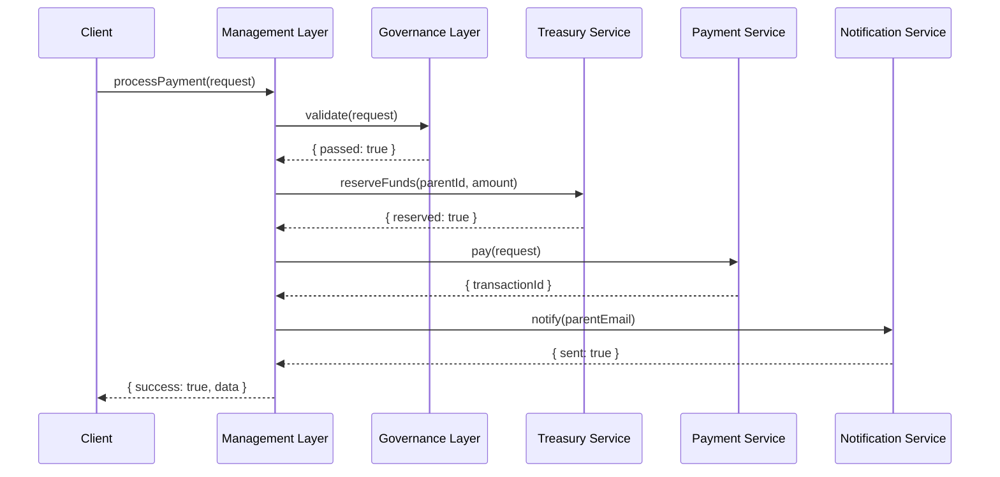

# Chapter 7: Management Layer

Welcome back! In [Chapter 6: Governance Layer](06_governance_layer_.md), you learned how to enforce policies and compliance. Now we’ll explore the **Management Layer**—think of it as a city’s administrative offices that coordinate day-to-day operations across multiple departments (our microservices).

---

## 1. Motivation & Central Use Case

Imagine the **Child Support Office** needs to process monthly payments:

1. **Validate eligibility** with the Governance Layer.  
2. **Reserve funds** from the central Treasury service.  
3. **Execute the payment** via the Payment service.  
4. **Send a notification** (email or SMS) to the parent.  
5. **Log the transaction** for auditors.

Without a dedicated orchestrator, each service would have to know about the others, leading to tangled code and hard-to-maintain workflows. The **Management Layer** centralizes these process flows:

- It defines **workflows** (step-by-step processes).  
- It handles **service orchestration** (calling each service in order).  
- It manages **resource allocation** (ensuring funds and notifications are available).

---

## 2. Key Concepts

1. **Workflow Definition**  
   A blueprint for a multi-step process (e.g., child support payment).  
2. **Task Orchestration**  
   Running each step in order, passing data along.  
3. **Error Handling & Compensation**  
   Rolling back or retrying when a step fails (e.g., refund if payment fails).  
4. **Resource Allocation**  
   Reserving or locking resources (funds, message quotas) before use.  

---

## 3. Defining a Simple Workflow

Here’s how to define a “Child Support Payment” workflow using a hypothetical `hms-sme-management` library.

```js
// src/workflows/childSupport.js
import { Workflow } from 'hms-sme-management';

export const childSupportWorkflow = new Workflow('ChildSupportPayment')
  .step('validate', data => gov.check('disburse-funds', data))
  .step('reserveFunds', data => treasury.reserve(data.parentId, data.amount))
  .step('pay', data => paymentService.pay(data))
  .step('notify', data => notifier.sendEmail(data.parentEmail, 'Payment Complete'))
  .onError((ctx, err) => {
    // compensation logic: release funds if reserved
    if (ctx.reserved) treasury.release(ctx.parentId, ctx.amount);
    throw err;
  });
```

Explanation:  
- We create a `Workflow` named `ChildSupportPayment`.  
- Each `.step()` calls a service function.  
- `.onError()` defines compensation if any step fails.

---

## 4. Running the Workflow

To kick off the payment process:

```js
// src/services/childSupportManager.js
import { childSupportWorkflow } from '../workflows/childSupport';

async function processPayment(request) {
  // request: { parentId, amount, parentEmail }
  const report = await childSupportWorkflow.run(request);
  if (report.success) {
    console.log('Payment processed:', report.data);
  } else {
    console.error('Payment failed:', report.error);
  }
}
```

What happens:  
1. `run(request)` starts each step in order.  
2. If all pass, you get `report.success === true`.  
3. On failure, the `onError` handler rolls back reserved resources.

---

## 5. Under the Hood: Sequence Diagram



1. **Client** asks the Management Layer to `processPayment`.  
2. **Management Layer** calls Governance, Treasury, Payment, then Notification in sequence.  
3. Results flow back to the client in a single report.

---

## 6. Management Layer Implementation Highlights

### a) Workflow Engine Core

File: `hms-sme-management/src/Workflow.js`
```js
export class Workflow {
  constructor(name) {
    this.name = name;
    this.steps = [];
    this.errorHandler = null;
  }
  step(key, fn) {
    this.steps.push({ key, fn });
    return this;
  }
  onError(fn) {
    this.errorHandler = fn;
    return this;
  }
  async run(input) {
    const ctx = { data: input };
    try {
      for (const { fn, key } of this.steps) {
        ctx[key] = await fn(ctx.data);
      }
      return { success: true, data: ctx };
    } catch (err) {
      if (this.errorHandler) await this.errorHandler(ctx, err);
      return { success: false, error: err };
    }
  }
}
```
- We store an array of `steps`.  
- `.run()` executes each function and accumulates results in `ctx`.  
- On error, `.errorHandler` is called for compensation.

### b) Resource Allocation Example

File: `hms-sme-management/src/treasury.js`
```js
export async function reserve(parentId, amount) {
  // call HMS-SVC treasury service API
  // omit HTTP details for brevity
  return { reserved: true };
}
export async function release(parentId, amount) {
  // release funds
}
```

These helper functions wrap real service calls.

---

## 7. What You’ve Learned

- The **Management Layer** defines and runs multi-step **workflows** across services.  
- How to declare a simple child support payment process with `.step()` and `.onError()`.  
- A sequence diagram showing the orchestration from request to notification.  
- The core of a workflow engine: collecting steps, running them, and handling errors/compensation.

Next up, we’ll dive into the actual backend services these workflows call in  
[Chapter 8: HMS-SVC Backend Services](08_hms_svc_backend_services_.md).

---

Generated by [AI Codebase Knowledge Builder](https://github.com/The-Pocket/Tutorial-Codebase-Knowledge)