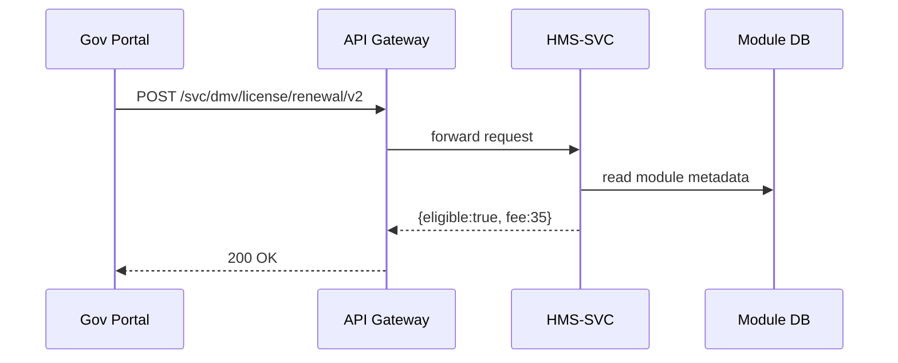
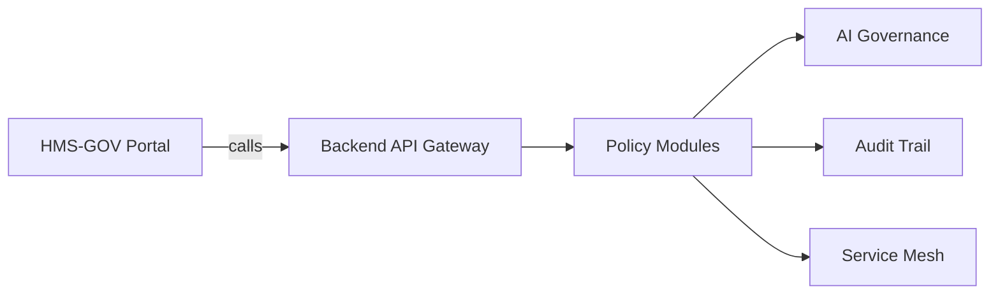

# Chapter 7: Policy & Process Modules (HMS-SVC)

*Sequel to [AI Governance Framework](06_ai_governance_framework_.md)*  

---

## 1. Why Do We Need “Lego Bricks” for Rules?

Meet **Alex**, a citizen renewing a **driver-license** online.  
During the same week, Congress approves a new **emergency-relief payout** for flood victims.  
Two totally different policies, both urgent, both live in the same national portal.

Without isolation, changing the *relief* rules could accidentally break the *license* workflow—bringing the DMV to a halt. 😱

**HMS-SVC** solves the problem by turning every rule set into an **independent Lego brick** (a *module*).  
Updating *Brick A* never shakes *Brick B*.

---

## 2. A 60-Second Tour of What HMS-SVC Does

| Everyday Analogy      | HMS-SVC Concept                    |
|-----------------------|------------------------------------|
| Each Lego block       | A **Policy Module** (self-contained rule logic) |
| The block’s studs     | The module’s **public API**        |
| The instruction sheet | **JSON Schema / OpenAPI contract** |
| Colored sticker       | **Version tag** (`dmv.license.v2`) |
| Spare parts box       | The module’s **private DB**        |

---

## 3. Key Concepts in Plain English

1. **Module** – a mini-service that owns *one* policy area (“driver-license renewal”).  
2. **Contract** – an OpenAPI spec that outsiders call (`POST /evaluate`).  
3. **Version** – frozen label (`v1`, `v2`). New versions live *next to* old ones.  
4. **Event** – broadcast “rule-changed”, “application-approved”, … via the service bus.  
5. **Isolation** – modules never read each other’s databases; they only talk through public APIs.

---

## 4. Hands-On: Building a Tiny Module

We’ll create `dmv.license.renewal.v1` in **9 lines** of code.

### 4.1 Skeleton

```ts
// modules/dmv.license.renewal.v1.ts
import { definePolicy } from '@hms-sme/svc';

export default definePolicy({
  id:     'dmv.license.renewal.v1',
  input:  ['age', 'visionScore', 'lastRenewalDate'],
  rule:   ctx => ctx.age < 80 && ctx.visionScore >= 0.7,
  action: ctx => ({ eligible: true, fee: 25 })
});
```

What each line means:

* `input` – fields the caller must send.  
* `rule`  – boolean test.  
* `action` – result payload when the rule passes (else HMS-SVC returns `eligible:false` automatically).

### 4.2 Register & Run

```bash
# 1. Register the module
hms-svc deploy modules/dmv.license.renewal.v1.ts

# 2. Call it
curl -X POST https://api.gov/svc/dmv/license/renewal/v1/evaluate \
  -d '{"age":30,"visionScore":0.9,"lastRenewalDate":"2019-06-01"}'
```

Response:

```json
{ "eligible": true, "fee": 25 }
```

Congrats—your first brick is live and *isolated*.

---

## 5. Updating Without Breaking Things

A new law raises the fee to **$35** starting next month.

### 5.1 Clone & Tweak (6 lines)

```ts
// modules/dmv.license.renewal.v2.ts
import v1 from './dmv.license.renewal.v1';

export default {
  ...v1,
  id: 'dmv.license.renewal.v2',
  action: ctx => ({ eligible: true, fee: 35 })
};
```

### 5.2 Side-by-Side Deployment

```bash
hms-svc deploy modules/dmv.license.renewal.v2.ts
```

Now:  
* `/v1/evaluate` → returns **25 $**  
* `/v2/evaluate` → returns **35 $**

Existing mobile apps pinned to `v1` keep working, while new clients migrate at their own pace.

---

## 6. Behind the Curtain: What Happens on a Call?



*Only* four hops, all under 200 ms in production.

---

## 7. Inside HMS-SVC (Code Peeks ≤ 20 Lines)

### 7.1 Tiny Runtime Engine

```ts
// runtime/applyRule.ts
export function applyRule(module, payload){
  const ok = module.rule(payload);
  if (!ok) return { eligible:false, reason:'RULE_FAIL' };
  return module.action(payload);
}
```

### 7.2 HTTP Entrypoint

```ts
// routes/evaluate.ts
router.post('/:agency/:domain/:name/:ver/evaluate', async (req,res)=>{
  const module = await registry.get(req.params);
  const result = applyRule(module, req.body);
  res.json(result);
});
```

### 7.3 Hot-Swap Without Downtime

```ts
// runtime/hotLoad.ts
watch('modules/', file=>{
  const mod = require(file).default;
  registry.save(mod.id, mod);    // instant swap
});
```

Each module reloads independently—other bricks keep running.

---

## 8. Working With Other HMS Layers



• All traffic first enters the **[Backend API Gateway](08_backend_api_gateway_.md)** for auth and throttling.  
• New or updated modules are scanned by the **[AI Governance Framework](06_ai_governance_framework_.md)** before activation.  
• Decisions and results are logged to **[Data Governance & Audit Trail](11_data_governance___audit_trail_.md)**.  
• Routing inside the data center rides on the **[Microservice Mesh](09_microservice_mesh___service_discovery_.md)**.

---

## 9. Adding a Completely Different Brick (Relief Payout)

```ts
// modules/fema.relief.payout.v1.ts
export default definePolicy({
  id: 'fema.relief.payout.v1',
  input: ['zip', 'damageCategory', 'income'],
  rule: ctx => ctx.damageCategory >= 3 && ctx.income < 40000,
  action: ctx => ({ grant: 5000 })
});
```

Deploying this file has **zero impact** on the DMV license modules—different ID, different DB table, different API path.

---

## 10. Common Beginner Questions

**Q: Can modules call each other?**  
A: They *can*, but only through public APIs. For large dependencies, consider a shared *utility module* (e.g., `common.date.calculator.v1`).

**Q: How do I roll back?**  
A: Just switch clients back to the older version endpoint. Both versions can coexist indefinitely.

**Q: What about performance?**  
A: A single module’s cold start is under 50 ms. Hot paths stay warm via service-mesh health probes.

---

## 11. Recap & Next Steps

You learned:

• Why splitting rules into Lego-like **modules** prevents cascading bugs.  
• How to create, version, and deploy a policy in under 10 lines.  
• What happens internally when an evaluation call is made.  
• How HMS-SVC plugs into the wider HMS-SME ecosystem.

Ready to see how every call reaches these bricks securely and with proper rate limits?  
Jump to [Backend API Gateway](08_backend_api_gateway_.md).

---

---

Generated by [AI Codebase Knowledge Builder](https://github.com/The-Pocket/Tutorial-Codebase-Knowledge)