# Chapter 8: Backend API Gateway  

*(Sequel to [Policy & Process Modules (HMS-SVC)](07_policy___process_modules__hms_svc__.md))*  

---

## 1. Why Do We Need a “Single Security Gate”?

Imagine **Olivia**, a software engineer at the **Maritime Administration (MARAD)**.  
She is building a mobile app that lets ship captains:

1. Check **harbor-fee invoices** (served by `HMS-BILL` microservice).  
2. File an **oil-spill report** (served by `HMS-ENV` microservice).  
3. Request a **tow-boat permit** (served by `HMS-SVC` policy module you met in the last chapter).

Without a central gate Olivia would have to:

* Learn a different **URL, token style, rate limit** for every microservice.  
* Handle **CORS** quirks, random error codes, stale versions… 🙈  

A **Backend API Gateway (HMS-GW)** fixes this:

“Just knock on **one well-lit door**; we’ll do the security checks, pick the right service, and hand your request inside.”

---

## 2. The Gateway in Two Sentences

1. **Traffic Cop** – every request (citizen, AI, partner agency) must show ID, pass a metal detector (schema check), and obey the speed limit (throttling).  
2. **Smart Dispatcher** – once cleared, it routes the call to the correct microservice (`HMS-SVC`, `HMS-ACH`, etc.) through the internal service mesh.

> Analogy: The security pavilion at a federal complex—one line, many buildings behind it.

---

## 3. Key Concepts (Plain English)

| Word                | Beginner Analogy                          | What It Means Here |
|---------------------|-------------------------------------------|--------------------|
| Ingress             | Main entrance gate                        | Public HTTPS endpoint of HMS-GW |
| Auth Middleware     | ID checker at the gate                    | Verifies JWT from [Role & Identity Management](10_role___identity_management__hms_sys_auth__.md) |
| Schema Validator    | Bag scanner                               | Ensures JSON body follows the declared schema |
| Throttler           | Turn-style counter                        | Blocks too many requests per minute |
| Router              | Reception desk                            | Decides which microservice receives the packet |
| Plugin              | Extra security camera                     | Drop-in code that adds logging, audit, etc. |

---

## 4. Quick-Start: Run the Gateway Locally (5 Minutes)

### 4.1 Install & Boot

```bash
npm install -g @hms-sme/gw-cli
hms-gw dev      # starts https://localhost:8443
```

> The CLI ships with sensible defaults: JWT auth, 50 req/s throttle, and built-in routes for HMS-SVC.

### 4.2 Make a Test Call (Citizen Flow)

```bash
curl -X POST https://localhost:8443/api/dmv/license/renewal/v1/evaluate \
  -H "Authorization: Bearer demo-token" \
  -H "Content-Type: application/json" \
  -d '{"age":60,"visionScore":0.8,"lastRenewalDate":"2018-05-01"}'
```

Expected reply (proxy from HMS-SVC):

```json
{ "eligible": true, "fee": 25 }
```

What happened?

1. Gateway checked the **JWT** inside `demo-token`.  
2. Body passed the **JSON schema** for `dmv.license.renewal.v1` (age, visionScore…).  
3. Within the 50 req/s limit, so allowed.  
4. Routed the request to `HMS-SVC` and streamed the response back.

---

## 5. Anatomy of a Request (Step-By-Step)

```mermaid
sequenceDiagram
    participant Client
    participant GW as API Gateway
    participant SVC as Policy Module
    Client->>GW: POST /api/dmv/license/renewal/v1
    GW->>GW: 1) auth ✓\n2) schema ✓\n3) throttle ✓
    GW->>SVC: forward payload
    SVC-->>GW: {eligible:true, fee:25}
    GW-->>Client: 200 OK
```



Three checks **inside** the gateway, then a fast hand-off.

---

## 6. Internal Code Peeks (All ≤ 20 Lines)

### 6.1 Minimal Gateway Server

```ts
// src/index.ts
import express from 'express';
import { auth, validate, throttle, route } from './middleware';

const app = express();
app.use(express.json());
app.use(auth);       // 1. JWT / API-key
app.use(throttle);   // 2. Rate limit
app.use(validate);   // 3. JSON schema

app.use('/api', route);   // 4. Smart proxy
app.listen(8443);
```

Beginner notes: Each middleware is a single responsibility; chaining keeps it readable.

---

### 6.2 Auth Middleware (Simplified)

```ts
// middleware/auth.ts
export function auth(req, res, next){
  const token = req.headers.authorization?.split(' ')[1];
  if(!token || !verifyJwt(token)) return res.status(401).end();
  req.user = decodeJwt(token);      // attach user info
  next();
}
```

Uses the public key from [Role & Identity Management](10_role___identity_management__hms_sys_auth__.md).

---

### 6.3 JSON Schema Validator

```ts
// middleware/validate.ts
import schemas from './schemas';

export function validate(req, res, next){
  const key = req.path;             // ex: /dmv/license/renewal/v1
  const schema = schemas[key];
  if(schema && !schema.isValid(req.body))
      return res.status(400).send('Bad schema');
  next();
}
```

Schemas are automatically synced from [Policy & Process Modules](07_policy___process_modules__hms_svc__.md) on deploy.

---

### 6.4 Smart Router

```ts
// middleware/route.ts
import { mesh } from '@hms-sme/mesh-sdk';

export async function route(req, res){
  const target = mesh.resolve(req.path);   // returns internal URL
  const resp = await fetch(target, {
    method: req.method,
    headers: req.headers,
    body: JSON.stringify(req.body)
  });
  res.status(resp.status).send(await resp.text());
}
```

`mesh.resolve` talks to the service mesh you’ll meet in [Microservice Mesh & Service Discovery](09_microservice_mesh___service_discovery_.md).

---

## 7. Adding a Plugin: Audit Logging in 8 Lines

```ts
// plugins/auditLog.ts
export function audit(req, res, next){
  const start = Date.now();
  res.on('finish', ()=> {
    auditTrail.write({
      path: req.path,
      user: req.user?.id,
      status: res.statusCode,
      ms: Date.now() - start
    });
  });
  next();
}

// enable it
app.use(audit);
```

Now every call is captured by [Data Governance & Audit Trail](11_data_governance___audit_trail_.md).

---

## 8. How Gateway Fits Into the Whole Picture


* One public door (`GW`)  
* Internal hallway (`Service Mesh`)  
* Many office rooms (`Microservices & Modules`)

---

## 9. Common Beginner Questions

**Q: Do I still need CORS handling?**  
A: No. The gateway terminates HTTPS and sets consistent CORS headers for every path.

**Q: Can I bypass the gateway for internal calls?**  
A: Inside the cluster, services talk over the mesh. External traffic **must** use the gateway to keep audit logs complete.

**Q: How do I change rate limits?**  
A: Edit `gateway.yaml`:

```yaml
routes:
  /api/dmv/**:
    throttle: 30   # 30 req/s
```

Changes hot-reload without downtime.

---

## 10. Recap & What’s Next

In this chapter you:

• Saw why a **Backend API Gateway** simplifies security and routing.  
• Started a dev instance and successfully called a policy module.  
• Learned the three built-in checks: auth, schema, throttle.  
• Peeked at concise middleware code and added an audit plugin.  

Behind this gate lives an **internal service mesh** that actually knows the address of every microservice.  
Time to open that door in [Microservice Mesh & Service Discovery](09_microservice_mesh___service_discovery_.md).

---

Generated by [AI Codebase Knowledge Builder](https://github.com/The-Pocket/Tutorial-Codebase-Knowledge)