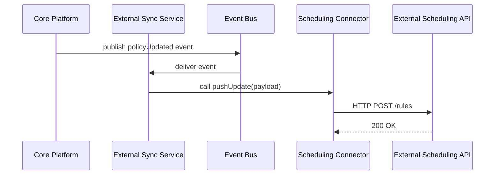

# Chapter 8: External System Synchronization

In [Chapter 7: Backend API](07_backend_api_.md) we learned how services inside HMS-SME create, read, and update policies and processes. But what happens when you need those updates to show up in third-party tools—like a scheduling service, a data warehouse, or a legacy database? That’s where **External System Synchronization** comes in.

---

## 1. Why We Need External System Synchronization

Imagine the U.S. Department of the Interior (DOI) publishes a new field-inspection policy. Field crews use an external scheduling tool to assign inspection dates. If the DOI policy changes (say, adding weekend slots), the scheduling tool must reflect it **immediately**. Otherwise crews will follow outdated rules.

Think of External System Synchronization as utility lines connecting a new municipal building to the city grid. When you flip the switch (publish a policy update), electricity (the update) flows instantly to every connected building (partner systems).

---

## 2. Key Concepts

1. **External System**  
   Any third-party service or legacy database that needs to stay in sync.

2. **Connector / Adapter**  
   A small piece of code that knows how to push updates to one specific external system.

3. **Event**  
   A lightweight message describing “what changed” (e.g., `policyUpdated`).

4. **Sync Service**  
   Listens for events from the core platform and routes them to the right connector.

5. **Transformation**  
   Converting internal data format into the external system’s expected shape.

6. **Error Handling & Retry**  
   If pushing an update fails (network glitch, API changes), we log it and retry later.

---

## 3. Solving Our Use Case

Let’s walk through a minimal example where the core platform publishes a policy update and we sync it to a Google-Calendar–like scheduling API.

### 3.1 Register a Connector

```javascript
// external_sync_service.js
class ExternalSyncService {
  constructor() { this.connectors = {}; }
  registerConnector(name, connector) {
    this.connectors[name] = connector;
  }
  async handleEvent(event) {
    const connector = this.connectors[event.target];
    if (connector) await connector.pushUpdate(event.payload);
  }
}
module.exports = ExternalSyncService;
```
> We store connectors by name (e.g., `"schedulingTool"`) and invoke `pushUpdate` when events arrive.

### 3.2 Define a Scheduling Connector

```javascript
// scheduling_connector.js
class SchedulingConnector {
  async pushUpdate(policy) {
    const transformed = {
      calendarId: policy.agencyId,
      title: policy.name,
      rules: policy.rules
    };
    // pretend we're calling the external API:
    await fetch('https://api.scheduler.gov/v1/rules', {
      method: 'POST',
      body: JSON.stringify(transformed)
    });
  }
}
module.exports = SchedulingConnector;
```
> This connector transforms our internal policy into the scheduler’s format and calls its REST API.

### 3.3 Tie It All Together

```javascript
// app.js
const ExternalSyncService = require('./external_sync_service');
const SchedulingConnector = require('./scheduling_connector');

const syncService = new ExternalSyncService();
syncService.registerConnector('schedulingTool', new SchedulingConnector());

// Later, when the Backend API emits an event:
const policyUpdateEvent = {
  target: 'schedulingTool',
  payload: { agencyId: 'DOI', name: 'Weekend Inspections', rules: [...] }
};
await syncService.handleEvent(policyUpdateEvent);
```
> When a `policyUpdateEvent` arrives, we look up the `"schedulingTool"` connector and call its `pushUpdate`.

---

## 4. What Happens Under the Hood?



1. **Core Platform → Event Bus**: A policy update event is published.  
2. **Event Bus → Sync Service**: Delivers the event.  
3. **Sync Service → Connector**: Looks up and calls `pushUpdate`.  
4. **Connector → External API**: Transforms data and makes an HTTP request.  
5. **External API → Connector**: Returns a success (or error).

---

## 5. Inside the Implementation

### 5.1 Non-Code Walkthrough

1. **Initialization**  
   - Load and register all connectors (scheduling, data-warehouse, legacy DB).  
2. **Event Listening**  
   - Subscribe to our [Backend API](07_backend_api_.md) event stream or message queue.  
3. **Dispatch**  
   - For each event, find the right connector by `event.target`.  
   - Transform the payload.  
   - Send the update.  
4. **Error & Retry**  
   - On failure, log the error.  
   - Schedule a retry with exponential back-off.

### 5.2 Minimal Connector Registry

```javascript
// connectors/index.js
const SchedulingConnector = require('./scheduling_connector');
const LegacyDbConnector = require('./legacy_db_connector');

module.exports = {
  schedulingTool: new SchedulingConnector(),
  legacyDatabase: new LegacyDbConnector()
};
```

```javascript
// external_sync_service.js (expanded)
const connectors = require('./connectors');

class ExternalSyncService {
  async start(eventBus) {
    // Subscribe to all core events
    eventBus.on('policyUpdated', e => this.handleEvent({
      target: e.system, payload: e.data
    }));
  }
  // ... handleEvent from earlier ...
}
```

> We load all connectors at startup and subscribe to core events. Now any `policyUpdated` event for `legacyDatabase` or `schedulingTool` flows through to the correct adapter.

---

## 6. Summary & Next Steps

You’ve learned how **External System Synchronization**:

- Connects HMS-SME to third-party tools (schedulers, warehouses, legacy DBs)  
- Uses **connectors/adapters** to transform and forward updates  
- Relies on an **event-driven** architecture for real-time sync  
- Handles errors and retries to ensure reliability  

Next up, we’ll explore how these synchronized policies and data appear to end users in the [Interface Layer](09_interface_layer_.md).

---

Generated by [AI Codebase Knowledge Builder](https://github.com/The-Pocket/Tutorial-Codebase-Knowledge)