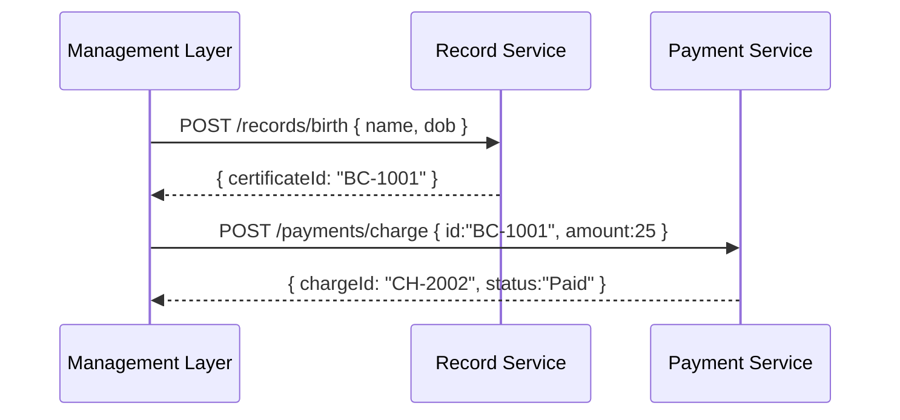

# Chapter 8: HMS-SVC Backend Services

In the previous chapter, you saw how the [Management Layer](07_management_layer_.md) orchestrates workflows across services. Now we’ll dive into **HMS-SVC Backend Services**—our “city departments” that each handle one business domain (e.g., citizen records, payments) and expose APIs for others to use.

---

## 1. Motivation & Central Use Case

Imagine the **Vital Records Office** issuing birth certificates:

1. A citizen fills out an online form.
2. The **Record Service** validates and stores personal details.
3. The **Payment Service** collects the application fee.
4. The **Record Service** returns a certificate number.

Without clear service boundaries, one giant codebase would be hard to maintain. With HMS-SVC, each department (microservice) focuses on one job, can be scaled or updated independently, and communicates via well-defined APIs.

**Use Case**: Handling a birth certificate request end-to-end.

---

## 2. Key Concepts

1. **Microservice**  
   A small, self-contained service that owns one domain (e.g., records, payments).

2. **Domain Boundary**  
   Each service manages its own data and rules. No other service reaches into its database.

3. **API Contract**  
   A clear, versioned HTTP interface (e.g., `POST /records/birth`, `POST /payments/charge`).

4. **Independent Deployment**  
   Services can be built, tested, and released without touching others.

---

## 3. Building a Simple Record Service

Below is a minimal Express service for handling birth certificate applications.

```js
// record-service/src/index.js
import express from 'express';
const app = express();
app.use(express.json());

// Apply basic auth for simplicity
app.use((req, res, next) => {
  if (!req.headers.authorization) {
    return res.status(401).send('Missing token');
  }
  next();
});

// Submit a new application
app.post('/records/birth', (req, res) => {
  const { name, dob } = req.body;
  // …save to database…
  res.status(201).json({ certificateId: 'BC-1001' });
});

// Get certificate info
app.get('/records/birth/:id', (req, res) => {
  // …fetch from database…
  res.json({ id: req.params.id, name: 'Alice', dob: '2000-01-01' });
});

app.listen(5000, () =>
  console.log('Record Service running on port 5000')
);
```

Explanation:
- `POST /records/birth` accepts name and date of birth, returns a new certificate ID.
- `GET /records/birth/:id` retrieves stored certificate details.
- A simple auth check ensures only authorized callers can use it.

---

## 4. Calling the Services in a Workflow

When the Management Layer runs our **ChildSupportPayment** workflow, one step might call the Record Service, then the Payment Service:



1. **Management Layer** asks **Record Service** to register the birth.  
2. **Record Service** responds with a certificate ID.  
3. **Management Layer** then tells **Payment Service** to charge the fee.  
4. **Payment Service** returns a payment confirmation.

---

## 5. Internals: Service Registration & Discovery

To let other services find this service, we register with HMS-SYS’s discovery:

```js
// record-service/src/sys.js
import { Core } from 'hms-sys-core';

const core = new Core({
  serviceName: 'record-service',
  discoveryUrl: 'http://hms-sys:8500',
  authToken: process.env.SYS_TOKEN
});

core.start(); // registers service and starts health checks
```

Explanation:
- We create a `Core` instance from **HMS-SYS Core Infrastructure** ([Chapter 5](05_hms_sys_core_infrastructure_.md)).
- `core.start()` advertises `record-service` so others can `discovery.find('record-service')`.

---

## 6. Inside a Backend Service

Let’s peek at how the **Payment Service** might handle charges:

```js
// payment-service/src/routes/charges.js
import express from 'express';
const router = express.Router();

// Charge endpoint
router.post('/payments/charge', async (req, res) => {
  const { id, amount } = req.body;
  // …call external bank API, save record…
  res.status(201).json({ chargeId: 'CH-2002', status: 'Paid' });
});

export default router;
```

And the main file:

```js
// payment-service/src/index.js
import express from 'express';
import chargeRoutes from './routes/charges.js';
import { Core } from 'hms-sys-core';

const app = express();
app.use(express.json());
app.use(chargeRoutes);

new Core({ serviceName:'payment-service', discoveryUrl, authToken })
  .start();

app.listen(6000, () =>
  console.log('Payment Service on port 6000')
);
```

Key points:
- Each service defines its own routes and logic.
- Both services use **HMS-SYS** to register and discover peers.

---

## 7. What You’ve Learned

- **Why** microservices (HMS-SVC) map to departments, keeping responsibilities clear.  
- **How** to create minimal Express services for records and payments.  
- The **sequence** of calls when a workflow uses these services.  
- **Service discovery** registration using **HMS-SYS Core** for inter-service calls.

Next up, we’ll see how to handle large-scale financial settlement in  
[Chapter 9: HMS-ACH Financial Processing](09_hms_ach_financial_processing_.md).

---

Generated by [AI Codebase Knowledge Builder](https://github.com/The-Pocket/Tutorial-Codebase-Knowledge)