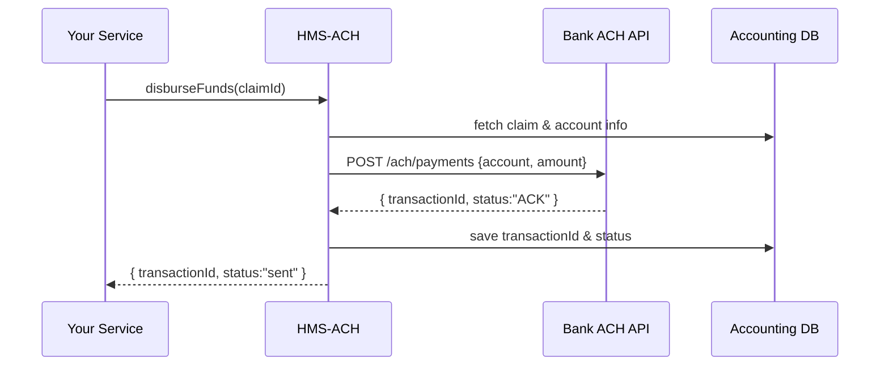

# Chapter 9: HMS-ACH Financial Processing

Continuing from [Chapter 8: HMS-SVC Backend Services](08_hms_svc_backend_services_.md), we now turn to the “city treasury” of our system: **HMS-ACH Financial Processing**. This chapter shows how HMS-ACH handles claims, disburses funds, and keeps accounts balanced—just like a real-world municipal treasury.

---

## 1. Motivation & Central Use Case

Imagine a **Child Support Office** that needs to send monthly payments to parents:

1. A case manager submits a **payment claim** for Parent #123, amount \$500.  
2. HMS-ACH validates the claim, sends an ACH payment to the parent’s bank, and records the transaction.  
3. At month-end, treasury officers **reconcile** all disbursements against their ledger to ensure nothing is missing.

Without a dedicated financial processor, each service would duplicate banking logic, struggle with retries, and risk compliance violations. **HMS-ACH** centralizes this work, ensuring payments are accurate, timely, and meet financial regulations.

---

## 2. Key Concepts

1. **Claim Processing**  
   Collect incoming payment requests and verify they’re valid (e.g., correct account info, approved amount).

2. **Fund Disbursement**  
   Communicate with external bank APIs to move money via ACH rails, handling retries and errors.

3. **Account Reconciliation**  
   At regular intervals, compare internal records with bank statements to catch mismatches.

4. **Compliance & Audit**  
   Every transaction is logged with timestamps, statuses, and error codes for regulatory review.

---

## 3. Using HMS-ACH in Your Code

Below is a minimal example showing how a service might use HMS-ACH to process a child support payment.

```js
// src/payments/childSupport.js
import { ACHProcessor } from 'hms-sme-ach';

const ach = new ACHProcessor({ apiKey: process.env.ACH_KEY });

// 1. Process the claim
const claim = await ach.processClaim({
  claimantId: 'parent-123', amount: 500, bankAccount: '0123456789'
});
// claim.status === 'validated'

// 2. Disburse the funds
const payout = await ach.disburseFunds(claim.id);
// payout.status === 'sent', payout.transactionId returned

// 3. Reconcile later (e.g., nightly job)
await ach.reconcileAccounts();
// updates internal ledger based on bank report
```

Explanation:
- `processClaim()` checks that the request is well-formed and approved.
- `disburseFunds()` sends the payment over the ACH network.
- `reconcileAccounts()` matches your records with the bank’s report.

---

## 4. Under the Hood: Sequence Walkthrough

Here’s what happens when you call `disburseFunds()`:



1. Your service calls `ACHProcessor.disburseFunds()`.  
2. HMS-ACH loads claim details from the database.  
3. It sends a payment request to the external **Bank ACH API**.  
4. On acknowledgement, it records the transaction and returns the details.

---

## 5. HMS-ACH Implementation Highlights

### a) Claim Validation

File: `hms-sme-ach/src/claims.js`
```js
export async function processClaim({ claimantId, amount, bankAccount }) {
  // Check approval status and basic rules
  if (amount <= 0) throw new Error('Invalid amount');
  // …load claimant record, verify bankAccount…
  const claimId = await db.insert('claims', { claimantId, amount, bankAccount });
  return { id: claimId, status: 'validated' };
}
```

### b) Disbursement Logic

File: `hms-sme-ach/src/disburse.js`
```js
export async function disburseFunds(claimId) {
  const claim = await db.get('claims', claimId);
  // Send to bank
  const resp = await http.post(process.env.BANK_URL + '/ach/pay', {
    account: claim.bankAccount, amount: claim.amount
  });
  // Save transaction record
  await db.insert('transactions', {
    claimId, transactionId: resp.id, status: resp.status
  });
  return { transactionId: resp.id, status: resp.status };
}
```

### c) Reconciliation Job

File: `hms-sme-ach/src/reconcile.js`
```js
export async function reconcileAccounts() {
  // Fetch bank’s daily report
  const report = await http.get(process.env.BANK_URL + '/ach/report');
  for (const entry of report.entries) {
    // Update our transactions table with real status
    await db.update('transactions', entry.id, { status: entry.status });
  }
}
```

Each piece is small and focused—HMS-ACH glues them into a cohesive financial pipeline.

---

## 6. What You’ve Learned

- **Why** we need a dedicated ACH processor: to centralize claim validation, disbursement, and reconciliation.  
- **How** to call HMS-ACH’s `processClaim`, `disburseFunds`, and `reconcileAccounts` from your service.  
- A **sequence diagram** showing payment flow between your service, HMS-ACH, the bank API, and the database.  
- **Peeked inside** HMS-ACH: code for claims, disbursement, and reconciling.

Next up, we’ll explore how AI agents can automate tasks across these services in  
[Chapter 10: HMS-A2A AI Agent Framework](10_hms_a2a_ai_agent_framework_.md).

---

Generated by [AI Codebase Knowledge Builder](https://github.com/The-Pocket/Tutorial-Codebase-Knowledge)