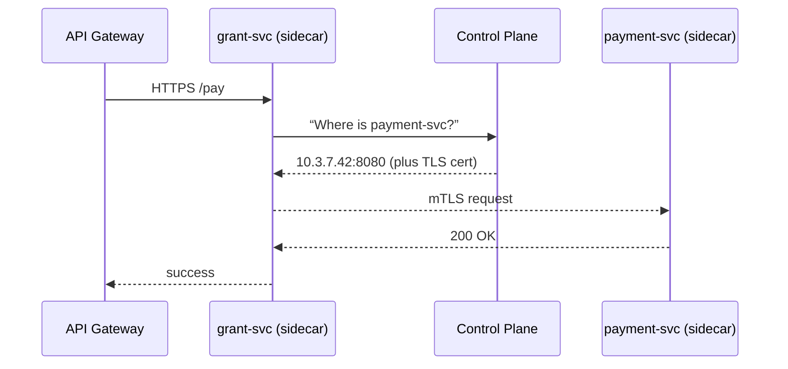
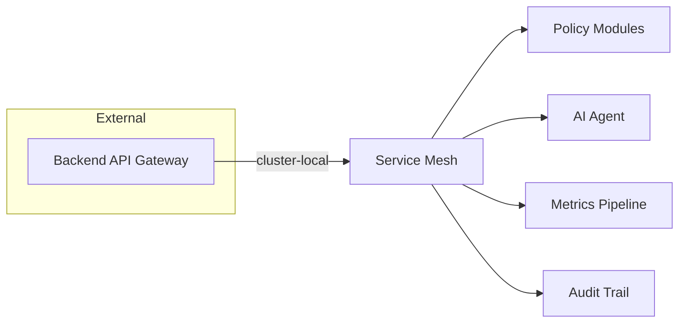

# Chapter 9: Microservice Mesh & Service Discovery  

*(Follow-up to [Backend API Gateway](08_backend_api_gateway_.md))*  

---

## 1. Why Do We Need an “Invisible Highway System”?

Picture **Lena**, a DevOps engineer at the **Rural Utilities Service (RUS)**.  
Her platform serves farmers who:

1. Apply for a **broadband-expansion grant** (served by `grant-svc`).  
2. Upload **utility-line blueprints** (served by `file-svc`).  
3. Track **payment disbursements** (served by `payment-svc`).  

On any given minute…

* thousands of HTTPS calls fly between these microservices,  
* some calls fail (network hiccup, pod restart),  
* new canary versions roll out,  
* all traffic must stay **encrypted** (OMB M-22-09) and **auditable**.

Manually wiring TLS certificates, retry logic, and service addresses would be a nightmare.  
A **Microservice Mesh** (think *Waze + encrypted tunnels* for services) automates all that:

* automatic **service discovery** – “Where is `payment-svc` today?”  
* built-in **mTLS** – every hop is encrypted without changing your code,  
* **retries + circuit-breakers** – network hiccups self-heal,  
* **traffic shaping** – 1 % of traffic to the canary, 99 % to stable.

---

## 2. Key Concepts in Plain English

| Term | Beginner Analogy | What It Means Here |
|------|------------------|--------------------|
| Sidecar | Carpool buddy | A tiny proxy container sitting **next to** your service pod. |
| Control Plane | GPS dispatcher | Brain that tells sidecars *where* to send traffic. |
| Data Plane | The highways | All sidecars + encrypted pipes between them. |
| Service Discovery | Phone book | Auto-updates “grant-svc → 10.3.7.42:8080”. |
| mTLS | Sealed envelope | Mutual TLS; both caller & callee prove their identity. |
| Canary | Small test balloon | Route a slice of traffic to a new version for safety. |

Popular implementations: **Istio**, **Linkerd**.  
The HMS-SME reference stack ships with *Linkerd* because it’s lighter for beginners, but everything you see also works in Istio.

---

## 3. 3-Minute Hands-On: See the Mesh in Action

We’ll watch `grant-svc` call `payment-svc` through the mesh.

### 3.1 Spin Up Demo Services

```bash
# one-liner installer (k3d + Linkerd)
curl -sL https://run.linkerd.io/install | sh
linkerd check   # verify cluster is mesh-ready

kubectl apply -f kubernetes/demo-services.yaml   # deploy 2 tiny pods
```

`demo-services.yaml` contains two 10-line Deployments; nothing mesh-specific yet.

### 3.2 Add Them to the Mesh (1 label!)

```bash
kubectl label ns default linkerd.io/inject=enabled
```

Kubernetes automatically restarts pods with a **sidecar proxy** injected.

### 3.3 Call the API & Watch Retries

```bash
# port-forward the gateway from Chapter 8
kubectl port-forward svc/hms-gateway 8443:443

curl -v https://localhost:8443/api/grant/pay \
  -H "Authorization: Bearer demo" \
  -d '{"grantId":"G-123"}'
```

In a second terminal:

```bash
linkerd tap deploy/payment-svc | head
```

You’ll see live mTLS-encrypted calls (`:authority=payment-svc.default.svc.cluster.local`), along with automatic **retries** if a packet drops.

---

## 4. What Actually Happens? (Step-By-Step)



Key takeaways for beginners:

1. **Your service code never sees TLS keys or IPs**—sidecars handle it.  
2. If the first attempt fails, sidecar auto-retries (configurable).  
3. New pods register with Control Plane; discovery is instant.

---

## 5. Beginner-Friendly Config Recipes

### 5.1 Turn On Retries & Timeouts (YAML ≤ 15 lines)

```yaml
# payment-policy.yaml
apiVersion: policy.linkerd.io/v1alpha1
kind: HTTPRoute
metadata:
  name: pay-with-retries
spec:
  destination:
    name: payment-svc
  rules:
  - backends:
    - name: payment-svc
      retries:
        attempts: 3
        perTryTimeout: 1s
```

Apply:

```bash
kubectl apply -f payment-policy.yaml
```

Result: grant-svc will retry up to **3 times**, each capped at **1 s**.

---

### 5.2 Ship a Canary Version (Only 10 % Traffic)

```yaml
# canary-split.yaml
apiVersion: split.smi-spec.io/v1alpha2
kind: TrafficSplit
metadata:
  name: payment-split
spec:
  service: payment-svc
  backends:
  - service: payment-svc-v1   # stable
    weight: 90
  - service: payment-svc-v2   # canary
    weight: 10
```

Apply → Instantly 10 % of calls go to **v2** without citizen downtime.

---

## 6. Minimal Code Changes Required? **Zero.**

Because sidecars live **outside** your container, your Go/Node/Java code keeps using plain HTTP:

```ts
// grant-svc/src/pay.ts  (10 lines)
import fetch from 'node-fetch';

export async function pay(id: string){
  const res = await fetch('http://payment-svc/pay', {
    method: 'POST',
    body: JSON.stringify({grantId: id})
  });
  return res.json();
}
```

No TLS, no retries, no host look-ups—mesh handles it.

---

## 7. Under the Hood (Tiny Implementation Peeks)

### 7.1 Sidecar Proxy (Rust snippet, 12 lines)

```rust
// pseudo-code of Linkerd sidecar
loop {
  let req = receive_http();               // from service
  let svc = lookup(req.authority());      // DNS + control-plane
  let tls = establish_mtls(svc);          // auto-certs
  let resp = tls.send(req)                // forward
      .retry(3)                           // if needed
      .timeout(1_000);
  return_to_service(resp);
}
```

Pure Rust binary < 10 MB; injected automatically.

### 7.2 Control Plane Service Registry (Go, 14 lines)

```go
// registry/update.go
func register(pod Pod) {
  entry := ServiceEntry{
      Name:  pod.Service,
      IP:    pod.IP,
      Port:  pod.Port,
      Cert:  issueCert(pod.Service),
  }
  db.Save(entry)                 // in-memory table
  broadcast(entry)               // sidecars watch via gRPC
}
```

Whenever Kubernetes starts/stops a pod, the registry auto-broadcasts the new address + TLS cert to every sidecar.

---

## 8. Integrating With Other HMS-SME Layers



* Gateway handles **public** traffic → Mesh handles **internal** traffic.  
* mTLS identities re-use the keys issued by [Role & Identity Management](10_role___identity_management__hms_sys_auth__.md) for consistent auth across layers.

---

## 9. Common Beginner Questions

**Q: Do I need to change my Dockerfile?**  
A: No. The mesh injects the proxy as a **second container** automatically.

**Q: What about local dev without Kubernetes?**  
A: Use `linkerd inject --manual` to run the proxy next to your process, or skip the mesh entirely in unit tests.

**Q: How is this different from the API Gateway?**  
A: Gateway = **edge door** (internet ↔ cluster).  
   Mesh = **internal roads** (service ↔ service).

**Q: Is mTLS heavy?**  
A: Benchmarks show < 2 ms extra latency per hop in Linkerd—usually less than a database query.

---

## 10. Recap & Next Steps

You just learned:

• A microservice mesh is the **invisible highway** that lets services discover & talk to each other securely.  
• How sidecars, control planes, and traffic policies work—no code changes needed.  
• How to roll out canaries, enforce retries, and tap live traffic in minutes.  

Next we’ll dive into **who** is actually allowed to make these calls by exploring authentication & authorization in [Role & Identity Management (HMS-SYS Auth)](10_role___identity_management__hms_sys_auth__.md).

---

Generated by [AI Codebase Knowledge Builder](https://github.com/The-Pocket/Tutorial-Codebase-Knowledge)