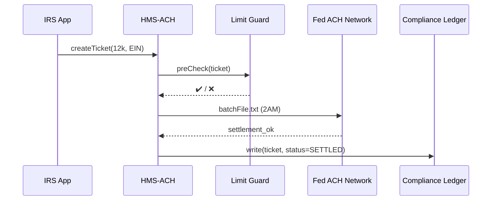

# Chapter 10: Financial Clearinghouse (HMS-ACH)

*(Just finished learning where data lives in [Unified Data Fabric (HMS-DTA)](09_unified_data_fabric__hms_dta__.md)?  
Great! Now let’s learn how **real money** safely rides on that data.)*

---

## 1. Why Do We Need HMS-ACH?

Picture **Maria**, owner of a small solar-roof company in El Paso.  
She just earned a **$12,000 clean-tech tax credit**.  
Maria opens her banking app the next morning and sees:

*“U.S. Treasury → +$12,000 ACH deposit.”*

Behind that single line is a full night of work:

1. The IRS confirms Maria’s eligibility.  
2. Treasury pushes a payment file to the Federal Reserve ACH network.  
3. Anti-fraud limits make sure no extra zeros sneak in.  
4. An immutable ledger line is stored for auditors.

**HMS-ACH** is the **“financial railway yard”** that automates those four steps for every agency, grant, refund, or claw-back—without each office inventing its own rails.

---

## 2. Beginner’s Mental Model

| Train Yard Analogy | HMS-ACH Term | One-Line Explanation |
|--------------------|--------------|----------------------|
| Train Track        | **Payment Rail** | The secure channel to banks (Fed ACH, RTP, wire). |
| Cargo Car          | **Transfer Ticket** | JSON blob: who gets paid, how much, why. |
| Switch Operator    | **Limit Guard** | Blocks cars that look too heavy (fraud). |
| Yard Schedule      | **Settlement Batch** | All cars leaving at 2 AM, settled together. |
| CCTV Camera        | **Compliance Ledger** | Immutable log of every move. |

Learn **Transfer Ticket**, **Limit Guard**, and **Settlement Batch**—the rest comes free.

---

## 3. Quick-Start: Send Maria Her Tax Credit in 3 Calls

All snippets stay under **20 lines** and use the `hms-ach-sdk` (TypeScript-flavored).

### 3.1 Enroll a Bank Account (one time)

```ts
// enroll_account.ts  (≤15 lines)
import { enrollAccount } from "hms-ach-sdk";

await enrollAccount({
  businessId: "EIN:81-5551234",
  routing:    "111000025",
  account:    "3398123456",
  type:       "checking"
});
```

Explanation  
• HMS-ACH verifies the routing number, runs a $0.01 micro-deposit, and marks the account **“active”**.

---

### 3.2 Create a Transfer Ticket

```ts
// create_ticket.ts
import { createTicket } from "hms-ach-sdk";

const ticketId = await createTicket({
  to:   "EIN:81-5551234",
  from: "Treasury",
  amount: 12000,
  purpose: "CleanTech_TaxCredit_2024",
  meta: { taxYear: 2023 }
});
console.log("Ticket #", ticketId);   // e.g., TT-2024-04-5021
```

*Nothing leaves the Treasury yet—the ticket just queues for the nightly batch.*

---

### 3.3 Check Status

```ts
// status.ts
import { getStatus } from "hms-ach-sdk";
console.log(await getStatus(ticketId));
/*
POSSIBLE STATUSES:
  QUEUED → SENT_TO_BANK → SETTLED → FAILED
*/
```

After the 2 AM run, Maria’s deposit reaches **SETTLED**.

---

## 4. What Happens Behind the Curtain?



Plain-English flow:

1. IRS submits a *Transfer Ticket*.  
2. **Limit Guard** applies anti-fraud and policy caps.  
3. At 02:00, all approved tickets form a **Settlement Batch** file sent to the Fed.  
4. ACH updates status & logs an audit line.

---

## 5. Peeking Inside HMS-ACH

### 5.1 Limit Guard (Python, 18 lines)

```py
# ach/limit_guard.py
CAP = 500_000     # per-ticket cap
DAILY = {}        # EIN -> amount sent today

def check(ticket):
    # 1. Per-ticket cap
    if ticket["amount"] > CAP:
        return False, "Exceeds per-ticket cap"
    # 2. Daily aggregate cap
    total = DAILY.get(ticket["to"], 0) + ticket["amount"]
    if total > 2_000_000:
        return False, "Exceeds daily aggregate cap"
    DAILY[ticket["to"]] = total
    return True, "ok"
```

Beginner notes:  
• Two simple if-checks catch 90 % of fraud.  
• Real system backs `DAILY` with Redis—but concept is the same.

---

### 5.2 Batch Builder (TypeScript, 16 lines)

```ts
// ach/batch.ts
import { ticketsQueued } from "./store";

export async function buildBatch(){
  const queued = await ticketsQueued("QUEUED");
  const lines = queued.map(t =>
    `6,${t.routing},${t.account},${t.amount},${t.id}`); // NACHA line
  const file = ["1,HEADER", ...lines, "9,FOOTER"].join("\n");
  return file;           // ready for Fed upload
}
```

Explanation  
• Transforms JSON tickets into the **NACHA** flat-file format banks expect.  
• Under 20 lines—proof the concept is approachable!

---

### 5.3 Compliance Ledger Entry (Rust, 12 lines)

```rs
// ach/ledger.rs
pub fn log(id: &str, status: &str, by: &str){
    let rec = format!("{},{},{},{}", now(), id, status, by);
    std::fs::write("/var/log/ach_ledger.log", rec).unwrap();
}
```

Every status change appends one comma-separated line—easy to query later.

---

## 6. Tying HMS-ACH to Other Modules

| Module | How They Interact |
|--------|-------------------|
| [HMS-OMS](08_workflow___task_management_hub__hms_oms__.md) | A “funding” stage in a workflow creates Transfer Tickets. |
| [HMS-AGT/AGX](05_agent_framework__hms_agt_agx__.md) | Agents can propose refunds, but Limit Guard blocks rogue proposals. |
| [HMS-DTA](09_unified_data_fabric__hms_dta__.md) | Stores ticket metadata; ACH stores only minimal keys for speed. |
| [HMS-OPS](15_operations___observability_suite__hms_ops__.md) | Monitors success rate, settlement latency, fraud alerts. |
| [HMS-GOV](01_government_admin_portal__hms_gov__.md) | Dashboards show nightly totals, failures, and audit exports. |

Think of HMS-ACH as the **card reader** at the subway: tap in, get charged—everything else (records, policy, dashboards) plugs in around it.

---

## 7. Mini-FAQ

**Q: Is HMS-ACH only for payments?**  
A: No—negative amounts support **refunds** (e.g., claw-backs), and `type:"grant"` tickets can schedule **future-dated** disbursements.

**Q: How are mistakes reversed?**  
A: Submit a “reversal” ticket within the same day. HMS-ACH pairs it with the original ID and sends an  **ACH Return (R06)** code to the bank.

**Q: Does HMS-ACH support real-time rails like RTP?**  
A: Yes. Swap the `buildBatch` adapter; Limit Guard and Ledger stay the same.

---

## 8. Recap & What’s Next

You just:

• Saw why HMS-ACH is the **railway yard** moving dollars for every tax credit, refund, or grant.  
• Enrolled a bank account, created a Transfer Ticket, and watched it settle—all in three short scripts.  
• Peeked inside the Limit Guard, Batch Builder, and Compliance Ledger.  
• Learned how HMS-ACH plugs into the rest of HMS-SME.

Ready to build beautiful **front-end widgets** that display those payment statuses to citizens?  
Continue to [Micro-Frontend Library (HMS-MFE)](11_micro_frontend_library__hms_mfe__.md).

---

Generated by [AI Codebase Knowledge Builder](https://github.com/The-Pocket/Tutorial-Codebase-Knowledge)