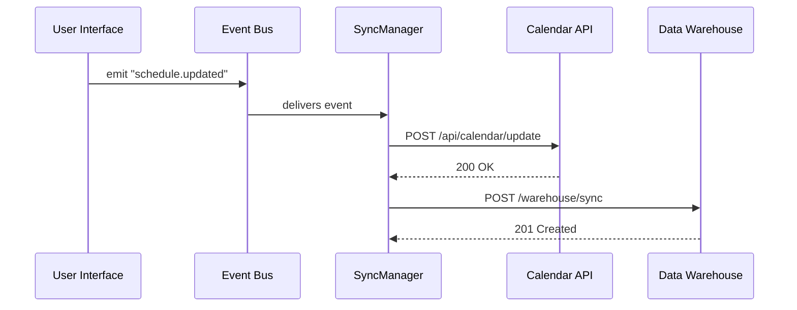

# Chapter 11: External System Sync

Welcome back! In [Chapter 10: HMS-A2A AI Agent Framework](10_hms_a2a_ai_agent_framework_.md) you learned how AI agents propose and execute plans. Now we’ll connect our platform to outside services in real time with **External System Sync**—the “phone line” that keeps everything in sync.

---

## 1. Motivation & Central Use Case

Imagine the **Department of Energy’s Office of Science** needs to push new experiment schedules into an external calendar system and also mirror each update in a central data warehouse. Without a dedicated sync layer, developers would write custom API calls everywhere, risk missing updates, or overload systems at different times.

**External System Sync** solves this by acting like an inter-agency liaison:  
- It listens for events (new schedule, updated record).  
- It transforms and forwards them instantly to any external system.  
- It retries on failures and reports status—ensuring no message is lost.

Central Use Case:  
1. A scientist updates an experiment time in our portal.  
2. External System Sync picks up the “schedule.updated” event.  
3. It calls the calendar API to update the public timetable.  
4. It writes the same change into the data warehouse for reporting.

---

## 2. Key Concepts

1. **Event Channel**  
   A real-time stream of events (like “record.created” or “record.updated”) from our core ([HMS-SYS Core Infrastructure](05_hms_sys_core_infrastructure_.md)).

2. **Connector**  
   A small adapter that knows how to speak an external API’s language (e.g., REST, gRPC).

3. **Transformer**  
   A mapping layer that reshapes our internal data into the external system’s format.

4. **Retry & Dead Letter**  
   Built-in logic to retry on transient errors and route permanent failures to a “dead letter” queue for manual review.

---

## 3. Using External System Sync

Below is a minimal example showing how to register a connector for a calendar API and a data warehouse.  

```js
// src/sync/registerSync.js
import { SyncManager } from 'hms-sme-sync';

// 1. Create the SyncManager
const sync = new SyncManager({
  eventBusUrl: 'http://hms-sys:9000/events'
});

// 2. Register a calendar connector
sync.on('schedule.updated', async (event) => {
  await sync.send({
    connector: 'calendarApi',
    data: { 
      id: event.data.id, 
      start: event.data.startTime 
    }
  });
});

// 3. Register a data-warehouse connector
sync.on('schedule.updated', async (event) => {
  await sync.send({
    connector: 'dataWarehouse',
    data: event.data
  });
});

// 4. Start syncing
sync.start();
```

Explanation:  
- We listen to `schedule.updated` events from the core event bus.  
- For each event, we call two connectors: `calendarApi` and `dataWarehouse`.  
- `sync.send()` handles transforming, calling the external API, and retry logic.

---

## 4. Internal Walkthrough

Let’s see step-by-step what happens when our platform emits a `schedule.updated` event:



1. **UI** triggers an event after a schedule change.  
2. The **Event Bus** (part of [HMS-SYS Core Infrastructure](05_hms_sys_core_infrastructure_.md)) forwards it to our **SyncManager**.  
3. **SyncManager** calls the **Calendar API** and **Data Warehouse** connectors in turn.  
4. Each external system confirms success, and SyncManager logs the result.

---

## 5. Under the Hood: Implementation Highlights

### a) Connector Definition

File: `src/sync/connectors/calendarApi.js`
```js
import axios from 'axios';

export async function calendarApi(data) {
  // Transform and call the external calendar service
  return axios.post('https://calendar.gov/api/update', {
    eventId: data.id,
    startTime: data.start
  });
}
```

### b) SyncManager Core

File: `node_modules/hms-sme-sync/src/SyncManager.js`
```js
export class SyncManager {
  constructor({ eventBusUrl }) {
    this.client = new EventBusClient(eventBusUrl);
    this.handlers = {};
  }
  on(eventType, handler) {
    this.handlers[eventType] = this.handlers[eventType] || [];
    this.handlers[eventType].push(handler);
  }
  async send({ connector, data }) {
    const fn = require(`./connectors/${connector}`);
    let tries = 0;
    while (tries < 3) {
      try { return await fn(data); }
      catch (e) { tries++; await wait(200 * tries); }
    }
    // on permanent failure, send to dead-letter queue
    await this.client.sendDeadLetter({ connector, data });
  }
  start() {
    this.client.subscribe(async (evt) => {
      (this.handlers[evt.type] || []).forEach(h => h(evt));
    });
  }
}
```

- `on()` registers event handlers by type.  
- `send()` looks up the connector function, retries on failure, and routes unfixable errors to a dead-letter queue.  
- `start()` subscribes to the event bus and invokes handlers as events arrive.

---

## 6. What You’ve Learned

- **External System Sync** acts like a 24/7 liaison, instantly propagating updates from our platform to outside services.  
- Key parts: **event channel**, **connectors**, **transformers**, and **retry/dead-letter** handling.  
- A minimal code example registering two connectors for calendar updates and warehouse sync.  
- Internals: how `SyncManager` listens, retries, and logs errors, and how connector functions adapt data for each API.

Next up, we’ll bring people back into the loop for manual checks and approvals in  
[Chapter 12: Human-in-the-Loop (HITL)](12_human_in_the_loop__hitl__.md).

---

Generated by [AI Codebase Knowledge Builder](https://github.com/The-Pocket/Tutorial-Codebase-Knowledge)